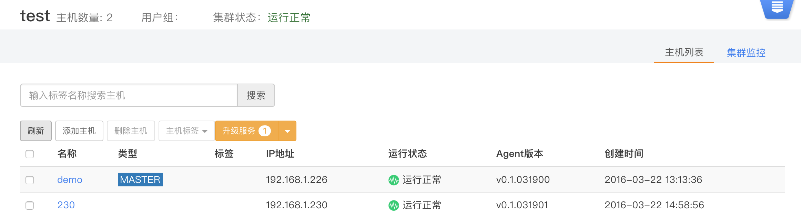

### 集群升级

数人云会定期更新版本，为用户提供崭新的功能和更舒适的体验。  

更新数人云集群，只需要简单的几步操作。

 *  点击集群管理，进入集群界面，点击查看集群（下图右侧蓝色图标内）会显示集群信息，如果集群内任意主机上的agent版本或者组件版本不是最新版，会在主机标签菜单旁边增加升级服务提示。
 
 
 
 点击升级服务，即开始更新低版本组件或者agent，用户可以选择待更新对组件。若组件均已成功升级，该按钮不显示。

*  注1:如果某一组件升级失败，可以选择重置操作，需要到主机详情界面操作（参见主机详情说明）。

*  注2:如果更新服务发现组件，会造成用户短时间无法访问应用，等待组件更新成功，可恢复正常访问；更新其它组件对用户体验无影响。
