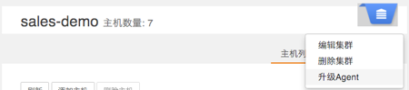
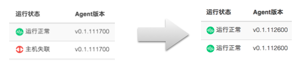

### 集群升级

数人云会定期更新版本，为用户提供崭新的功能和更舒适的体验。  

更新数人云集群，只需要简单的几步操作。

1. 进入集群的“集群详情”页。若该集群可以升级，会在右侧下拉菜单中出现“升级Agent”按键。

2. 点击该按键，集群各主机将开始升级。升级过程中，主机会短时间进入失联或初始化状态，刷新“集群详情”页，待看到 Agent 版本更新，说明该主机已经升级完成。

3. 所有主机升级完成后，则该集群升级完成。升级后的集群在“集群详情”页将不再出现“升级Agent”按键。

