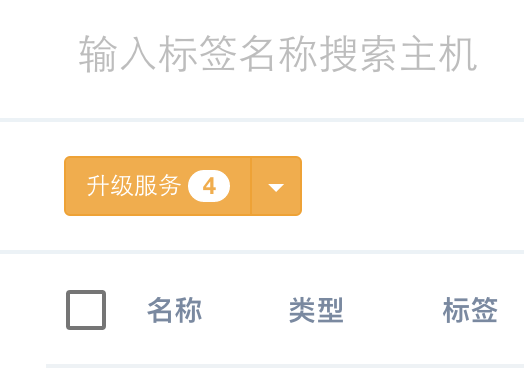

### 集群升级

数人云会定期更新版本，为用户提供崭新的功能和更舒适的体验。  

更新数人云集群，只需要简单的几步操作。

 *  点击集群管理，进入集群界面，点击查看集群（下图右侧蓝色图标内）会显示集群信息，如果集群内任意主机上的agent版本或者组件版本不是最新版，会在主机标签菜单旁边增加升级服务提示。
 
 
 
 点击升级服务，即开始更新低版本组件或者agent，升级成功后该按钮不显示。

*  注：如果更新服务发现组件，会造成用户短时间无法访问应用。等待组件更新成功，可以正常访问；更新其它组件对用户体验无影响。
