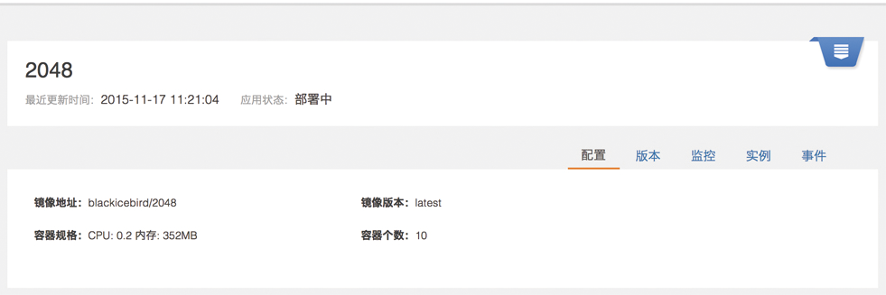

# 应用管理

主要负责部署应用和管理应用的生命周期。可以添加、删除、启动、停止应用。还可以弹性扩展应用实例数量。

<h2 id="app">1. 创建/删除应用</h2>

### 1.1 新建应用

用户通过新建应用向指定的集群中部署一个新的应用。   

1. 填写应用名。同一集群中的应用不可重名，应用名不能包含下划线；  
2. 选择集群；选择部署该应用的集群；  
2. 填写镜像地址；  
3. 填写镜像版本号；  
4. 选择容器数量，默认为1；  
5. 为应用预分配 CPU、内存；  
6. 选择应用类型。如果为无状态应用，该应用会被部署到“动态类型”的任意主机；如果为有状态应用，如 Mysql, Redis 等，要为该应用选择所要部署的“数据类型”的主机，并填写数据存放的主机目录和容器目录；  
7. 根据具体情况，填写高级设置，如暴露端口、环境变量、启动命令等；  
注1：镜像需要由用户自己制作，或使用公共仓库的通用镜像；用户自己制作镜像时，建议不要使用 latest 作为版本号，便于后期的镜像版本更新；  
注2：新建应用时配置的端口、规格、环境参数等在应用成功运行后不能修改。  

### 1.2 删除应用

用户可以删除一个应用，在应用管理页和应用详情页都有删除按钮可以删除应用。应用一旦被删除，相关的数据也将一并在集群中删除且不可通过数人云平台恢复。     

<h2 id="check">2. 查看应用</h2>

### 2.1 应用列表

当成功向集群部署应用后，用户可以在应用管理页看到所有成功部署的应用，包括这些应用当前的状态以及可以对应用进行的操作，启动/停止、扩展、删除，这些操作在应用详情页同样可以进行。     

### 2.2 应用详情

用户在应用详情能看到应用的状态、配置（包括容器规格、端口和环境变量）、实例、监控、版本以及应用的事件。  

- 应用的配置信息不可修改，若需要修改，则需要新建应用；  
- 实例页面，以列表形式查看该应用的每个实例的信息；  
- 监控页面，可以实时看到该应用的 CPU、内存使用情况；  
- 版本页面，记录了应用的镜像版本信息；  
- 事件页面记录了应用从第一次成功部署到被删除之前的发生的变化过程。  

    

<h2 id="start">3. 启动/停止应用</h2>

用户可以停止正在运行的应用，也可以再次启动它。在应用列表和应用详情都有启动/停用按钮。    

<h2 id="elastic">4、应用伸缩</h2>

用户按照应用的需要扩充或缩减实例的个数，同样，在应用列表和应用详情都有扩展按钮可以进行这项操作。 与新建应用时调整容器个数的操作方式一样。    

