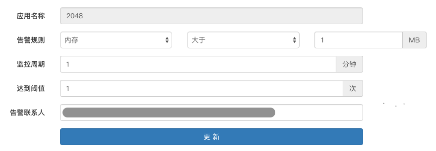
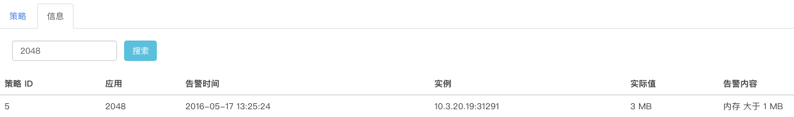
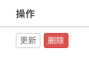

####应用告警
 
 我们可以为每个应用制定单独的告警策略、通过点击新建策略按钮：如图：
 
  
  
  
  
  * 应用名称：选择需要告警的应用名称
  * 告警规则：可以根据内存、CPU使用率、硬盘读写速率、网络速率等信息设置预警阀值
  * 监控周期：设置监控周期，最小值1分钟
  * 达到阈值：设置达到阈值次数，最小值1次，当监控周期内，达到的阀值次数超过该次数，触发告警，发送告警邮件
  * 告警联系人：设置告警邮件发送的email地址
  * 点击创建，服务策略－－应用告警界面会显示该条策略，可用通过“启用”选择该策略是否生效
  
    
  
  * 所有创建的策略都可以做更新、删除操作
   
    
    
  * 信息界面可以显示已经触发告警的策略及告警信息
 
    