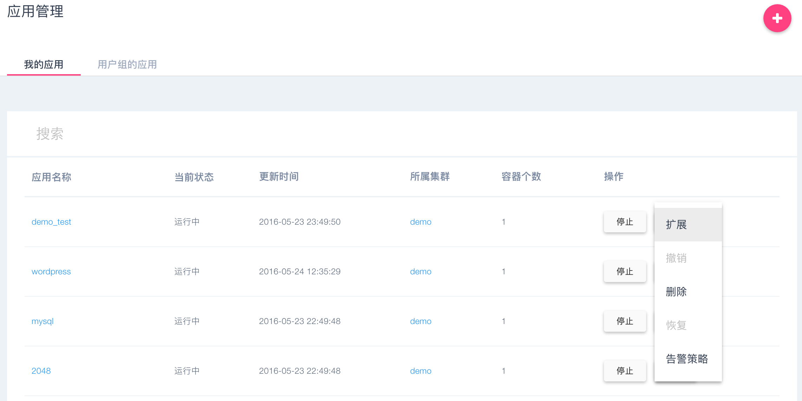
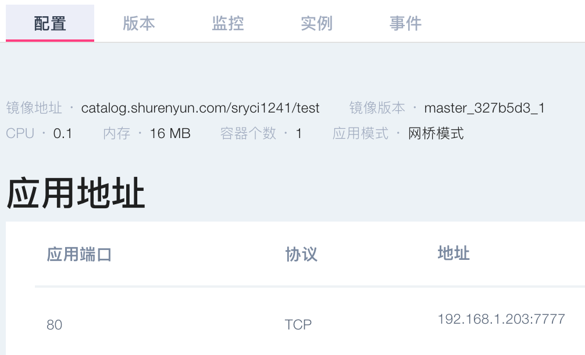
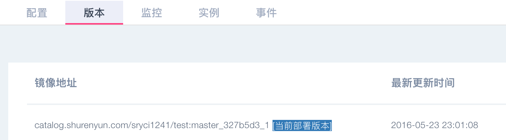
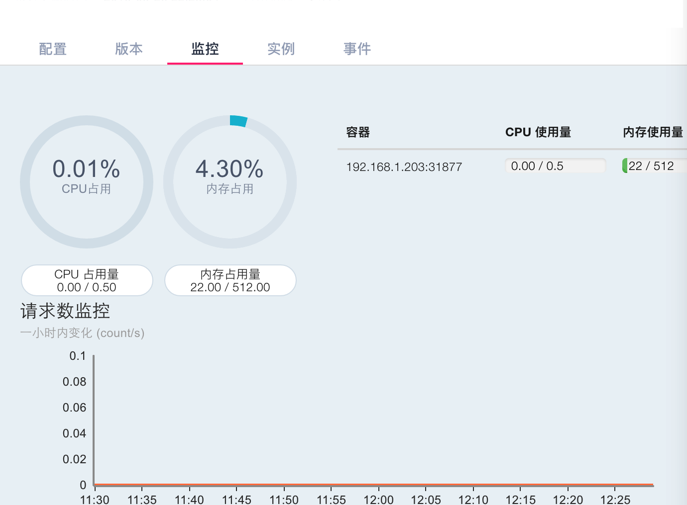
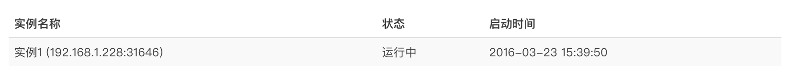
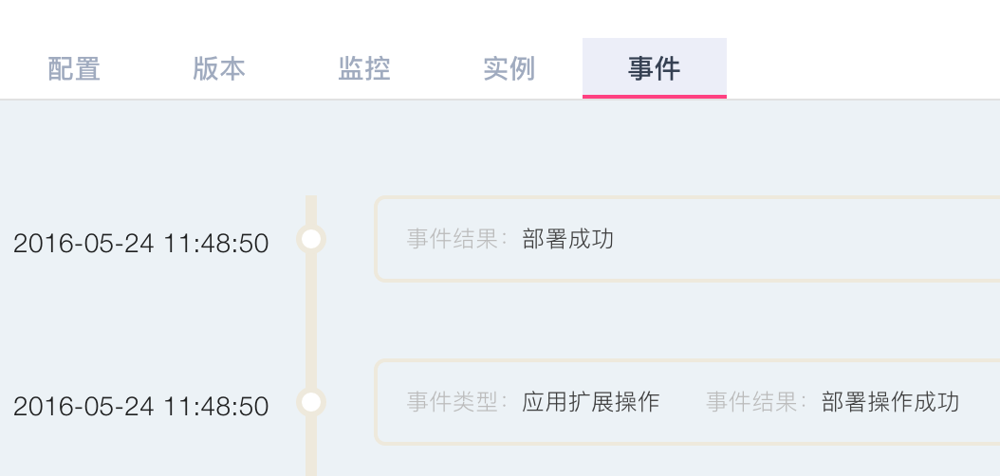

### 查看应用状态

#### 应用列表

当成功向集群部署应用后，用户可以在应用管理页看到所有应用，以及这些应用当前的状态；同时，可以对应用进行一系列操作，启动/停止、扩展、删除。

#### 应用详情

用户在应用详情能看到应用的状态、配置（包括容器规格、端口和环境变量）、版本、监控、实例以及应用的事件。  

- 配置页面，应用的配置信息不可修改，若需要修改，则需要更新应用；

    

- 版本页面，记录了应用的发布的版本信息，同样的镜像但不同的配置就会记为一个版本； 

     
 
- 监控页面，可以实时看到该应用资源及网络请求信息；  
  

- 实例页面，以列表形式查看该应用的每个实例的信息；  
    
- 事件页面，记录了应用从第一次成功部署到被删除之前的发生的变化过程。  
    