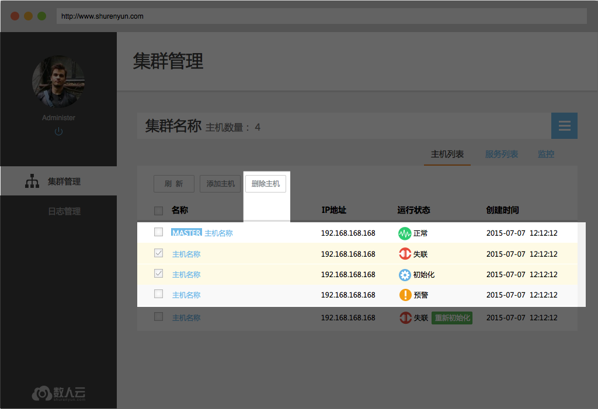

## 集群管理

数人云的集群管理功能可将底层服务器集群进行统一管理，变成一个资源池供用户使用。不同业务或应用可混跑在同一个集群中，从而提高集群运维管理效率和集群资源利用率。  

用户能够创建集群并加入一定数量的主机，搭建出可支持分布式管理的集群结构，并且根据主机的数量不同可选择不同的集群结构。  

  * [创建/删除集群](create_delete_cluster.md)
  * [添加/删除主机](create_delete_host.md)
  * [集群/主机监控](monitor_cluster.md)

<h2 id="cluster">1. 创建/删除集群</h2>

### 1.1 创建集群

输入集群名称,选择集群规模，即建立一个新的集群。根据集群规模选择在集群中安装初级版，高级版或是企业版。
  * 初级版：1 Master，常用于开发环境，建议集群主机规模 < 6；
  * 高级版：3 Master，常用于小型生产环境或测试环境，建议集群主机规模 < 30;
  * 企业版：5 Master，常用于高容错性的分布式应用生产环境，建议集群逐级规模 >= 30。

    

### 1.2 删除集群

用户在集群管理、集群详情页面都可以删除集群，确认删除后，数人云平台会停止集群上运行的所有应用、组件，但应用产生的业务数据依然保留在原主机上。  
注：有状态应用的数据仍会保留在主机上，不进行删除；所有，若要在同一台主机上重新发布一个曾今发布过的有状态应用，请注意移除之前应用的数据目录。  

<h2 id="host">2. 添加/删除主机</h2>

### 2.1 添加主机

用户在集群管理页、集群详情页都可以找到“添加主机”。  

  1. 待添加主机需要满足页面中提示的条件；  
  2. 填写主机名；  
  3. 选择主机类型。鼠标放在类型选项上时会有相应的类型说明；  
  4. 如果主机未安装 Docker，可通过提示进行安装。如果已安装 Docker，跳过该步骤；  
  5. 点击“点击复制”，页面右上角提示“复制成功”；  
  6. 复制安装指令到主机，安装数人云的主机监控程序；  
  7. 待主机提示“Omega Agent installed successfully”，添加主机页面会提示“主机连接成功，系统初始化中，这可能需要一段时间，您可以离开本页面去执行其他操作。”，表示添加工作完成；  
  8. 点击“完成”，返回集群管理页，可以看到正在初始化的主机图标。点击“完成并继续添加主机”，则重复以上步骤。  

注：当作为master的主机出现异常时，新添加其他主机进入集群，需要保证新加入要做master的这台为同样的IP。  

### 2.2 删除主机   
即将主机从该集群中删除，在集群详情页选择想要删除的主机，点击删除主机按钮并确认。
**删除主机并不删除主机上的应用数据，** 但会停止主机监控程序，即agent，从而无法通过数人云平台的集群管理访问该主机。     

    

<h2 id="view">3. 集群/主机监控</h2>

### 3.1 集群详情

**集群正常状态**

集群正常工作时，用户可以在集群管理页看到集群中有多少台主机，以及每一台主机的运行状态。  
Master 节点以大图标显示在上方，Slave 节点以小图标排列在下方。     

**集群异常状态**

当集群中超过半数的 Master 节点为非正常状态时，集群也将被标识为异常状态，如下图所示。

   

**集群中的主机**

集群管理页和集群详情页（可由查看集群进入）都能看到集群中的主机，每个主机的图形、文字符号，也都可以转向主机的详情页面。     

  

**集群监控**  

集群详情页可以进入集群监控页面，可以看到实时更新的集群资源占用情况，包括总集群的 CPU、内存用量，以及该集群中每个应用所占的资源。  

 

### 3.2 主机监控

点击主机列表中的主机名称，会进入主机监控页面。  
主机监控页面共有三类信息：

1. 主机状态及各个组件状态；
2. 主机信息，包括 IP 地址，所属集群等；	
3. 主机的 CPU 和内存监控图。  

主机有4种运行状态：

* 正常，主机监控程序及数人云平台管理组件都正常运行，平台可以向主机分发应用、下发任务；    
* 异常，主机监控程序可以与数人云平台通信，但是管理组件已无法正常接收、执行平台下发的任务；    
* 失联，主机监控程序与数人云平台的通信中断；    
* 初始化中，主机监控程序正常运行，正在初始化数人云平台的管理组件。

  
