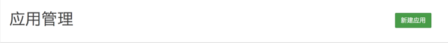
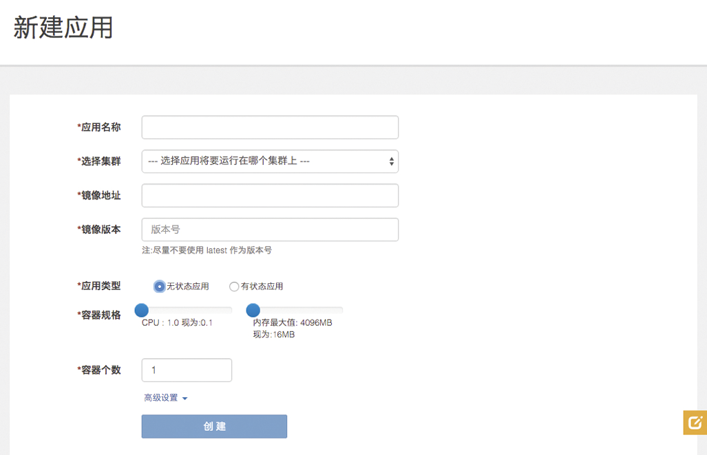
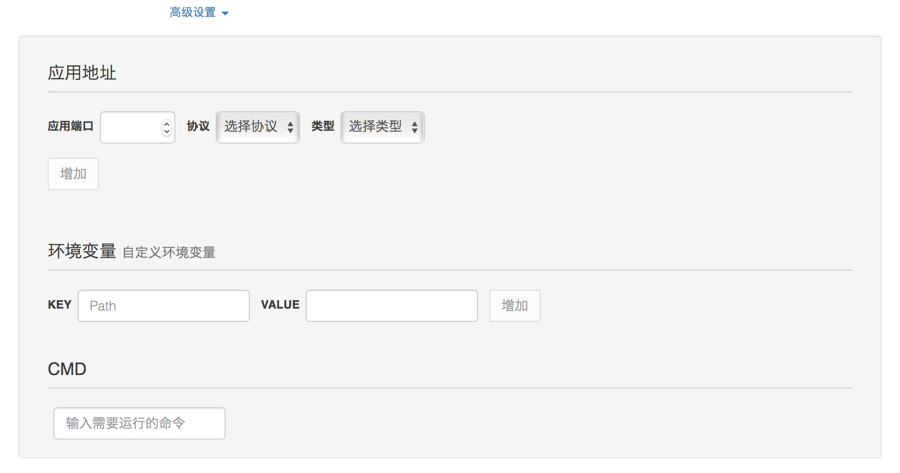

### 创建/删除应用

#### 新建应用

用户通过“应用管理”页点击“新建应用”，向指定的集群中部署一个新的应用。  

 

进入“新建应用”页面，新建一个应用：  

1. 填写应用名。同一集群中的应用不可重名，应用名不能包含下划线；  
2. 选择集群；选择部署该应用的集群；  
2. 填写镜像地址；在外网环境不理想或镜像文件较大的情况下，建议建立内网镜像库，便于镜像拉取；  
3. 填写镜像版本号；  
4. 选择容器数量，默认为1；  
5. 为应用预分配 CPU、内存；  
6. 选择应用类型。如果为无状态应用，该应用会被部署到“动态类型”的任意主机；如果为有状态应用，如 Mysql, Redis 等，要为该应用选择所要部署的“数据类型”的主机，并填写数据存放的主机目录和容器目录；  

  

应用也可以根据应用的不同，选择高级配置。  

1. 应用地址：将应用的端口映射为可访问端口；可以根据应用的协议类型选择 TCP 或 HTTP；如果应用提供对外访问服务，则应该定义为对外服务类型，数人云会将该服务端口映射到外部网关的域名或 IP；如果应用作为内部服务模块，则应该定义为对内服务类型，其端口将被映射到内部代理的制定端口。通过配置应用地址，可以方便地实现多实例服务的服务发现和负载均衡。
2. 环境变量：通过配置环境变量可以让应用获得该应用在运行过程中所以需要的参数；  
3. 启动命令：通知该应用在启动时所要执行的指令；  
注1：镜像需要由用户自己制作，或使用公共仓库的通用镜像；用户自己制作镜像时，建议不要使用 latest 作为版本号，便于后期的镜像版本更新；  
注2：新建应用时配置的端口、规格、环境参数等在应用成功运行后不能修改。  

#### 删除应用

用户可以删除一个应用，在应用管理页和应用详情页都有删除按钮可以删除应用。应用一旦被删除，相关的数据也将一并在集群中删除且不可通过数人云平台恢复。     
注：有状态应用在删除时，挂载的主机目录的数据不会删除；用户应尽快根据需要自行处理该数据，以免该应用再次部署时造成数据冲突。  

