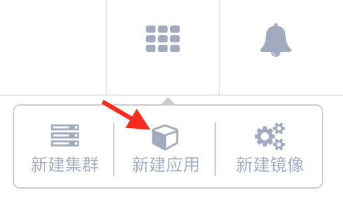
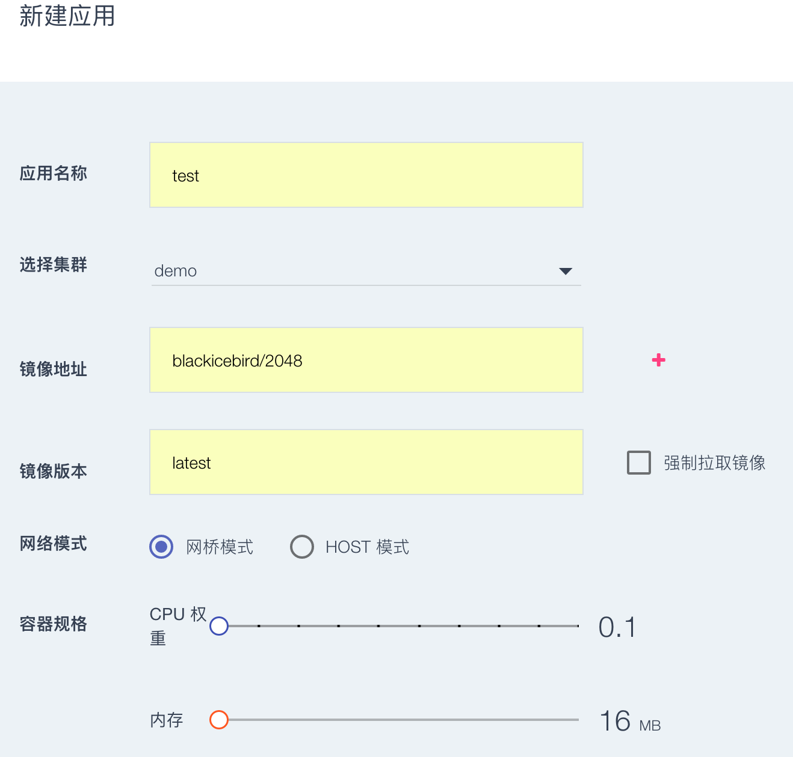
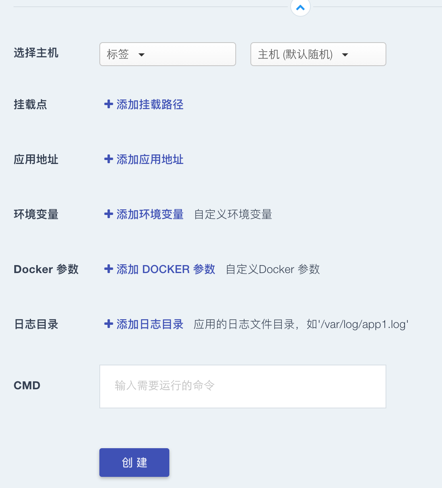
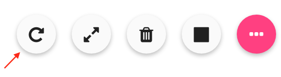
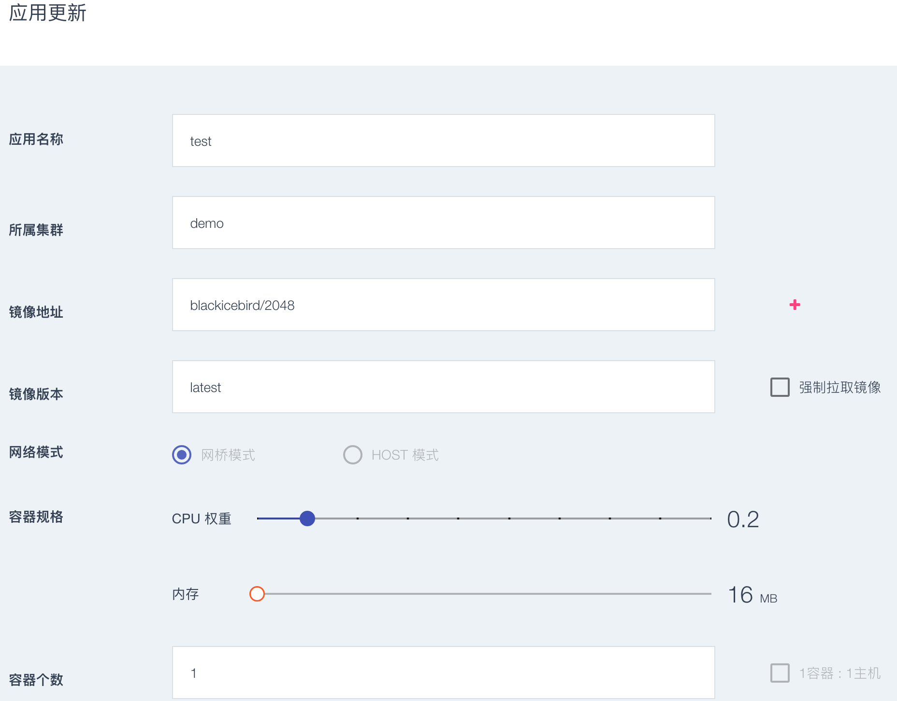
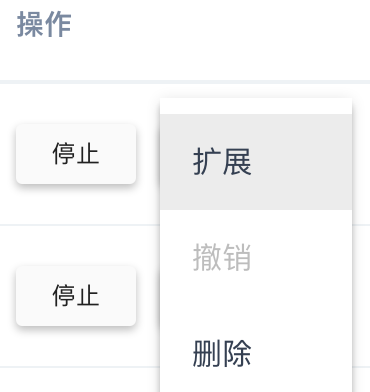

### 创建/删除应用

#### 新建应用

用户通过页面右上角的快捷入口，点击“新建应用”，向指定的集群中部署一个新的应用。  

  

进入“新建应用”页面，新建一个应用：
 
 * 填写应用名：同一集群中的应用不可重名；
 * 选择集群： 选择部署该应用的集群； 
 * 填写镜像地址：在外网环境不理想或镜像文件较大的情况下，建议建立内  网镜像库，便于镜像拉取；
 * 填写镜像版本号：按照使用的镜像版本号填写；
 * 强制拉取镜像：勾选后容器重启时自动更新最新镜像；
 * 网络模式：根据应用状态选择网桥模式或者host模式；
 * 容器规格： 为应用预分配 CPU、内存；
 * 容器个数：该应用初次创建的个数 。

  

也可以根据应用的不同，选择高级配置。  

*  挂载点：添写主机的目录，该目录会被挂载到容器内；

1. 应用地址：将应用的端口映射为可访问端口；可以根据应用的协议类型选择 TCP 或 HTTP；如果应用提供对外访问服务，则应该定义为对外服务类型，数人云会将该服务端口映射到外部网关的域名或 IP；如果应用作为内部服务模块，则应该定义为对内服务类型，其端口将被映射到内部代理的制定端口。通过配置应用地址，可以方便地实现多实例服务的服务发现和负载均衡。
2. 环境变量：通过配置环境变量可以让应用获得该应用在运行过程中所以需要的参数；  
3. docker参数： docker参数可以设定容器启动时参数；可以选择以下常用参数设置
      
   `add-host`    添加主机IP到容器
   
   `log-driver`  设置容器日志驱动
   
   `device`      添加主机设备给容器
   
   `dns-opt`      设置dns参数
   
   `log-opt`	   设置日志参数
  
  **注**
  
           如果参数设置有误，会导致容器无法发布成功，建议参照官方说明设置。
           数人云已经集成大部分常用设置，通常可以不设置该参数。
          
* 日志目录：容器内的日志存储文件
* 启动命令：通知该应用在启动时所要执行的指令。
**注**：镜像需要由用户自己制作，或使用公共仓库的通用镜像；用户自己制作镜像时，建议不要使用latest 作为版本号，便于后期的镜像版本更新；数人云支持自动构建镜像，参考镜像构建说明。

#### 更新应用

* 应用发布后可以通过更新操作，配置的端口、规格、环境参数等参数，点击应用名称。
  
   
    
* 对应用配置更新后，点击更新按钮、完成更新
     
   
    

应用更新时，状态会更新为部署中，部署中应用可以撤销。

**注**：如果应用发布时选择了host模式或者选择了1容器1主机模式，该应用不支持更新。

#### 删除应用

用户可以删除一个应用，在应用管理页和应用详情页都有删除按钮可以删除应用。应用一旦被删除，相关的数据也将一并在集群中删除且不可通过数人云平台恢复。     

* 注：有状态应用在删除时，挂载的主机目录的数据不会删除；用户应尽快根据需要自行处理该数据，以免该应用再次部署时造成数据冲突。  

