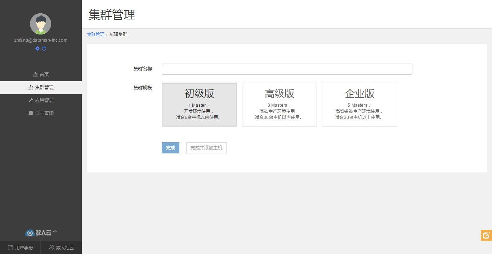

### 创建/删除集群

#### 创建集群

输入集群名称,选择集群规模，即建立一个新的集群。根据集群规模选择在集群中安装初级版，高级版或是企业版。
  * 初级版：1 Master，常用于开发环境，建议集群主机规模 < 6；
  * 高级版：3 Master，常用于小型生产环境或测试环境，建议集群主机规模 < 30;
  * 企业版：5 Master，常用于高容错性的分布式应用生产环境，建议集群逐级规模 >= 30。

    

#### 删除集群

用户在集群管理、集群详情页面都可以删除集群，确认删除后，数人云平台会停止集群上运行的所有应用、组件，但应用产生的业务数据依然保留在原主机上。  
注：有状态应用的数据仍会保留在主机上，不进行删除；所有，若要在同一台主机上重新发布一个曾今发布过的有状态应用，请注意移除之前应用的数据目录。  