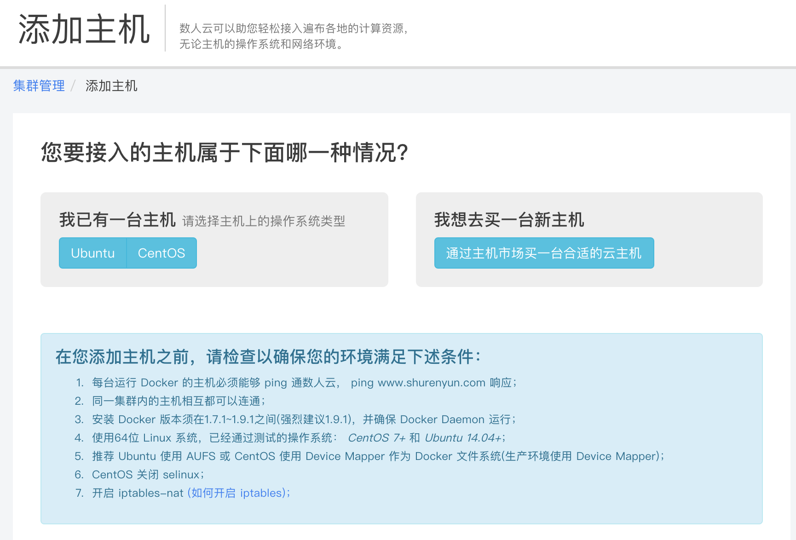
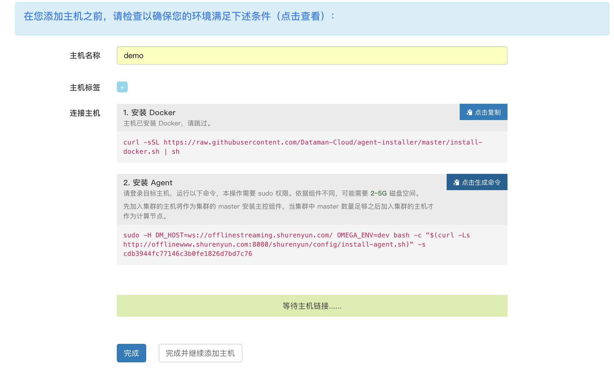
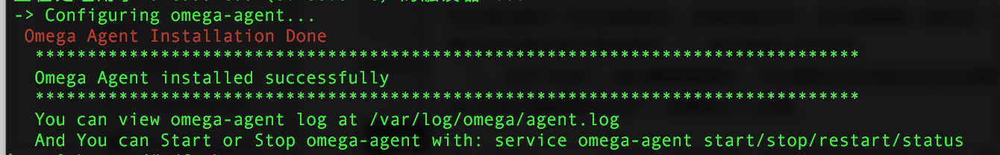
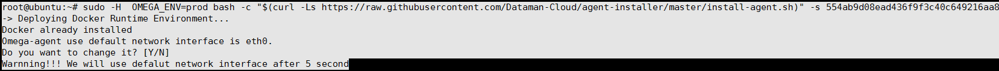
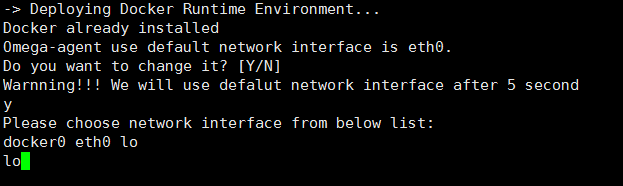
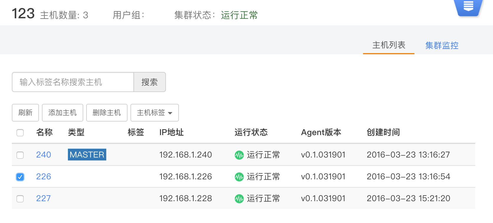

### 添加/删除主机

#### 添加主机

用户在集群管理页、集群详情页都可以找到“添加主机”。

    
  
  1. 待添加主机需要满足页面中提示的条件，根据用户主机情况选择相应按钮：跳转到
  
  
  2. 填写主机名；  
  3. 选择主机类型。鼠标放在类型选项上时会有相应的类型说明；  
  4. 如果主机未安装 Docker，可通过提示进行安装。如果已安装 Docker，跳过该步骤；  
  5. 点击“点击生成命令”，页面右上角提示“复制成功”；  
  6. 复制安装指令到主机，安装数人云的主机监控程序；  
  7. 待主机提示“Omega Agent installed successfully”，添加主机页面会提示“主机连接成功，系统初始化中，这可能需要一段时间，您可以离开本页面去执行其他操作。”，表示添加工作完成；
    
  8. 点击“完成”，返回集群管理页，可以看到正在初始化的主机图标。点击“完成并继续添加主机”，则重复以上步骤。  

注：当作为master的主机出现异常时，新添加其他主机进入集群，需要保证新加入要做master的这台为同样的IP。  

注意：若主机多个网卡，eth0又不是默认网卡，首先需要确定你的主机应该使用哪一个网卡， 你可以通过命令 ifconfig 查看网卡信息，然后找到你的主机用来与外部通信IP所在的网卡，该IP一般会是类似 192.168.111.23 或者 10.34.23.12 或者公网IP 123.234.123.344 等。 然后在添加主机时，安装agent时会有5秒的延时，默认选择eth0，如果不是，请及时输入Y , 然后将你第1步中确定的网卡输入到这里

#### 删除主机   
即将主机从该集群中删除，在集群详情页选择想要删除的主机，点击删除主机按钮并确认。
**删除主机并不删除主机上的应用数据，** 但会停止主机监控程序，即agent，从而无法通过数人云平台的集群管理访问该主机。     

   