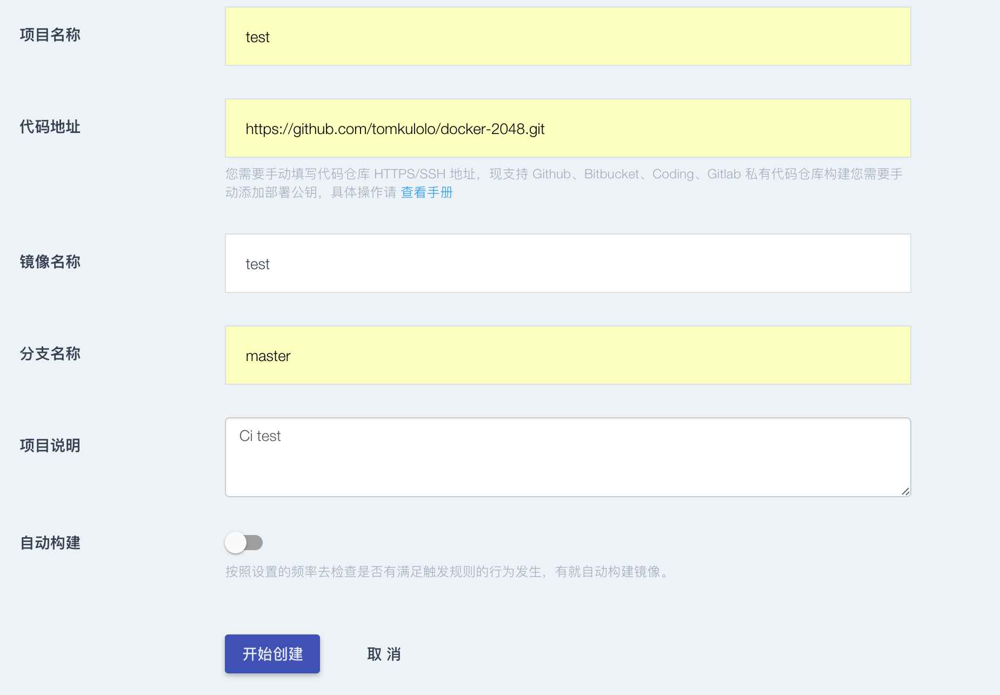
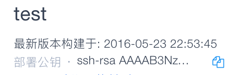
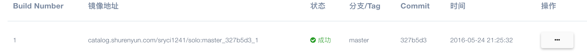

#### 新建镜像

   *  点击右上角的快速入口，点击右上角新建镜像按钮如图：
    
   
   
   * 项目名称：为该项目设置名称
   * 代码地址：需要手动填写代码仓库 HTTPS/SSH 地址，现支持 Github、Bitbucket、Coding、Gitlab 私有代码仓库构建。
   * 镜像名称：为镜像设置名称
   * 分支名称：选择镜像仓库的分支名称，若无分支填写master。
   * 项目说明：简要描述项目内容
   * 自动构建：若需要选是，否则选否
   * 自动构建时间：分5分钟，10分钟，半个小时三种选择。该时间为检查更新时间，若构建的镜像无变化，不启动构建操作。
   * 触发规则：可同时选择tag更新和代码分支更新。也可以根据需求单选其中一种。镜像将按照触发规则自动构建
   
   
   
   * 开始创建：配置完成，点击该按钮，跳转到查看镜像界面:
   * 注：此时一定要添加公钥到自己的代码仓库。
  
   
  
   * 点击上图中的部署公钥的复制图标，以github为例：点击自己的github用户图标－Settings-SSH keys-News SSH key
   * 新建Title，然后将刚刚复制的公钥消息复制到key内，点击Add SSH key，完成添加公钥操作。
   
   
  
   * 点击构建按钮，开始构建镜像操作，状态顺序为“等待中”，“构建中”、“成功”。如果显示失败，需要检查构建的日志信息（点击操作按钮），根据报错信息校正后重新构建，或者删除后重新构建。已经构建成功的镜像目前存在于数人云的私有仓库。
  
 
   
  
  * 注：自动构建镜像时，代码仓库要有Dockerfile及Dockerfile需要的相关文件以及yaml文件，yaml文件可以参照示例编写。
  
    
  
  *  yaml文件必须以.sryci.yaml命名：示例：
  
    	 
   			build:
  			  image: index.shurenyun.com/zhguo/golang:1.5.1
              commands:
                - echo 'done done'
                - go build -o hello
                
  * `image`对应的镜像为代码编译的基础环境，如果仓库的代码需要编译，该镜像需要安装编译代码的相关依赖，数人云的持续集成根据该yaml文件，拉取镜像。
  * `commands` 为镜像启动执行的命令，可以为多行，示例中的`go build -o hello`是将项目内的go语言代码编译成可执行文件，文件名`hello`。该镜像执行完编译后，会将编译后的程序包放在当前目录，以供构建程序镜像时使用。该`commands`的编译命令需要根据编译环境设置。
  *  如果项目中的文件已编译，如war包等，`commands`可以不设置编译命令。
  * 目前数人云对.sryci.yaml文件做了限制，仅`build`下的值生效，其余值会过滤。
  		 
  	
  