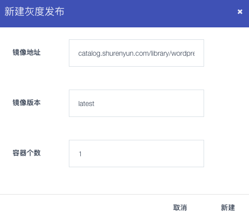
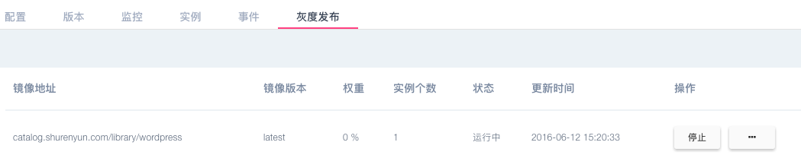
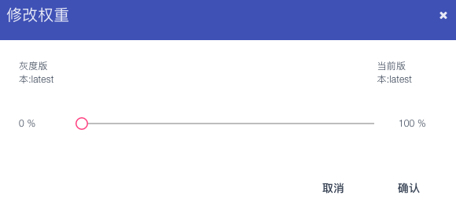

### 扩展/灰度发布
####弹性扩展

* 用户按照应用的需要扩充或缩减实例的个数，同样，在应用列表和应用详情都有扩展按钮可以进行这项操作。 点击`扩展`按钮。    

    

* 输入需要扩展到的容器数量，确认即可

   
 
 * 注: 扩展中的状态，可以通过该列菜单的撤销按钮，恢复到扩展前的容器数。
 * 注: 已有灰度发布的应用可以对灰度发布的版本扩展，但是不能对原有版本扩展，需要将灰度发布版本`正式部署`或者`删除`
 * 注:此处的`恢复`按钮为应用所在主机失联，集群还有其他可用资源，可用点击该按钮，再其他主机重新发布。
#### 灰度发布
* 应用列表处选择需要灰度发布的应用名称，选择`操作列表`中的`新建灰度`按钮，如图箭头所示：

   

* 如果镜像名称未做修改、修改镜像的版本号为待部署的版本，选择容器个数即可点击`新建`确认发布，其余参数，系统会默认为之前版本的参数设置。

   

* 应用灰度发布后，可以在灰度发布界面查看相应信息，也可以做相关扩展及设置与权重信息，如果选择正式部署，则会将该版本的应用作为部署版本完全替换原有应用

   
 
* `权重`该应用的请求会根据该值的设定，将网络流量按权重比重分发给新旧版本应用，该比重可以随时调整。

  

* `回滚`如果已经将灰度发布的版本正式部署，又希望恢复到原有版本，可以在`应用版本`内选择历史版本重新部署。
 
  
  
* 已有灰度发布版本的应用不能`新建灰度`，需要将现有的灰度版本`正式部署`或者`删除`，才能继续`新建灰度`。
* 注:发布应用时有端口映射的应用才可以做灰度发布。
