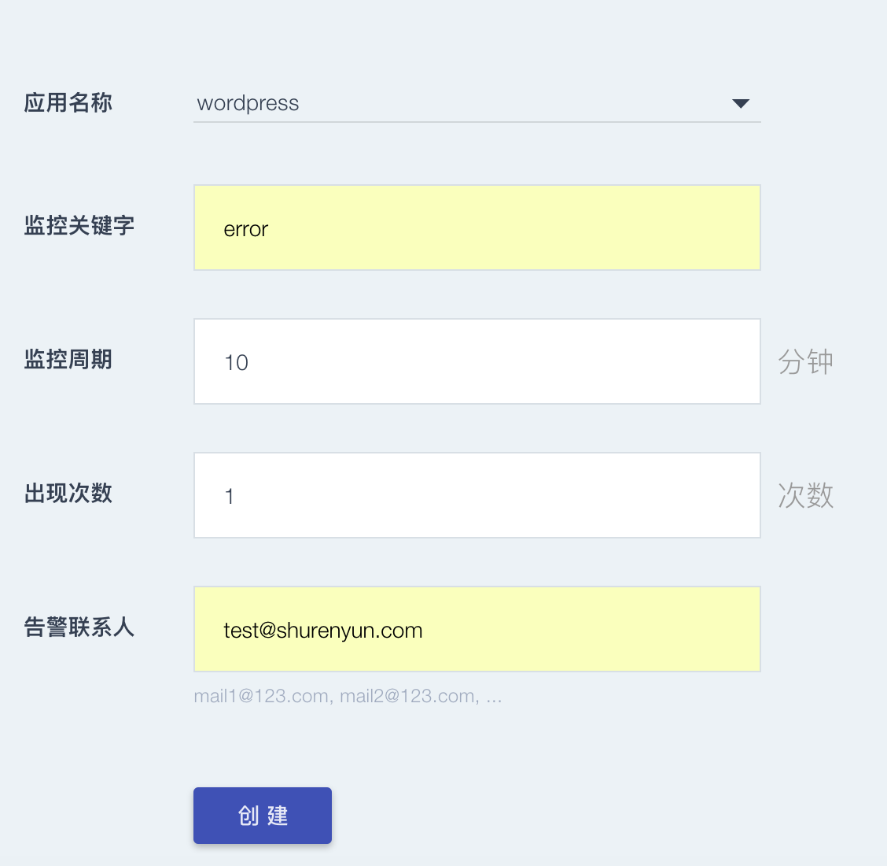
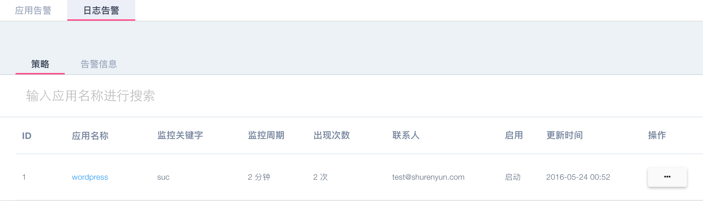

      
####日志告警
 我们为每个应用制定单独的告警策略、通过点击新建策略按钮，右上粉色方块按钮：如图：
 
   
  
  * 应用名称：选择需要告警的应用名称
  * 监控关键字：可以设置日志的关键字，设置多个关键字需要以“，”分隔
  * 监控周期：设置监控周期，最小值1分钟
  * 出现次数：当日志中监控关键字出现次数达到设定次数后，最小值为1次，触发告警，发送告警邮件
  * 告警联系人：设置告警邮件发送的email地址
  * 点击创建，服务策略日志告警主界面会显示该条策略，可用通过操作按钮选择该策略是否启动，所有创建的策略都可以做更新、删除操作
     
  * 告警信息界面可以显示已经触发告警的策略及告警信息，扩缩信息可以查看应用扩缩状态
     
    
    
  * 注：如果已经触发扩缩的策略，更新后的扩缩策略需要等到下一个监控周期生效。
  * 注：监控周期内累计达到监控关键字出现的次数才会触发扩缩，如果设置多个关键字，总的出现次数大于设置次数即可触发；即扩缩周期＝监控周期，与应用告警略有不同，应用告警的扩缩周期可以小于监控周期，只要监控周期内次数触发告警即触发扩缩。
