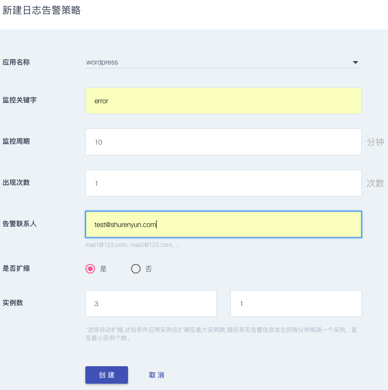

      
####日志告警
 我们为每个应用制定单独的告警策略、通过点击新建策略按钮，右上粉色方块按钮：如图：
 
   
  
   
  
  * 应用名称：选择需要告警的应用名称
  * 监控关键字：可以设置日志的关键字，谁知多个关键字需要以“，”分隔
  * 监控周期：设置监控周期，最小值1分钟
  * 出现次数：当日志中监控关键字出现次数达到设定次数后，最小值为1次，触发告警，发送告警邮件
  * 告警联系人：设置告警邮件发送的email地址
  * 点击创建，服务策略日志告警主界面会显示该条策略，可用通过操作按钮选择该策略是否生效，所有创建的策略都可以做更新、删除操作
  
     
      

    
  * 告警信息界面可以显示已经触发告警的策略及告警信息
 
    

