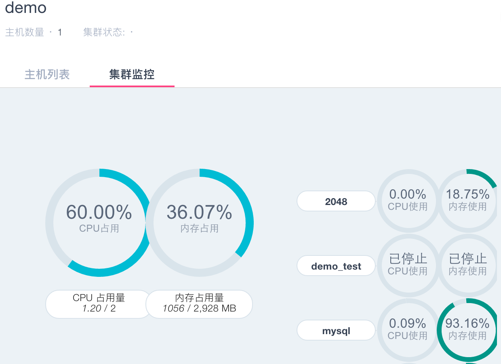
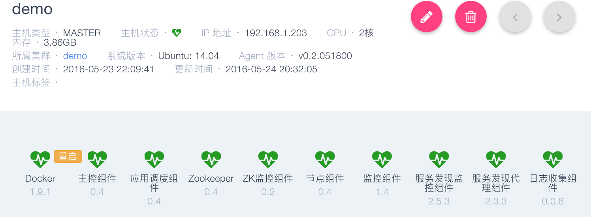

### 集群/主机监控

###集群状态

* 集群正常工作时，用户可以在集群详情页看到集群中有多少台主机，以及每一台主机的运行状态，Master 节点以大图标显示在上方，Slave 节点以小图标排列在下方。当集群中超过半数的 Master 节点为非正常状态时，集群也将被标识为异常状态。
* 主机状态分为：正常主机，失联主机，报警主机，初始化中主机，以颜色区分。     

###集群监控 

集群详情页可以进入集群监控页面，可以看到实时更新的集群资源占用情况，包括总集群的 CPU、内存用量，以及该集群中每个应用所占的资源。  

 

#### 主机监控

点击主机列表中的主机名称，会进入主机监控页面。  
主机监控页面共有三类信息：

1. 主机状态及各个组件状态,如果组件状态不是绿色，需要点击修复按钮修复。
2. 主机信息，包括 IP 地址，所属集群等；	
3. 主机的 CPU 、内存、磁盘、磁盘I/O、网络I/O监控图。。  

主机有4种运行状态：

*  正常，主机监控程序及数人云平台管理组件都正常运行，平台可以向主机分发应用、下发任务；    
*  异常，主机监控程序可以与数人云平台通信，但是管理组件已无法正常接收、执行平台下发的任务；    
*  失联，主机监控程序与数人云平台的通信中断；    
*  初始化中，主机监控程序正常运行，正在初始化数人云平台的管理组件。
*  注：若个别组件初始化失败，下图组件会显示红色，可以点击修复组件或重置组件。组件正常状态为绿色。

*  cpu监控：实时显示cpu占用情况，按使用百分比显示，多核cup以不同颜色区分。

*  内存监控：实时显示内存使用情况，按使用百分比显示。

*  磁盘监控：实时显示硬盘使用状况，按百分比显示。

* 硬盘I/O监控：实时显示硬盘I/O读写速率。

*  网络I/O监控：实时显示网络I/O传输速度。

