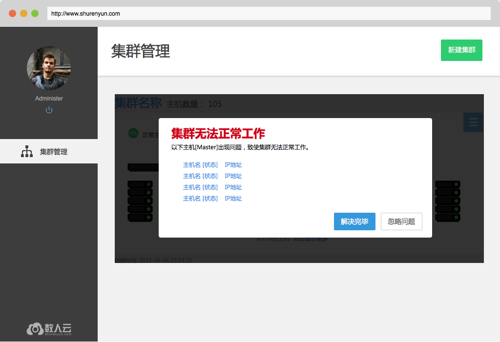

### 集群/主机监控

#### 集群详情

**集群正常状态**

集群正常工作时，用户可以在集群管理页看到集群中有多少台主机，以及每一台主机的运行状态。  
Master 节点以大图标显示在上方，Slave 节点以小图标排列在下方。     

**集群异常状态**

当集群中超过半数的 Master 节点为非正常状态时，集群也将被标识为异常状态，如下图所示。

   

**集群中的主机**

集群管理页和集群详情页（可由查看集群进入）都能看到集群中的主机，每个主机的图形、文字符号，也都可以转向主机的详情页面。     

  

**集群监控**  

集群详情页可以进入集群监控页面，可以看到实时更新的集群资源占用情况，包括总集群的 CPU、内存用量，以及该集群中每个应用所占的资源。  

 

#### 主机监控

点击主机列表中的主机名称，会进入主机监控页面。  
主机监控页面共有三类信息：

1. 主机状态及各个组件状态；
2. 主机信息，包括 IP 地址，所属集群等；	
3. 主机的 CPU 和内存监控图。  

主机有4种运行状态：

* 正常，主机监控程序及数人云平台管理组件都正常运行，平台可以向主机分发应用、下发任务；    
* 异常，主机监控程序可以与数人云平台通信，但是管理组件已无法正常接收、执行平台下发的任务；    
* 失联，主机监控程序与数人云平台的通信中断；    
* 初始化中，主机监控程序正常运行，正在初始化数人云平台的管理组件。

  