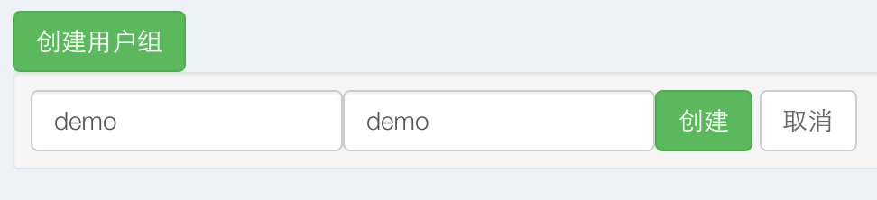
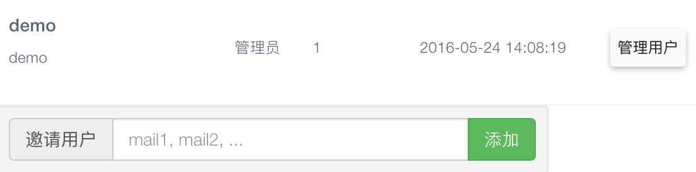

   
####用户组管理

  *  点击创建用户组，设置用户组名称及描述，创建用户组之后，在创建集群时可以选择关联的用户组。
      
       
       
  *  注：组成员互相不可见，成员可以在组内集群发布应用，查看组内应用状态，但是不能维护非本人创建的集群和发布的应用。

  *  点击管理用户，可以邀请组成员，填写用户的邮箱，且该邮箱为数人云用户，可以成功邀请，被邀请的用户会收到邀请邮件，点击邮件内的接受邀请，即可成功加入用户组。如不想加入，忽略邀请即可。
   
    
  
  * 管理员用户可以显示管理用户和删除用户组，组内成员显示为离开用户组。
   
   
    
    