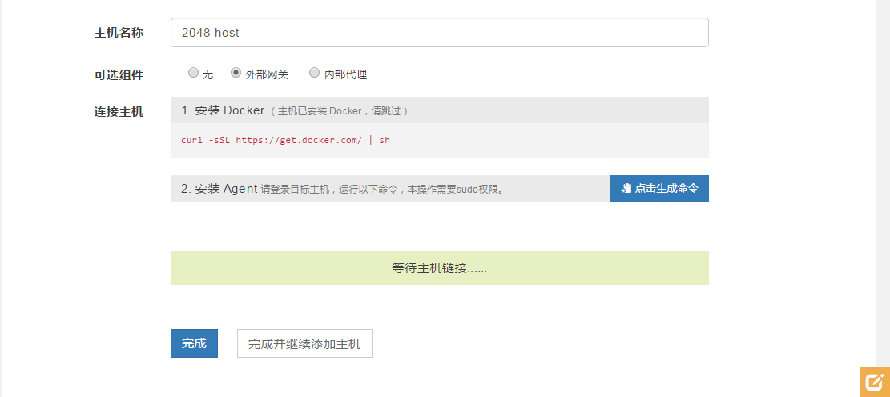
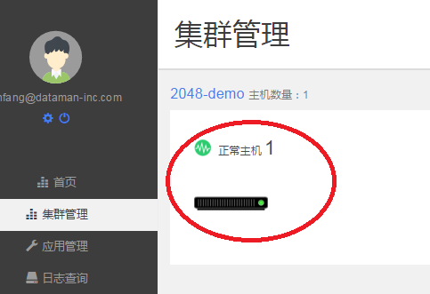
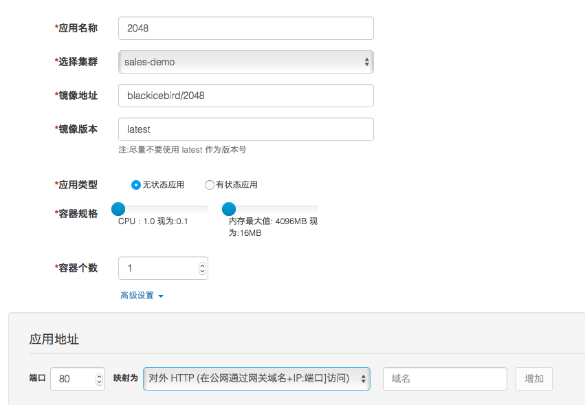
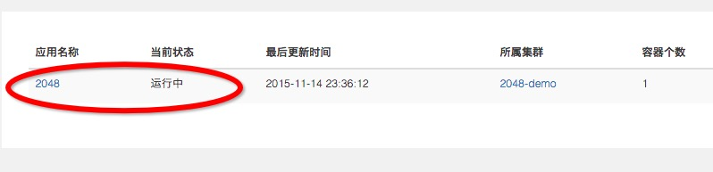
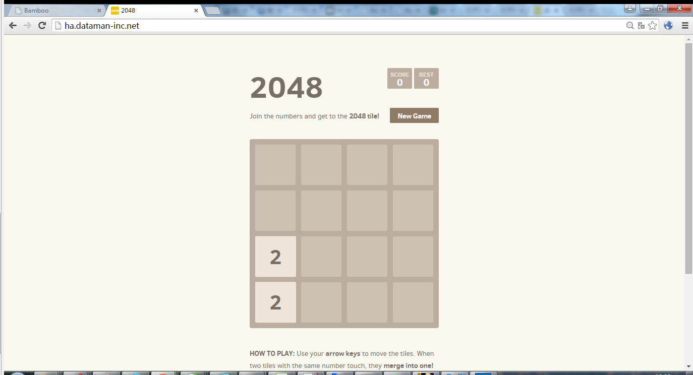

# 用数人云两步发布2048游戏应用

## 第一步建立集群（应用发布环境）

只需要准备一台主机，建议选择带公网IP地址的主机。

主机可以是可以连接互联网的物理主机，也可以是阿里云、Ucloud、 AWS、Azure、首都在线、华为云等公有云上购买的任意一台云主机。

### 1 新建集群

* 登录账户后，在集群管理中，点击"新建集群"

* 填写集群名称（2048-demo），选择初级版 1 Master集群，点击完成。（如图所示）

### 2 添加主机

* 点击"添加主机"，填写主机名"2048-host", 将主机类型设置为"计算节点"和"外部网关"，并根据提示在您的主机上依次执行以下命令来安装Docker和Agent. 安装完毕后点击"完成"即可。（如图所示）

注：外部网关节点需要配置可访问域名或外网 IP，以便实现外网访问。

* 确认主机正常运行，如图所示：

## 第二步新建2048应用

### 1 找到或制作2048游戏镜像

我们选择Docker官方镜像库的2048游戏镜像，镜像地址是：

blackicebird/2048

### 2 新建2048游戏应用

* 选择"应用管理"中的"新建应用"
* 填写"应用名称"，选择集群"2048-demo"
* 填写镜像地址： ，镜像版本：latest
* 高级设置中将端口80，映射为"对外HTTP访问"，映射到外部网关节点的域名或对外 IP ，如图所示：

* 确认应用正常运行,如图所示：

## let's play !

通过主机的外网IP地址，或与该主机绑定的域名，就可以访问2048游戏啦！

