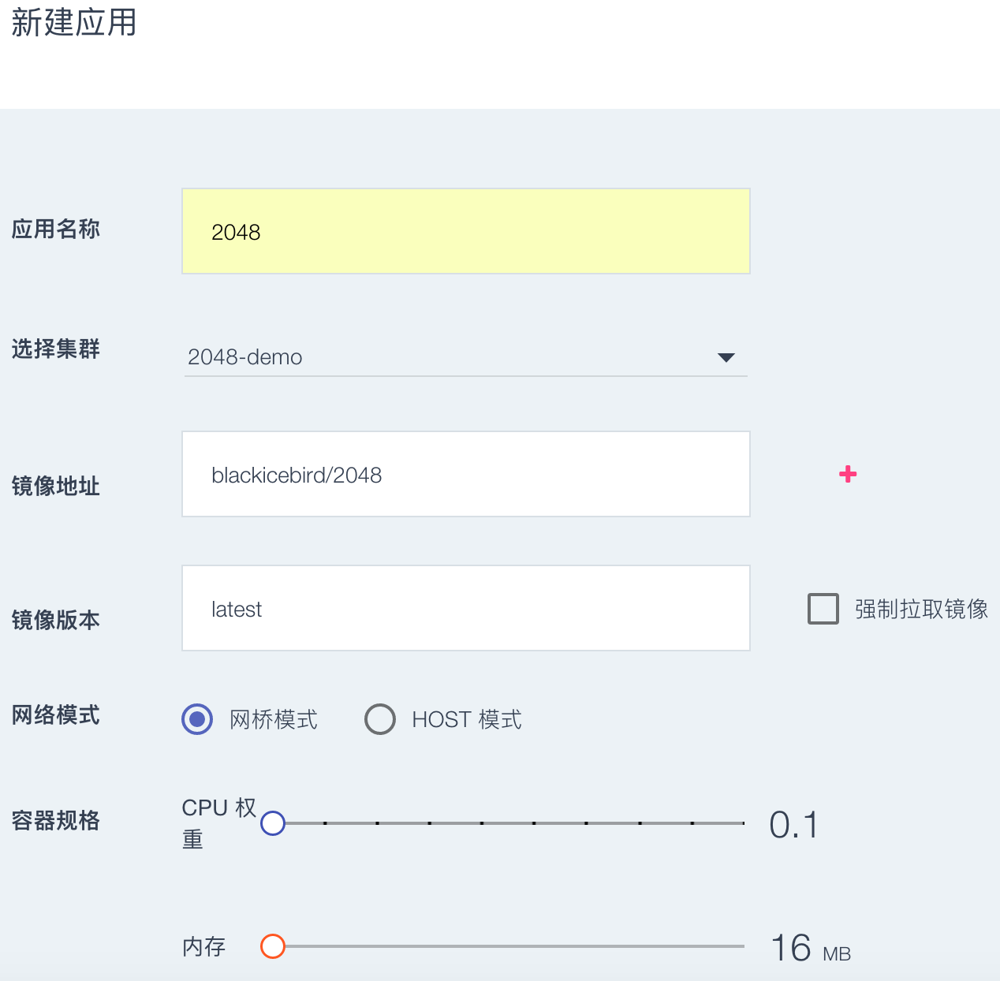

# 用数人云两步发布2048游戏应用

通过这个例子，可以了解如何建立一个最小规模的实验集群，并且发布一个单机应用。  

## 第一步建立集群（应用发布环境）

只需要准备一台主机，建议选择带公网IP地址的主机来演示。  

主机既包括可以连接互联网的物理主机，也可以是阿里云、UCloud、 AWS、Azure、首都在线和华为云等公有云上购买的任意一台云主机。  

### 1 新建集群

* 登录账户后，请在左侧边栏的“集群管理”中，点击"新建集群";

* 填写集群名称“2048-demo”，选择初级版 1 Master集群，点击“完成”。（如图所示）

### 2 添加主机

* 点击添加主机，点击选择接入主机的操作系统类型；没有主机可以通过云主机市场购买一台;

* 点击"添加主机"，填写主机名"2048-host",将可选组件设置为"外部网关"；  
* 请通过 SSH 登录到待添加的主机上，首先确认 Docker 软件包已经安装，并且 Docker deamon 已经运行；  
* 请点击 2 中的“点击复制”，并且登录目标主机运行刚刚复制的命令，安装数人云的 Agent；

* 当agent安装完成时，状态条显示“主机已经连接”。
* 当状态条显示“主机已经连接”，既可以点击"完成"。（如图所示）

>注1：“外部网关”节点需要配置公网 IP，最好有相应的域名，以便从外网访问。  
>注2：你可以执行 `docker --help` 命令来确认该主机是否已经安装了 Docker 软件包。  

* 确认主机正常运行，如图所示：

## 第二步新建2048应用

### 1 找到或制作2048游戏镜像

我们选择Docker官方镜像库的2048游戏镜像，镜像地址是：

blackicebird/2048

### 2 新建2048游戏应用

* 请在左侧边栏的"应用管理"中选择"新建应用"
* 填写"应用名称"，然后选择刚才建立的集群"2048-demo"
* 填写镜像地址： blackicebird/2048
* 填写镜像版本：“latest”（如果是您的应用，建议不要使用 latest，便于版本控制） 
* 强制拉取镜像：指每次重启容器时自动更新最新镜像。
* 选择主机：可以通过指定标签选择主机运行，默认为随机选择主机。
* 应用模式：网桥模式（对应 Docker 的 bridge 模式）

因为我们想通过公网能够访问到2048的游戏，需要进行在高级设置中添加应用地址。场景为：  
游戏2048在容器内的端口是 80。希望能在公网上通过域名XXX.XXX.XXX 来访问2048。因为采用了域名，自然公网端口是默认的 80。  

* 在高级设置中设置应用地址，此处将“应用端口”设为 80，选择 “HTTP”协议。此处容器内访问应用的端口，例如 Tomcat 默认是8080，MySQL 默认是3306。
* 选择“对外”类型，因为我们希望此服务在公网上可以访问。
* 选择“有域名”，使用域名访问时公网暴露的端口强制为 80。如果是通过IP访问，则可以任意指定外网暴露的端口。
* 域名为用户需要访问应用的域名。
* 务必点击“添加”按钮，此配置才生效。

* 应用的发布需要一定时间。在左边栏“应用管理”中确认应用的状态为“运行中”,如图所示：

## let's play !

通过主机的外网IP地址，或与该主机绑定的域名，就可以访问2048游戏啦！

