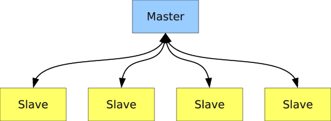
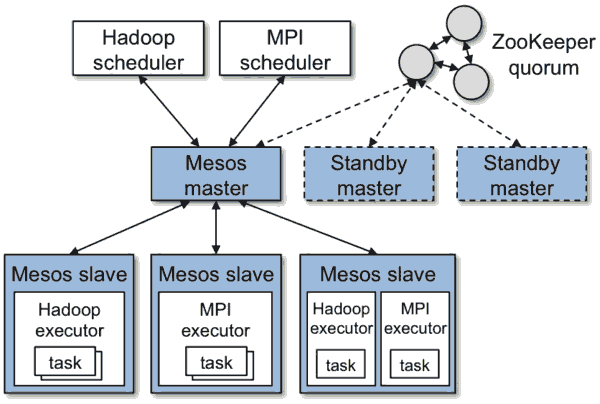

## 词汇表  

### 集群部署  
“集群”，顾名思义，是由多个计算机组成，但不仅仅是机器的堆砌；作为一个整体，集群用来提供高质量不间断的服务，具有很高的容错性；而集群中的单个节点（一般指机器）实现功能上相同或者互补的服务，一旦宕机，可以瞬间被其它节点取代。  
一般而言，集群的架构都遵从 Master/Slave 结构，Master 主要负责调度，Slave 主要负责运行计算任务。  
  
Apache Mesos系统作为一个集群资源管理调度系统，可以用来管理Docker集群。同其他大部分分布式系统一样，Mesos为了简化设计，也是采用了 Master/Slave 结构；为了解决 Master 单点故障，将 Master 做得尽可能地轻量级，其上面所有的元数据可以通过各个 Slave 重新注册而进行重构，故很容易通过 Zookeeper 解决该单点故障问题。  
Mesos 可以轻松支持 Hadoop，MPI，Spark 等计算框架，并支持在同一集群下的资源混用；同时，Mesos 和 Docker 可以做到无缝结合，通过 Marathon 可提交服务性应用，通过 Chronos 可提交批处理性应用。   
  
通过数人云，可以在你的虚拟机或物理机之上快速部署 Mesos。你可以根据计算节点的数据量灵活的选取单 Master、3 Master、或5 Master 的集群规模。选择 Master 数量后，数人云会将最先加入集群的几个节点定义为 Master 节点，而将后加入的节点都定义为 Slave 节点。
Master 节点作为集群调度的中心节点，一旦被删除或出现故障，则整个集群将不可用，而多 Master 的集群可以在很大程度上确保该集群的高可用性。

### 微服务  
微服务是一种新兴的应用软件架构，它通过一组服务的方式来构建一个应用，服务独立部署在不同的进程中，不同服务通过一些轻量级交互机制来通信，例如 REST。每个服务可独立扩展伸缩，并且定义了明确的边界，不同的服务甚至可以采用不同的编程语言来实现，由独立的团队来维护。  

微服务架构有很多好处:  
  1. 通过将巨大的单体式应用分解为多个服务,解决了复杂性问题。在功能不变的情况下，应用被分解为多个可管理的分支或服务。每个服务都有一个用 REST API 定义清楚的边界。微服务架构给采用单一编码方式很难实现的功能提供了模块化的解决方案，而单个服务很容易开发、理解和维护。  
  2. 这种架构使得每个服务都可以由专门的开发团队进行开发。开发者可以自由选择开发技术，提供API服务。当然，许多公司试图避免混乱，只提供某些技术选择。然后，这种自由意味着开发者不需要被迫使用项目初期所采用的过时技术，他们可以选择最新的技术。因为服务都是相对简单，所以即使用现在技术重写以前代码也不是很困难的事情。  
  3. 微服务架构要求每个微服务做到独立部署。开发者不再需要协调其它服务部署对本服务的影响。这种改变可以加快部署速度。微服务架构模式使得持续化部署成为可能。  
  4. 微服务架构模式使得每个服务可以独立地扩展。你可以根据每个服务的业务量来部署满足其需求的规模。  

### 服务发现  

服务发现的基本思想是，任何一个应用的实例能够以编程的方式获取当前环境的细节，而新的实例可以嵌入到现有的应用环境而不需要人工干预。服务发现工具通常是用全局可访问的存储信息注册表来实现，它存储了当前正在运行的实例或者服务的信息。大多数情况下，为了使这个配置具有容错与扩展能力，这个工具以分布式形式存储在多个节点上。  

服务发现减少或消除了组件之间的“手动”连接。当你把你的应用程序推送进生产环境的时候，所有的这些事情都可以配置：数据库服务器的主机和端口，REST 服务的 URL 等等。在一个高可扩展的架构中，这些连接可以动态改变。一个新的后端可以被添加，一个数据库节点也可以被停止，你的应用需要适应这种动态环境。  

数人云共提供五种服务发现方式：  
  1. 对外标准HTTP  
公网HTTP服务，通过应用域名和端口80访问   
例如:http://app1.xyz.com  
  2. 对外HTTP  
公网HTTP服务，通过网关节点IP和指定的端口访问  
例如: http://8.8.8.8:8080  
  3. 对外TCP  
公网TCP服务，通过网关节点域名和指定的端口访问  
例如: telnet apps.xyz.com 3306  
  4. 对内HTTP  
内网HTTP服务，通过代理节点IP和指定的端口访问  
例如: http://192.168.1.1:8080  
  5. 对内TCP  
内网TCP服务，通过过代理节点IP和指定的端口访问  
例如: telnet 192.168.1.1 3306  

注：对外服务发现要求网关节点配置公网 IP；如果是对外标准 HTTP 服务，则需要配置域名。  

### 容器服务  

容器采用沙箱机制，相互之间不会有任何接口（类似 iPhone 的 app），几乎没有性能开销，可以很容易地在机器和数据中心中运行。最重要的是，他们不依赖于任何语言、框架以及系统。  
Docker是一个开源的应用容器引擎，让开发者可以快速打包应用以及依赖包到一个可移植的容器中，然后发布到任何主流的 Linux 主机上。  
数人云采用目前流行的Docker容器，基于 Mesos 集群调度工具，能轻松管理和调度成千上万个容器，做到秒级启动，秒级销毁，并且能做到大规模的负载均衡。  
数人云提倡客户采用微服务架构，将微服务架构应用的服务进行容器化，作为云计算应用交付的标准。这样的好处是，不仅能保持应用环境的一致性，让开发和运维等从烦杂的环境构建中解脱出来，还可以轻松做到容错性、高可用、横向扩展等特性。  

