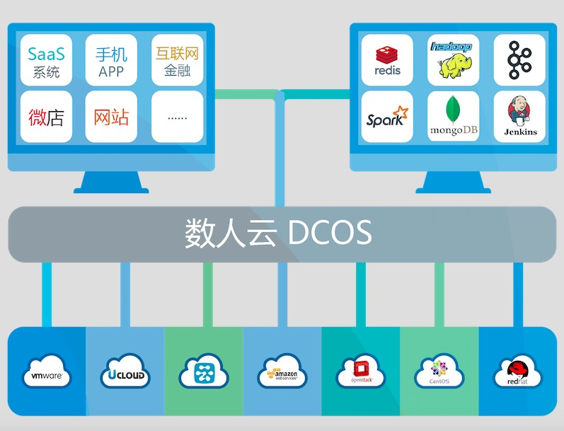

# 数人云

“数人云”—云操作系统，是一款部署在公有云或者私有云（IDC）之上的应用运维软件，旨在帮助用户在云端快速建立并稳定运维一个高性能生产环境。  

通过数人云，用户可以快速整合不同环境下的主机资源，部署海量应用。通过领先的 Mesos 和 Docker 技术，数人云可以为用户的业务系统带来高可用的服务质量，快速的性能伸缩，高效的资源利用以及便捷的可视化管理和监控；同时，数人云保证用户的服务资源和数据完全为用户私有可控。  

  

