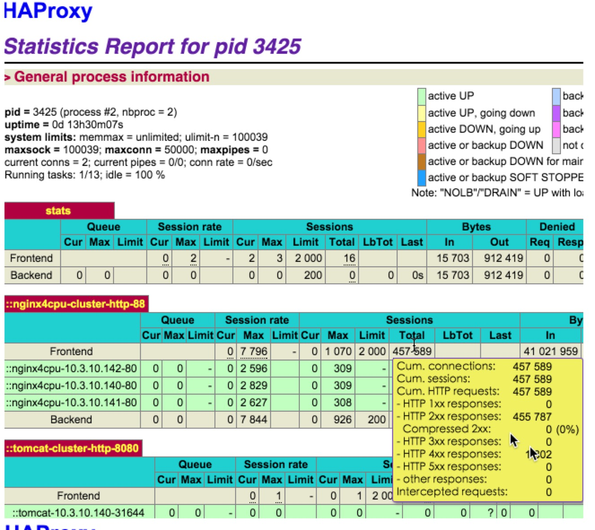
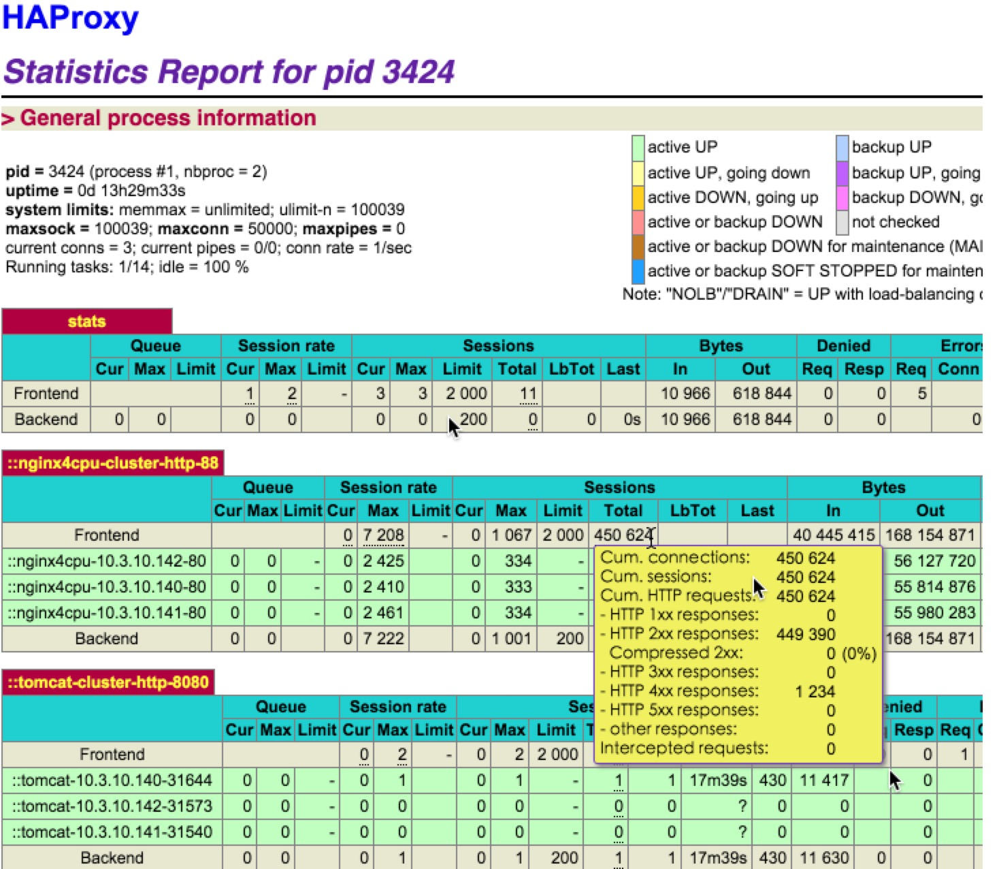

# 数人云测试报告

通过阅读本章您可以对数人云的性能有一个大致了解

## 测试报告

### 高并发，大 qps 测试
首先，我们的架构需要硬负载（譬如F5）与软负载（`Haproxy`）结合使用。 我们会根据流量预估来提前铺设（可自动或手动）多个`HAproxy`实例及相应的业务层实例。接下来，当请求到达时，硬负载首先将请求均衡到后面的某个`HAproxy`上，然后，`HAproxy`再把相应的请求负载均衡转到它后面的业务层实例上。这其中的`Haproxy` 与 业务层实例都可以横向扩展。

下面是不考虑硬负载性能的情况下， 我们对 `Mesos` 集群 及 `Haproxy` 的测试结果：

#### Mesos 集群性能测试
在我们铺设的实验环境，Mesos 集群在

* 3 个 master 节点
* 500 台虚拟机
* ubuntu 14.04 x86 * 2核4G

前提下， 经测试可以承载10000个 docker 容器（nginx）。


#### 数人云网关节点（HAproxy）的性能测试

- 我们目前没有在物理机上压测过，下面是官网发布的物理机上的测试结果

   10G的网卡，8KB的测试包，HAproxy 每秒能处理 2万5千个请求
   
   参考链接： [HAproxy官网10G Nic 测试](http://www.haproxy.org/10g.html)

- 我们在 2核4G的 ucloud 云主机上的测试结果
    - 承载云主机的物理机：未知
    - 网卡：未知
    - 虚拟机
        - 2vcpu
        - 4G mem
        - ubuntu 14.04 64位
    - 测试架构： 
       
       apache benchmark -> HAproxy -> 3 个 Nginx实例
       
    **测试1**
    
    传输 128字节，使用apache benchmark 进行测试， HAProxy 负载均衡到后面3个实例，它大约能承载每秒 2000 个并发， 11000个请求。另外，cpu使用率高于 90%, 内存使用率低于 300M。

    ```
    root# ab -n 100000 -c 1500 http://10.3.10.138:88/128.html
    This is ApacheBench, Version 2.3 <$Revision: 1528965 $>
    Copyright 1996 Adam Twiss, Zeus Technology Ltd, http://www.zeustech.net/
    Licensed to The Apache Software Foundation, http://www.apache.org/


    Benchmarking 10.3.10.138 (be patient)
    Completed 10000 requests
    Completed 20000 requests
    Completed 30000 requests
    Completed 40000 requests
    Completed 50000 requests
    Completed 60000 requests
    Completed 70000 requests
    Completed 80000 requests
    Completed 90000 requests
    Completed 100000 requests
    Finished 100000 requests


    Server Software:        nginx/1.8.0
    Server Hostname:        10.3.10.138
    Server Port:            88

    Document Path:          /128.html
    Document Length:        128 bytes

    Concurrency Level:      1500
    Time taken for tests:   8.756 seconds
    Complete requests:      100000
    Failed requests:        0
    Total transferred:      44000000 bytes
    HTML transferred:       12800000 bytes
    Requests per second:    11420.69 [#/sec] (mean)
    Time per request:       131.341 [ms] (mean)
    Time per request:       0.088 [ms] (mean, across all concurrent requests)
    Transfer rate:          4907.33 [Kbytes/sec] received

    Connection Times (ms)
                  min  mean[+/-sd] median   max
    Connect:        0   35  43.5     34    1081
    Processing:    11   96  55.8     90    1169
    Waiting:       11   82  55.8     75    1143
    Total:         51  130  66.9    127    1179

    Percentage of the requests served within a certain time (ms)
      50%    127
      66%    134
      75%    137
      80%    140
      90%    151
      95%    161
      98%    182
      99%    227
     100%   1179 (longest request)
    ```

    


    **测试2**

    传输256字节， 使用apache benchmark 进行测试， HAProxy 负载均衡到后面3个实例，它大约能承载每秒 2000 个并发， 11000个请求。另外，cpu使用率高于 90%, 内存使用率低于 350M。

    ```
    root# ab -n 100000 -c 1500 http://10.3.10.138:88/256.html
    This is ApacheBench, Version 2.3 <$Revision: 1528965 $>
    Copyright 1996 Adam Twiss, Zeus Technology Ltd, http://www.zeustech.net/
    Licensed to The Apache Software Foundation, http://www.apache.org/

    Benchmarking 10.3.10.138 (be patient)
    Completed 10000 requests
    Completed 20000 requests
    Completed 30000 requests
    Completed 40000 requests
    Completed 50000 requests
    Completed 60000 requests
    Completed 70000 requests
    Completed 80000 requests
    Completed 90000 requests
    Completed 100000 requests
    Finished 100000 requests


    Server Software:        nginx/1.8.0
    Server Hostname:        10.3.10.138
    Server Port:            88

    Document Path:          /256.html
    Document Length:        256 bytes

    Concurrency Level:      1500
    Time taken for tests:   8.945 seconds
    Complete requests:      100000
    Failed requests:        0
    Total transferred:      56900000 bytes
    HTML transferred:       25600000 bytes
    Requests per second:    11179.86 [#/sec] (mean)
    Time per request:       134.170 [ms] (mean)
    Time per request:       0.089 [ms] (mean, across all concurrent requests)
    Transfer rate:          6212.25 [Kbytes/sec] received

    Connection Times (ms)
                  min  mean[+/-sd] median   max
    Connect:        0   40  57.5     40    1037
    Processing:     4   89  83.1     82    1129
    Waiting:        4   75  83.2     66    1119
    Total:         38  130  98.4    124    1149

    Percentage of the requests served within a certain time (ms)
      50%    124
      66%    131
      75%    134
      80%    136
      90%    144
      95%    153
      98%    179
      99%    287
     100%   1149 (longest request)
     ```

     
