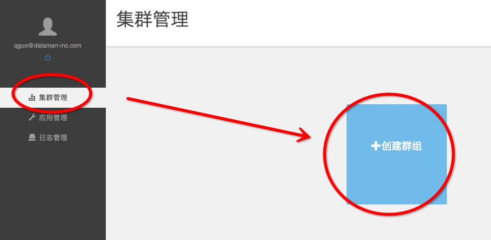
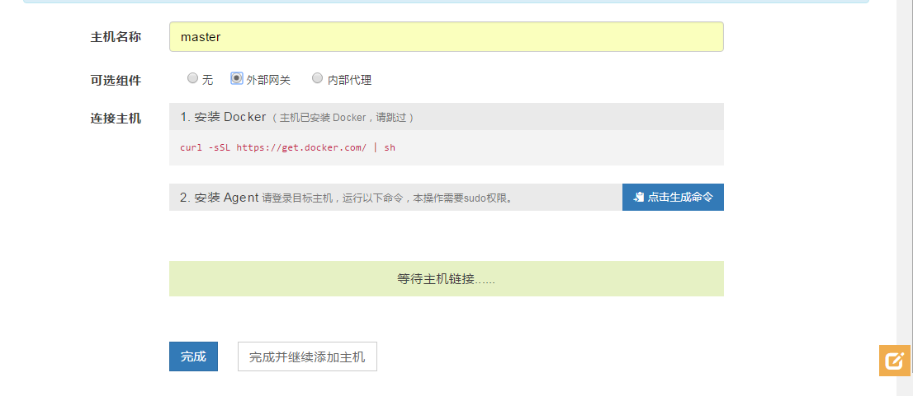
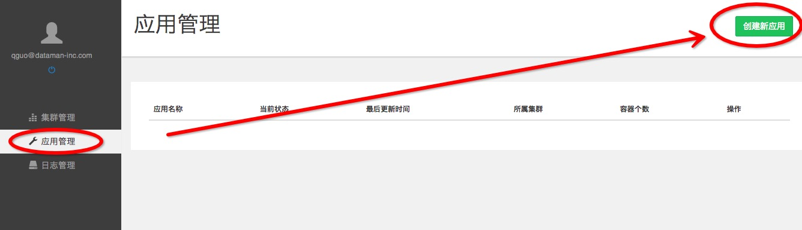
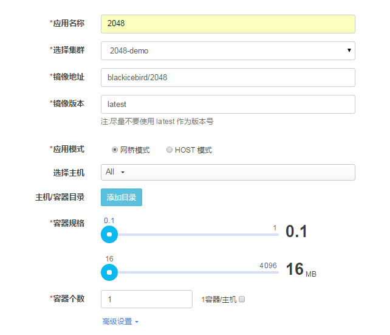
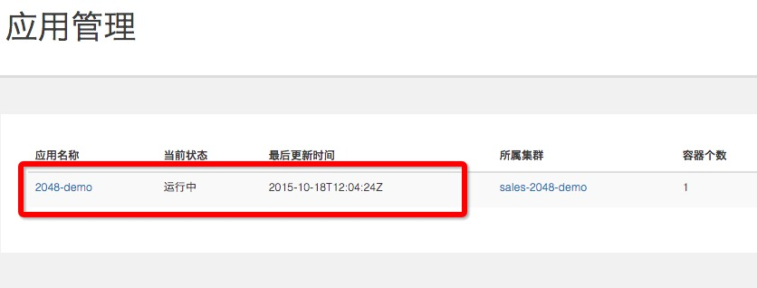
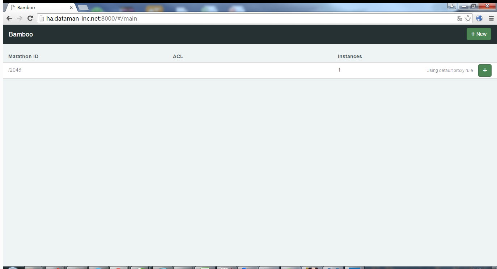
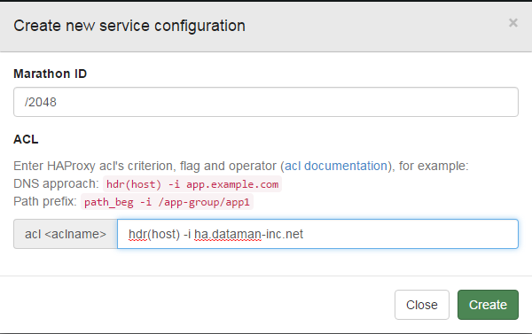
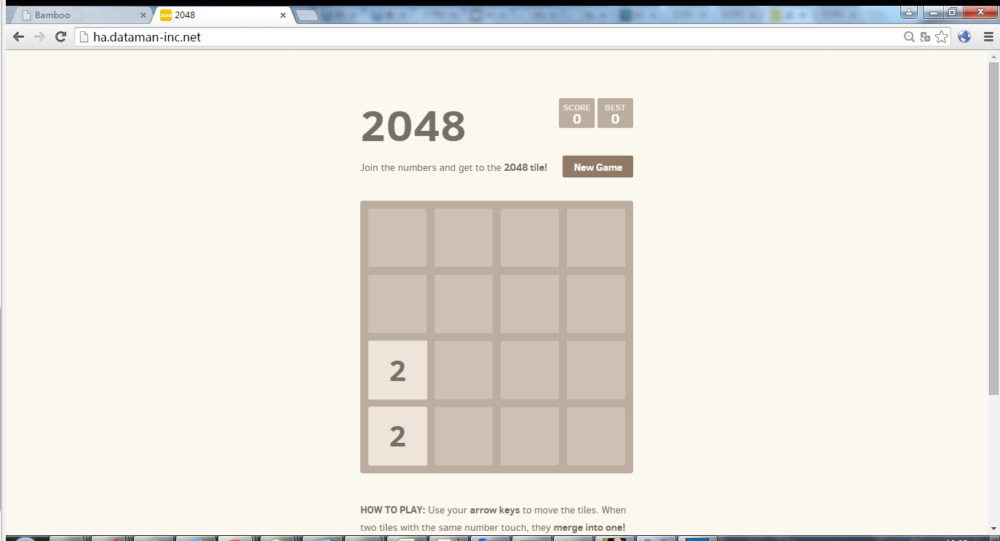

# 用数人云三步发布2048游戏应用
## 目录
### [第一步建立集群](#step1)
### [第二步发布应用](#step2)
### [第三步服务发现](#step3)

<h2 id="step1">第一步建立集群（应用发布环境）</h2>

### 1.1 注册&登录数人云

访问 [www.shurenyun.com](http://www.shurenyun.com) 注册并登录系统。

备注：数人云目前是内测期，如您需要邀请码，请填写免费试用表单申请。  

[免费试用>>](http://form.mikecrm.com/f.php?t=CgBTTT)

### 1.2 准备主机

需要准备至少一台主机，主机可以是可以连接互联网的物理主机，也可以是阿里云、Ucloud、
AWS、Azure、首都在线、华为云等公有云上购买的任意一台云主机。

### 1.3 建立集群

1.3.1 登录账户后，在集群管理中，点击创建群组。（如图所示）

1.3.2 填写集群名称（sales-2048-demo），选择 1 Master集群，点击完成。

备注：本例是demo，所以选择 1 Master 集群即可。

集群已经建立，如下图所示：

### 1.4 添加主机

1.4.1 添加主机，如图点击右上角下拉菜单，选择添加主机。

1.4.2 填写主机名称，并在主机上根据"连接主机"的提示进行操作。

（1）安装Docker

	curl -sSL https://get.docker.com/ | sh

（2）安装 Agent

	curl -Ls https://www.shurenyun.com/install.sh | sudo -H sh -s 050f9bb687234f0e9e1e304aa7ddb0ba

执行以上两步后，点击"完成"即成功添加主机。

提示：向同一集群添加的主机应存在于同一网段内，暂不支持跨公网的主机组建集群。

### 1.5 确认集群环境正常

主机添加完成后，检查主机运行是否正常，如图所示：

<h2 id="step2">第二步发布应用</h2>

### 2.1 找到或制作2048游戏镜像

我们选择Docker官方镜像库的2048游戏镜像，镜像地址是：

hub.docker.com/alexwhen/docker-2048

### 2.2 新建2048游戏应用

2.2.1 选择"应用管理"中的"创建应用"，如图所示：

2.2.2 创建应用

填写应用名称:2048-demo

添加应用镜像地址：alexwhen/docker-2048

选择容器规格和集群

填写镜像版本，一般为：latest

如图所示：

### 2.3 确认应用正常运行

回到应有管理中，即可看到应用已正常运行。

<h2 id="step3">第三步服务发现，let's play !</h2>

### 3.1 环境说明
- 注意：请将Bamboo安装到Master主机中
- Ubuntu 14.04.3 LTS
- 内核版本 3.13.7-031307-generic
- docker version： 1.8.1
- Storage Driver: aufs
- 与mesos集群内在同一内网

### 3.2 Bamboo和Haproxy的安装步骤

### 3.2.1 通过 docker 镜像安装Bamboo和Haproxy
    docker pull registry.dataman.io/centos7/bamboo-0.24.0-haproxy-1.5.4:omega.v0.2.19

### 3.2.2 docker参数启动
    vi bamboo.sh
    docker run -d \
        -e "MARATHON_ENDPOINT"="http://marathonip1:8080,http://marathonip2:8080,http://marathonip3:8080" \
        -e "BAMBOO_ENDPOINT"="http://bambooip:8000" \
        -e "BAMBOO_ZK_HOST"="zk1:2181,zk2:2181,zk3:2181" \
        --name bamboo-haproxy --net host --privileged --restart always \
        registry.dataman.io/centos7/bamboo-0.24.0-haproxy-1.5.4:omega.v0.2.19

    example

    docker run -d \
        -e "MARATHON_ENDPOINT"="http://10.3.10.103:8080,http://10.3.10.104:8080,http://10.3.10.105:8080" \
        -e "BAMBOO_ENDPOINT"="http://10.3.10.127:8000" \
        -e "BAMBOO_ZK_HOST"="10.3.10.103:2181,10.3.10.104:2181,10.3.10.105:2181" \
        --name bamboo-haproxy --net host --privileged --restart always \
        registry.dataman.io/centos7/bamboo-0.24.0-haproxy-1.5.4:omega.v0.2.19

    sh bamboo.sh

####参数说明：
* MARATHON_ENDPOINT ：marathon地址端口
* BAMBOO_ENDPOINT ：bamboo地址端口
* BAMBOO_ZK_HOST ：zookeeper端口

### 3.3 配置Bamboo

####  3.3.1 将一个域名解析到本台机器

* 例 ：将ha.dataman-inc.net域名解析到10.3.10.127

* 外网访问：http://ha.dataman-inc.net:8000

* 添加Bamboo设置 hdr(host) -i ha.dataman-inc.net

* 外网访问ha.dataman-inc.net就能访问服务了

备注：如对Bamboo详细设置感兴趣，请查看 [Bamboo官方信息>>](https://github.com/QubitProducts/bamboo)
