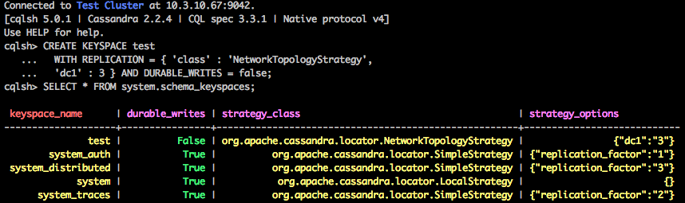

## 使用数人云部署 Cassandra 集群  

Cassandra 是一个高可靠的大规模分布式存储系统，是一个高度可伸缩的、一致的、分布式的结构化 key-value 存储方案，集 Google BigTable 的数据模型与 Amazon Dynamo 的完全分布式的架构于一身。2007由facebook开发，2009年成为Apache的孵化项目。由于 Cassandra 良好的可扩展性，被 Digg、Twitter 等知名网站所采纳，成为了一种流行的分布式结构化数据存储方案。

接下来，来体验一下用数人云来部署 Cassandra 集群吧。

<h3 id="step1">第一步 制作镜像</h3>

首先，我们需要在 Docker 环境下制作  Cassandra 的 Docker image，并推送至可访问的 Docker Registry。  

####1. 编写如下配置文件  

docker-entrypoint.sh

```	
	#!/bin/bash
	set -e

	# first arg is `-f` or `--some-option`
	if [ "${1:0:1}" = '-' ]; then
		set -- cassandra -f "$@"
	fi
	
	if [ "$1" = 'cassandra' ]; then
		: ${CASSANDRA_RPC_ADDRESS=$HOST}
	
		: ${CASSANDRA_LISTEN_ADDRESS=$HOST}
		if [ "$CASSANDRA_LISTEN_ADDRESS" = 'auto' ]; then
			CASSANDRA_LISTEN_ADDRESS="$(hostname --ip-address)"
		fi	
	
		: ${CASSANDRA_BROADCAST_ADDRESS="$CASSANDRA_LISTEN_ADDRESS"}
	
		if [ "$CASSANDRA_BROADCAST_ADDRESS" = 'auto' ]; then
			CASSANDRA_BROADCAST_ADDRESS="$(hostname --ip-address)"
		fi
		: ${CASSANDRA_BROADCAST_RPC_ADDRESS:=$CASSANDRA_BROADCAST_ADDRESS}
	
		if [ -n "${CASSANDRA_NAME:+1}" ]; then
			: ${CASSANDRA_SEEDS:="cassandra"}
		fi
		: ${CASSANDRA_SEEDS:="$CASSANDRA_BROADCAST_ADDRESS"}
	
		sed -ri 's/(- seeds:) "127.0.0.1"/\1 "'"$CASSANDRA_SEEDS"'"/' "$CASSANDRA_CONFIG/cassandra.yaml"
	
		for yaml in \
			broadcast_address \
			broadcast_rpc_address \
			cluster_name \
			endpoint_snitch \
			listen_address \
			num_tokens \
			rpc_address \
			start_rpc \
		; do
			var="CASSANDRA_${yaml^^}"
			val="${!var}"
			if [ "$val" ]; then
				sed -ri 's/^(# )?('"$yaml"':).*/\2 '"$val"'/' "$CASSANDRA_CONFIG/cassandra.yaml"
			fi
		done
	
		for rackdc in dc rack; do
			var="CASSANDRA_${rackdc^^}"
			val="${!var}"
			if [ "$val" ]; then
				sed -ri 's/^('"$rackdc"'=).*/\1 '"$val"'/' "$CASSANDRA_CONFIG/cassandra-rackdc.properties"
			fi
		done
	fi
	
	exec "$@"
```

其中，有两个地方需要注意：

* CASSANDRA_RPC_ADDRESS：Cassandra服务器对外提供服务的地址。如果留空，将默认使用服务器的机器名；
* CASSANDRA_LISTEN_ADDRESS：Cassandra集群中服务器与服务器之间相互通信的地址。如果留空，将默认使用服务器的机器名。

数人云下发的每一个应用容器中都会包含环境变量“HOST”，其取值就是应用容器所在主机的 IP；以上两个变量都会通过$HOST 赋值；

####2. 编写 Dockerfile  

```  
	FROM debian:jessie-backports

	RUN apt-key adv --keyserver ha.pool.sks-keyservers.net --recv-keys 514A2AD631A57A16DD0047EC749D6EEC0353B12C
	
	RUN echo 'deb http://www.apache.org/dist/cassandra/debian 22x main' >> /etc/apt/sources.list.d/cassandra.list
	
	ENV CASSANDRA_VERSION 2.2.4
	
	RUN apt-get update \
	        && apt-get install -y cassandra="$CASSANDRA_VERSION" \
	        && rm -rf /var/lib/apt/lists/*
	
	ENV CASSANDRA_CONFIG /etc/cassandra
	
	COPY docker-entrypoint.sh /docker-entrypoint.sh
	ENTRYPOINT ["/docker-entrypoint.sh"]
	
	VOLUME /var/lib/cassandra
	
	# 7000: intra-node communication
	# 7001: TLS intra-node communication
	# 7199: JMX
	# 9042: CQL
	# 9160: thrift service
	EXPOSE 7000 7001 7199 9042 9160
	CMD ["cassandra", "-f"]
```  

####3. 创建并上传 Docker image:  

```
	docker build -t your.registry.site/cassandra:2.2.4   
	docker push your.registry.site/cassandra:2.2.4  
```

* 请把 ```your.registry.site``` 换成你的镜像仓库地址；数人云已将该镜像推送至测试仓库 ```index.shurenyun.com```.

<h3 id="step2">第二步 建立集群</h3>

请参见 [创建/删除集群](../function/create_delete_cluster.md) 来创建您的集群。  

创建集群的实例可以参考[第一个应用-2048](../get-started/2048.md)，若要部署 Cassandra 集群，需至少3个 Slave 节点。

>注意：本实例至少需要一个内部代理，以便进行 Cassandra 集群的服务发现。  

<h3 id="step3">第三步 发布应用</h3>    
  
接下来，通过数人云创建应用。  

新建 Cassandra 应用：   

	应用名称:cassandra  
	选择集群：your-cluster  
	镜像地址：index.shurenyun.com/cassandra  
	镜像版本：2.2.4   
	网络模式：HOST 模式  
	选择主机：（选择3台主机）
	添加目录：主机目录：/var/lib/cassandra  容器目录：/var/lib/cassandra  
	选择容器规格：  CPU：1   内存：2048 MB  
	容器个数：3，选中"1容器1主机"  
高级设置：  
	
	添加应用地址：  
		端口：9024，类型：对内 TCP，映射端口：9024    
		端口：9160，类型：对内 TCP，映射端口：9160    
	添加环境变量：  
		CASSANDRA_SEEDS=ip1,ip2,ip3（3台主机的 IP，以逗号分隔）

>注1：CASSANDRA_SEEDS：Cassandra集群的种子节点地址；这个选项可以设置多个值，即Cassandra集群中有多个种子节点，集群中所有的服务器在启动的时候，都将于seed节点进行通信，从而获取集群的相关信息；这里选择3台主机作为 seed 节点；  
>注2：Cassandra 启动需要足够的资源，建议 CPU 数最小为1，内存最低2G；  
>注3：Cassandra 节点间需要通信，所以选择 HOST 模式部署，避免端口隐射导致而节点间无法通信；  
>注4：如果对 Cassandra 集群有大致的规划，可以在选择主机处选择所需数量的主机；应用发布后，可以在所选主机的数量范围内，自由伸缩 Cassandra 节点数量。  

<h3 id="step4">第四步 测试</h3>  

等待应用部署完成，登陆一台集群中的测试机，通过以下指令，用 cqlsh 连接 Cassandra 集群：  

```sudo docker run -it --rm index.shurenyun.com/cassandra:2.2.4 cqlsh 10.3.10.39```

>其中，请将10.3.10.39换成你的集群的内部代理 IP；
  
若连接成功，输入以下代码：

```
CREATE KEYSPACE test
  WITH REPLICATION = { 'class' : 'NetworkTopologyStrategy',
  'dc1' : 3 } AND DURABLE_WRITES = false;

SELECT * FROM system.schema_keyspaces;
```

若看到名为 test 的 keyspace 已经添加成功，如下图所示：



恭喜，现在你的 Cassandra 集群已经正常运作了！