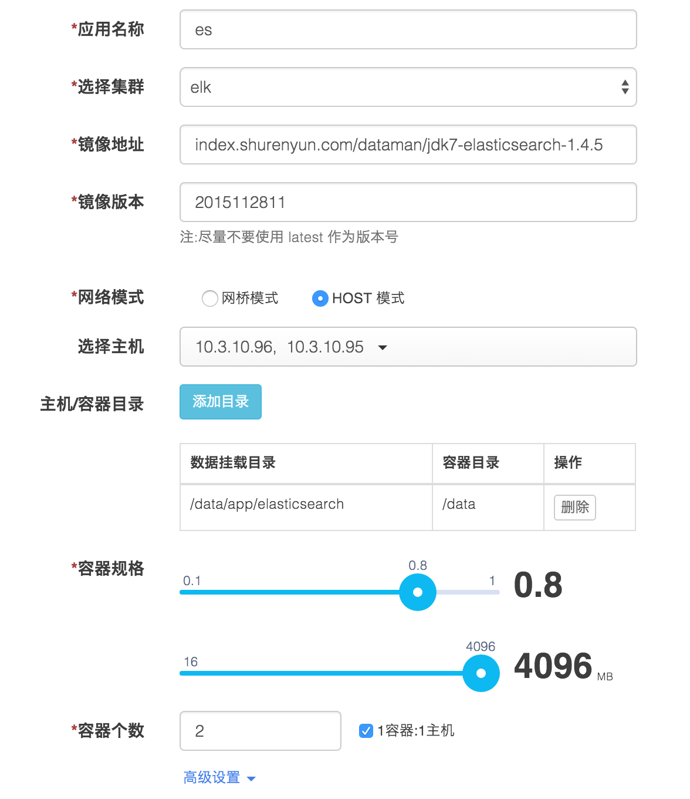
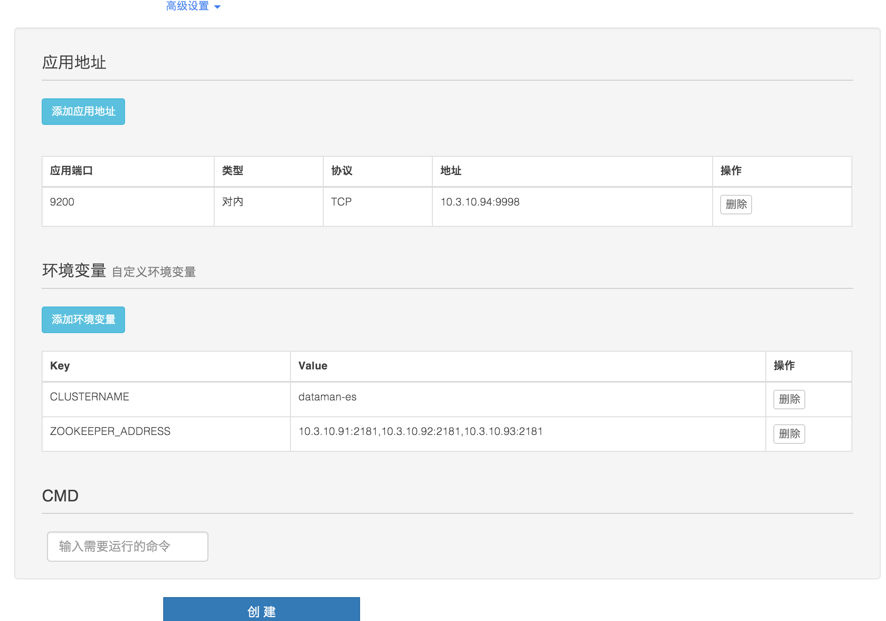
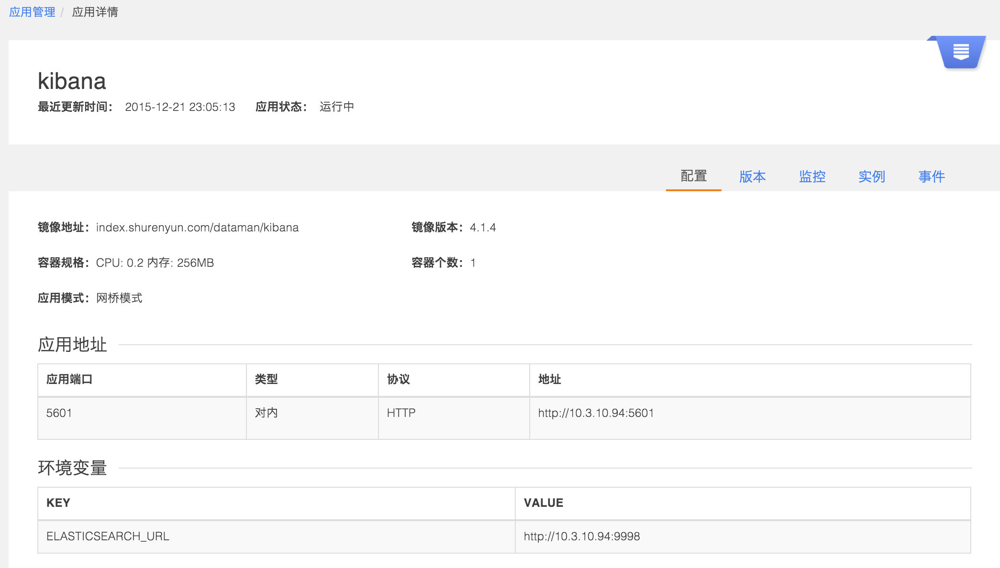
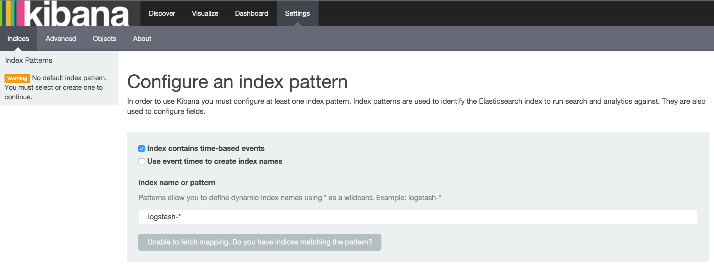

## 通过数人云部署弹性的 ELK 集群

本篇文章将通过数人云部署一套标准的 ELK(ElasticSearch+Logstash+Kibana) 日志收集系统。通过数人云部署的 ELK 系统有如下优势：

- 部署方便: 用户的应用无需任何改造，只需要提供日志的存储目录
- 可扩展: 如果日志存储端(ElasticSearch)需要添加更多的实例， 用户只需要向集群中添加更多的机器， 并在应用列表页点击扩展相应的 ELK 即可。
- 安全: 用户应用的所有日志数据都存储在了集群内网的ES服务集群中。


### 目录

#### 第一步: [将你的主机组织成集群](#step1)
#### 第二步: [发布 elasticsearch 实例](#step2)
#### 第三步: [发布 kibana 实例](#step3)
#### 第四步: [发布 logstash 实例到待收集日志的应用server](#step4)

### 正文

<h3 id="step1">第一步: 将你的主机组织成集群 </h3>

### 1.1 注册&登录数人云

访问 [www.shurenyun.com](http://www.shurenyun.com) 注册并登录系统。

### 1.2 准备主机

假设我们有7台主机，主机可以是连接互联网的私有主机，也可以是阿里云、Ucloud、
AWS、Azure、首都在线、华为云等公有云上购买的任意一台云主机。这7台主机之间需要网络互通，并且能够访问外网。设这7台主机的规划及配置信息如下

IP        |  将要在集群中承担的角色  |  配置
----------|----------------|--------------
10.3.10.91| master 节点，负责集群本身和ES的高可用| 2核4G，无数据盘 
10.3.10.92| master 节点，负责集群本身和ES的高可用|2核4G，无数据盘
10.3.10.93| master 节点，负责集群本身和ES的高可用|2核4G，无数据盘
10.3.10.94| slave 节点，部署内部代理服务 |2核4G，无数据盘
10.3.10.95|slave 节点，部署 ES 实例 | 4核8G，100G（或更多） 数据盘
10.3.10.96|slave 节点，部署 ES 实例 | 4核8G，100G（或更多） 数据盘
10.3.10.97|slave 节点，正在运行着用户的应用 | 依用户配置而定

### 1.3 建立集群

1.3.1 登录账户后，在集群管理中，点击创建群组。  
1.3.2 填写集群名称（elk），选择 3 Master 集群，点击完成。

### 1.4 添加主机

1.4.1 添加主机，如图点击右上角下拉菜单，选择添加主机。


1.4.2 点击**我已有一台主机**下面的按钮 *Ubuntu* 或者 *CentOS*

1.4.3 填写主机名称，并在主机上根据"连接主机"的提示进行操作。   

1.4.4 选择主机组件：
  
  * 前3台主机(10.3.10.9[1-3])为 Master 节点, **无**可选组件；
  * 我们在添加主机 `10.3.10.94` 时需要将 *可选组件* 中的**内部代理**勾选上;  


1.4.5 登录到将要添加的主机终端, 譬如： 

```bash
ssh ubuntu@10.3.10.91
```

1.4.6 安装 Docker（若你的主机已经安装了 docker，此步可以跳过）

```bash
curl -sSL https://get.docker.com/ | sh
```

1.4.7 安装 Agent： 点击页面按钮 **点击生成命令** 生成安装命令并粘贴到主机终端运行。

```bash
sudo -H OMEGA_ENV=prod bash -c "$(curl -Ls https://raw.githubusercontent.com/Dataman-Cloud/agent-installer/master/install-agent.sh)" -s 92a0c8b287d34445b03f8518ce688e66
```

按提示执行以上两步后，点击"完成"即成功添加主机。

**!!!特别提醒**：

- 由于数人云默认将加入集群的前3台机器作为 master 节点，为了符合我们前期的规划，请确保主机`10.3.10.91`, `10.3.10.92`, `10.3.10.93` 首先被加入到集群中
- 向同一集群添加的主机应存在于同一网段内，暂不支持跨公网的主机组建集群
- 由于数人云在主机连接后会向主机上安装基础服务，所以主机需要一段时间进行初始化，依主机所处的网络环境，主机初始化的时间有所不同

### 1.5 确认集群环境正常

主机添加完成后，检查主机运行是否正常，如图所示：


<h3 id="step2">第二步: 发布 elasticsearch 实例</h3>

这里我们将通过数人云将es的 docker 镜像以 HOST 模式部署到我们规划的主机 `10.3.10.95` 和`10.3.10.96` 上。


2.1 选择"应用管理"中的"新建应用"，如图所示：  

  

2.2 新建`es`应用  

- 填写应用名称：es
- 选择集群：elk  
- 添加应用镜像地址：index.shurenyun.com/dataman/jdk7-elasticsearch-1.4.5  
- 填写镜像版本：2015112811   
- 网络模式：网桥模式
- 主机选择：10.3.10.95,10.3.10.96
- 容器目录：容器内的挂载目录 /data/app/elasticsearch
- 主机目录：主机上的挂载目录 /data (该目录是我们主机数据盘所在的目录)
- 选择容器规格： CPU：0.8   内存：4096MB
- 容器个数：2 并且勾选 *1容器:1主机*
- 高级设置：
  - 添加应用地址：
  
     应用端口| 类型|协议|地址
     -------|---|----|---
      9200|对内|TCP|10.3.10.94:9998
  - 环境变量
  
    Key|Value
    ---|-----
    CLUSTERNAME|dataman-es
    ZOOKEEPER_ADDRESS|10.3.10.91:2181,10.3.10.92:2181,10.3.10.93:2181

填写完成后，点击创建。 如下图所示：




第一次向集群部署ES时由于本地没有 docker 镜像 index.shurenyun.com/dataman/jdk7-elasticsearch-1.4.5，集群需要大约1-2分钟去拉取镜像（可能更长时间）。我们可以在 `es` 的应用详情页看到相应的状态，以及事件等。

<h3 id="step3">第三步: 发布 kibana 实例</h3>

3.1 点击新建应用，新建 `kibana` 应用：  

- 填写应用名称:kibana
- 选择集群：elk
- 添加应用镜像地址：index.shurenyun.com/dataman/kibana
- 填写镜像版本：4.1.4
- 网络模式：网桥模式
- 选择主机: ALL
- 容器规格： CPU：0.2  内存：256 MB
- 容器个数：1
- 高级设置：
  - 应用地址：
  
    应用端口|类型|协议	|地址
    -------|---|---|---
    5601|对内|HTTP|http://10.3.10.94:5601
    
  - 环境变量：
  
    KEY|VALUE
    ---|-----
    ELASTICSEARCH_URL|http://10.3.10.94:9998
  

注： kibana 需要通过环境变量**ELASTICSEARCH_URL**来确定 ElasticSearch 的地址，由于添加主机时我们已经设置**内部代理**的节点为`10.3.10.94`，并且在添加ES应用时将其端口映射到了内部代理端口`9998`, 所以这里我们只需要设置`ELASTICSEARCH_URL=http://10.3.10.94:9998`即可使得 kibana 发现 ES 实例。


3.2 确认应用正常运行

来到 kibana 的应用详情页，若应用状态为**运行中**即应用已正常运行。

  

打开浏览器，访问地址：http://10.3.10.94:5601（可能需要为你的浏览器设置内网代理），看到如下页面，则说明 kibana 应用已经成功运行。  




<h3 id="step4">第四步: 发布 logstash 实例到待收集日志的应用server</h3>

4.1 点击新建应用，新建 `logstash` 应用：  

- 填写应用名称:logstash
- 选择集群：elk
- 添加应用镜像地址：index.shurenyun.com/dataman/logstash
- 填写镜像版本：2.1
- 网络模式：网桥模式
- 选择主机: 10.3.10.97 注：由于上面我们假设应用运行在了主机 `10.3.10.97` 上，所以这里我们限制logstash在该主机上收集日志
- 主机/容器目录

  数据挂载目录|容器目录
  ----------|-------
  /var/log/app |/var/log/app
  
  注： 这里我们假设用户的应用（待采集日志的应用）日志存储在了主机目录 `/var/log/app` 下面，

- 容器规格： CPU：0.3  内存：256 MB
- 容器个数：1
- 高级设置：
  - CMD: 
  
    ```bash
    logstash -e 'input { file { type => "linux-syslog" path => ["/var/log/app/*.log"]}} output { elasticsearch { hosts => "10.3.10.94:9998" }}'
    ```

4.2 同样，等待1-2分钟后logstash将被部署到应用server上并且开始收集日志， 用户可以通过访问 `kibana` 的页面来发掘相应的日志信息。