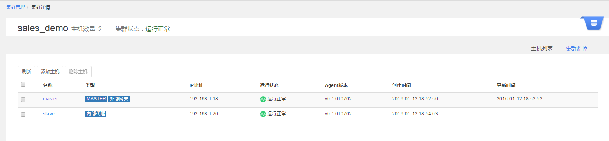
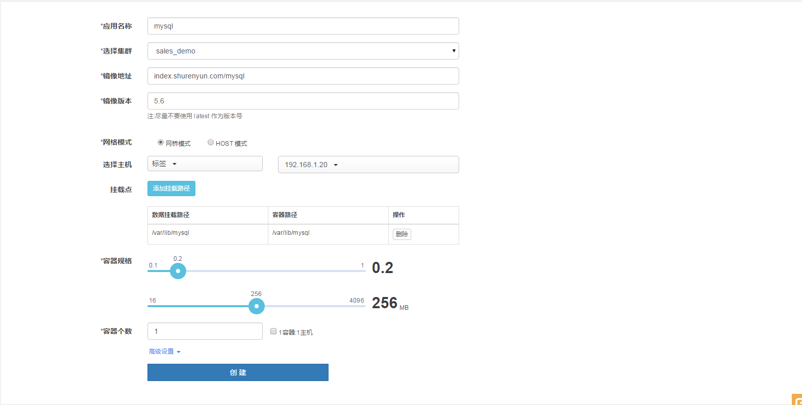
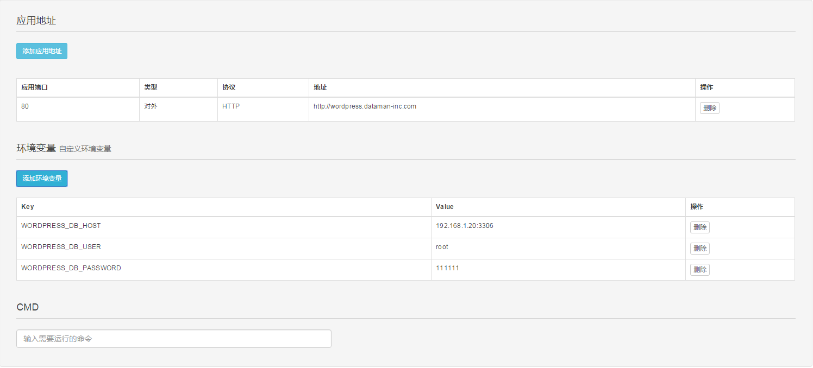

## 通过数人云部署弹性的 ELK 集群

本篇文章将通过数人云部署一套标准的 ELK(ElasticSearch+Logstash+Kibana) 日志收集系统。通过数人云部署的 ELK 系统有如下优势：

- 部署方便: 用户的应用无需任何改造，只需要提供日志的存储目录
- 可扩展: 如果日志存储端(ElasticSearch)需要添加更多的实例， 用户只需要向集群中添加更多的机器， 并在应用列表页点击扩展相应的 ELK 即可。
- 安全: 用户应用的所有日志数据都存储在了集群内网的ES服务集群中。


### 目录

#### 第一步: [将你的主机组织成集群](#step1)
#### 第二步: [发布 elasticsearch 实例](#step2)
#### 第三步: [发布 kibana 实例](#step3)
#### 第四步: [发布 logstash 实例到待收集日志的应用server](#step4)

### 正文

<h3 id="step1">第一步: 将你的主机组织成集群 </h3>

### 1.1 注册&登录数人云

访问 [www.shurenyun.com](http://www.shurenyun.com) 注册并登录系统。

### 1.2 准备主机

假设我们有7台主机，主机可以是连接互联网的私有主机，也可以是阿里云、Ucloud、
AWS、Azure、首都在线、华为云等公有云上购买的任意一台云主机。这7台主机之间需要网络互通，并且能够访问外网。设这7台主机的规划及配置信息如下

IP        |  将要在集群中承担的角色  |  配置
----------|----------------|--------------
10.3.10.91| master 节点，负责集群本身和ES的高可用| 2核4G，无数据盘 
10.3.10.92| master 节点，负责集群本身和ES的高可用|2核4G，无数据盘
10.3.10.93| master 节点，负责集群本身和ES的高可用|2核4G，无数据盘
10.3.10.94| slave 节点，部署内部代理服务 |2核4G，无数据盘
10.3.10.95|slave 节点，部署 ES 实例 | 4核8G，100G（或更多） 数据盘
10.3.10.96|slave 节点，部署 ES 实例 | 4核8G，100G（或更多） 数据盘
10.3.10.97|slave 节点，正在运行着用户的应用 | 依用户配置而定

### 1.3 建立集群

1.3.1 登录账户后，在集群管理中，点击创建群组。  
1.3.2 填写集群名称（elk），选择 3 Master 集群，点击完成。

### 1.4 添加主机

1.4.1 添加主机，如图点击右上角下拉菜单，选择添加主机。


1.4.2 点击**我已有一台主机**下面的按钮 *Ubuntu* 或者 *CentOS*

1.4.3 填写主机名称，并在主机上根据"连接主机"的提示进行操作。   

1.4.4 选择主机组件：
  
  * 前3台主机(10.3.10.9[1-3])为 Master 节点, **无**可选组件；
  * 我们在添加主机 `10.3.10.94` 时需要将 *可选组件* 中的**内部代理**勾选上;  


1.4.5 登录到将要添加的主机终端, 譬如： 

```bash
ssh ubuntu@10.3.10.91
```
1.4.6 安装 Docker（若你的主机已经安装了 docker，此步可以跳过）

```bash
curl -sSL https://get.docker.com/ | sh
```

1.4.7 安装 Agent： 点击页面按钮 **点击生成命令** 生成安装命令并粘贴到主机终端运行。

```bash
sudo -H OMEGA_ENV=prod bash -c "$(curl -Ls https://raw.githubusercontent.com/Dataman-Cloud/agent-installer/master/install-agent.sh)" -s 92a0c8b287d34445b03f8518ce688e66
```

按提示执行以上两步后，点击"完成"即成功添加主机。

**!!!特别提醒**：

- 由于数人云默认将加入集群的前3台机器作为 master 节点，为了符合我们前期的规划，请确保主机`10.3.10.91`, `10.3.10.92`, `10.3.10.93` 首先被加入到集群中
- 向同一集群添加的主机应存在于同一网段内，暂不支持跨公网的主机组建集群
- 由于数人云在主机连接后会向主机上安装基础服务，所以主机需要一段时间进行初始化，依主机所处的网络环境，主机初始化的时间有所不同

### 1.5 确认集群环境正常

主机添加完成后，检查主机运行是否正常，如图所示：



<h3 id="step2">2 第二步发布应用</h3>  
部署 Wordpress 应用，首先需要部署 mysql 数据库，然后部署 Wordpress 服务；我们先从 mysql 开始。  

### 2.1 新建 Mysql 应用

2.1.1 选择"应用管理"中的"新建应用"，如图所示：  

  

2.1.2 新建应用  

填写应用名称：mysql  

选择集群：your-cluster  

添加应用镜像地址：mysql  

填写镜像版本：latest   
网络模式：网桥模式

主机选择：192.168.1.19
 

容器目录：容器内的挂载目录  /var/lib/mysql

主机目录：主机上的挂载目录  /var/lib/mysql

选择容器规格： CPU：0.2   内存：256 MB  

  

高级设置：  

填写应用地址：  端口：3306，类型：对内 TCP  
选择“对内 TCP”方式，则该应用会向内部代理注册，内部代理对外暴露3306端口；  

填写环境变量参数：
```Key:MYSQL_ROOT_PASSWORD  Value:your-password```  

  
填写完成后，点击创建。  

### 2.2 新建 Wordpress 应用  

点击新建应用，新建 Wordpress 应用：  

填写应用名称:wordpress  

选择集群：your-cluster  

添加应用镜像地址：wordpress  

填写镜像版本：latest   

网络模式：网桥模式

选择容器规格：  CPU：0.2   内存：256 MB  

容器个数：2  

  

高级设置：  

填写应用地址：  端口：80，类型：对外 HTTP，域名：your-website  
注：由于 Wordpress 是 HTTP 应用，并需要对外服务发现，因此选择对外标准 HTTP，会对外暴露 80 端口；同时，需要填写域名：your-website；  

填写环境变量参数：  
```
Key:WORDPRESS_DB_HOST  Value:192.168.1.20:3306  
Key:WORDPRESS_DB_USER  Value:root
Key:WORDPRESS_DB_PASSWORD  Value:your-password
```  
注1：应用地址选择对外标准 HTTP 时，需要配置相应的域名或外网 IP 到对外网关节点，以确保可以通过公网进行访问；  
注2：配置 mysql 地址的环境变量时，mysql 地址应该为内部代理的 IP 和 mysql 的映射 IP，根据上述 mysql 配置，该地址为10.3.10.63:3306。

  

### 2.3 确认应用正常运行

回到应有管理中，即可看到应用已正常运行。

  

打开浏览器，访问地址：http://wordpress.dataman-inc.com（替换成你的域名或者网关 IP），看到如下页面，则说明 Wordpress 应用已经成功运行。  


恭喜，现在你已经拥有了一个小型的 Wordpress 站点，并且为 web server 创建了 2 个实例，实现了最基础的横向扩展和负载均衡！
