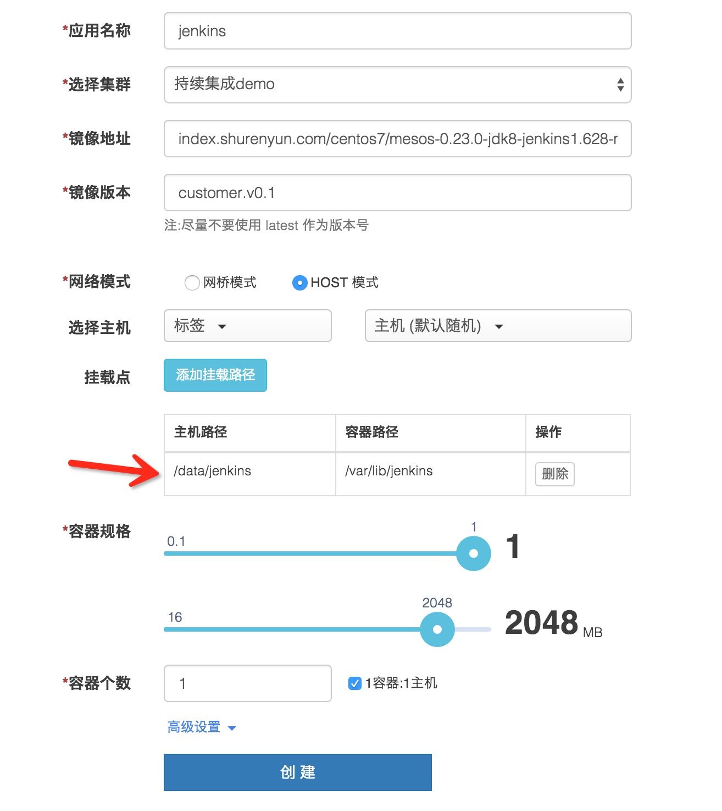
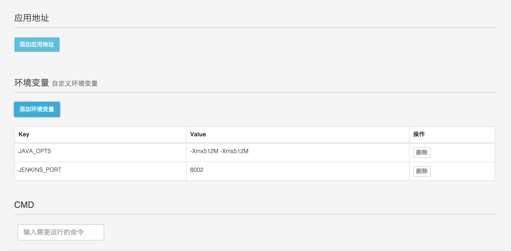
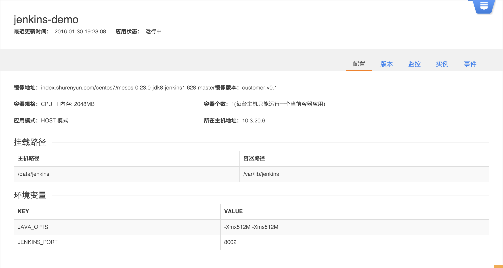
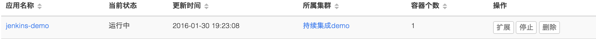
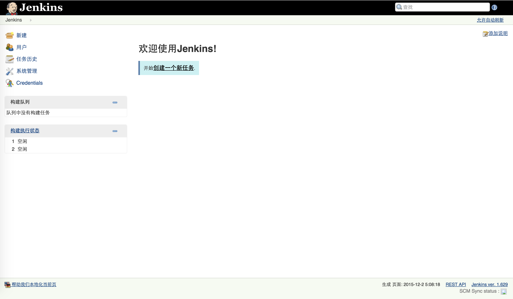
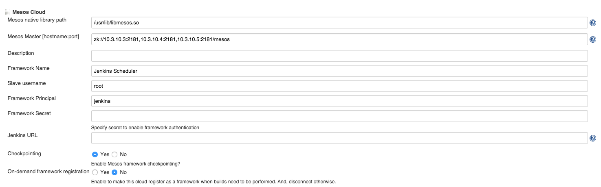
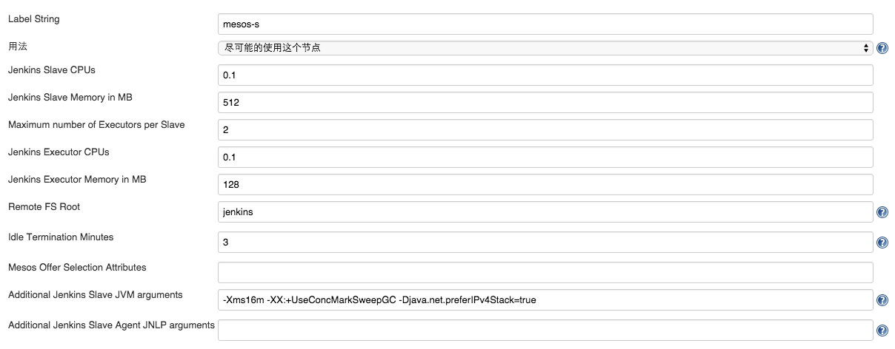
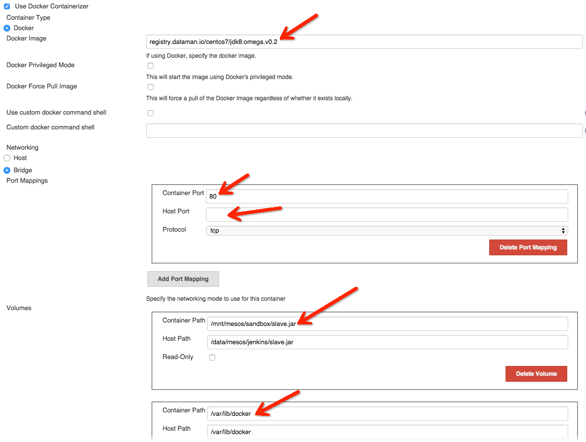
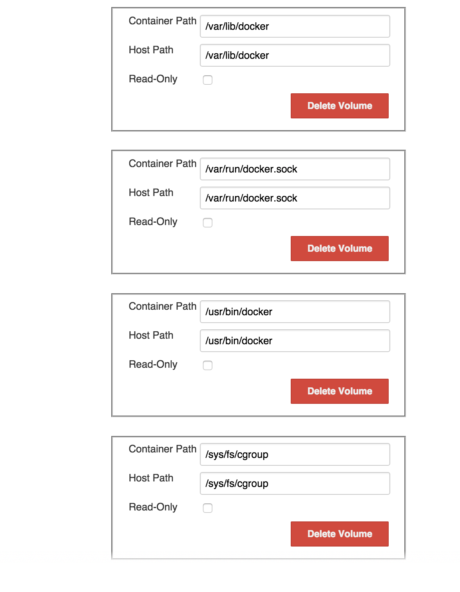

俗话说的好，天下武功，唯快不破。雷教主也说"专注 极致 口碑 快"是小米成功的秘诀。为什么一定要迭代快呢？ 因为太阳底下没有新鲜事，聪明人那么多，凭空想出一个绝世好点子，然后憋足劲做出一个惊天地泣鬼神的产品，除了乔帮主，还真没几个人能做到。

互联网产品拼的就是迭代速度，这已是互联网行业中大家公认的秘诀。但为什么有人能做到？有人做不到呢？一个重要原因就是开发过程中的持续集成和持续交付（CI/CD）其实并没有那么容易做到，单是部署一个Jenkins持续集成环境，就是一个费时费力的事。

工欲善其事 必先利其器。下面给大家介绍如何通过[数人云](https://www.shurenyun.com/)快速搭建[Jenkins持续集成环境](https://www.shurenyun.com/company-app.html)。

### Jenkins
Jenkins 是基于 Java 开发的一种持续集成 (CI) 工具，使用数人云部署 Jenkins 能够在做到快速搭建的同时，实现资源的动态调度，提高资源利用率。

下面讲述一下数人云上搭建 Jenkins 的架构和工作流程：

* Jenkins Master
  
  它负责提供整个 Jenkin 的设置、webui、工作流控制定制等。首先，将Jenkins-Master使用数人云发布，数人云会对其进行程序管理和健康检查，从而在应用程序由于某些意外崩溃后自动恢复，保证了Jenkins-Master构建系统的全局高可用，使用数人云部署Jenkins使您的Jenkins应用运行在一个资源池中，进一步实现了资源共享，提高了资源利用率。

* Jenkins Slave

  Jenkins利用在数人云上建立的集群资源，主要的目的是利用弹性资源分配来提高资源利用率，通过配置Jenkins-mesos-plugin插件，Jenkins Master可以在作业构建时根据实际需要动态的申请Jenkins-Slave节点，并在构建完成后的一段时间后，将节点归还。

* Jenkins-mesos-plugin

  Jenkins-mesos-plugin是用插件模式挂载到Jenkins Master上的。主要目的是要把Jenkins-Master当作集群的调度器使用，可以调度用数人云建立的集群资源为Jenkins服务。

### 数人云注册&登录&创建集群

因为数人云迭代很快，所以这里就不进行详细描述，最新数人云操作文档会在数人云用户手册中，需要参考的用户请点击：[数人云用户手册](http://doc.shurenyun.com/get-started/index.html)

### 使用数人云部署 Jenkins

部署 Jenkins 应用很简单，下面是具体操作步骤：

选择应用管理，点击"新建应用"，按照如下提示，新建 Jenkins 应用：

* 填写应用名称：jenkins
* 选择集群：demo
* 添加应用镜像地址：testregistry.dataman.io/centos7/mesos-0.23.0-jdk8-jenkins1.628-master
* 填写镜像版本：app.v0.3
* 选择应用模式：HOST模式
* 选择应用类型：有状态应用
* 选择主机：主机下拉列表中选择任一合适IP即可
* 主机/容器目录配置： 数据挂载目录：/data/jenkins  容器目录：/var/lib/jenkins
* 选择容器规格：CPU：0.2  内存：512MB

高级设置：

* 点击添加环境变量，填写环境变量参数：

        Key: JAVA_OPTS      Value: -Xmx512M -Xms512M
        key: JENKINS_PORT   Value: 8002
        

填写完成之后，点击创建即可，创建完成后可看到应用部署状态等信息：

稍等片刻可看到应用已正常运行：

打开浏览器，在内部代理配置好的情况下访问 Jenkins，访问地址为：yourip:JENKINS_PORT，看到如下页面，则说明 Jenkins 应用已经成功运行。

### Jenkins 数人云设置

如果我们想要将Jenkins作为mesos的一个framework注册到mesos上，需要在成功启动 Jenkins之后对其插件进行设置。

设置 Jenkins-Mesos 分三层，点击左上角"系统管理"，然后在系统管理页面点击"系统设置"。

1. Jenkins 调用 Mesos 集群设置

* Mesos native library path 设置 Mesos lib 库路径，一般在/usr/lib/libmesos.so，拷贝无效，必须安装 Mesos。
* Mesos Master [hostname:port] 设置 Mesos-Master 地址加端口，如果单 Mesos-Master 模式，使用 mesos-master-ip:5050格式，如果是多 Mesos-Master 使用 zk://zk1:2181,zk2:2181,zk3:2181/mesos 格式
* Framework Name 设置 Mesos Master 查看到的应用框架名称
* Slave username 设置 Slave的名字
* Checkpointing 设置检查
* On-demand framework registration 设置是否在无任务的情况下，从 Mesos-Master 注销应用框架

2. Jenkins Slave 调用 Mesos-Slave 类型设置(可按资源)

* Label String 设置 Slave 标签
* Maximum number of Executors per Slave 每个 Slave 可以同时执行几个任务
* Mesos Offer Selection Attributes 选择在那些 Mesos Slave 标签资源上运行，格式{"clusterType":"标签"}

3. Jenkins Slave 调用 Docker 镜像设置

* Docker Image 设置 Jenkins Slave 使用镜像
* Networking - Bridge 设置网络模式，这里一定要设置网桥模式
* Port Mapping -Container Port & Host Prot 设置容器端口关系，必须设置否则会导致 Mesos-DNS 因找不到端口映射崩溃，Host Port 默认设置为空(自动取)，否则必须设置在39000以后的Mesos Slave 选定端口内。
* Volumes 挂载目录，必须挂载 slave.jar 和 docker in docker 

### 后续

所使用的 Dockerfile 和启动脚本全部开源，并上传到了[数人科技的GITHUB](https://github.com/Dataman-Cloud/OpenDockerFile/tree/master/jenkins)，有兴趣的同学可以帮助一起改进。

至此一个基于 Jenkins 的持续集成集群环境已搭建完成，让我们一起快速迭代产品吧，给用户不断带来一个个的小惊喜。