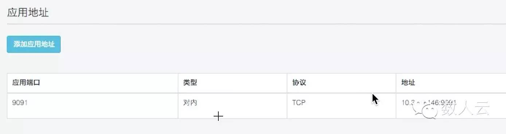

## 5分钟把 LinkedIn 的 “中枢神经系统” Kafka 搬上数人云

### 用数人云部署 Kafka 集群的三个理由

神器Kafka几乎成为日志和大数据处理的必备组件，一直为程序猿们津津乐道。但其集群的部署和扩容管理都极为复杂，让不少同学望而却步。基于数人云5分钟就可以部署Kafka集群，通过简单的web界面操作即可实现整个Kafa集群的扩容和管理。

* 部署简单：相比较在Linux上直接部署Kafka集群，使用数人云部署会大大降低部署难度，缩短部署时间。

* 轻松扩容：通过数人云可以对Kafka集群实现自动扩缩容，调整集群规模。

* 资源混用：使用数人云，可以将Kafka，Spark，容器应用混合部署在同一个集群中，提高集群资源利用率。

### 目录

#### 第一步: [将你的主机组织成集群](#step1)
#### 第二步: [发布 Kafka 应用](#step2)
#### 第三步: [发布 Kafka_Manager 应用](#step3)

### 正文

<h3 id="step1">第一步: 将你的主机组织成集群 </h3>

注册，并在数人云上建立一个集群。参考：【数人云用户手册-建立集群：  http://open.shurenyun.com/article/18#rd?sukey=fc78a68049a14bb2bde2e05567742eb46ff30be6b5ec83fd4c4451e7fe5e5f4565b8ee535b0e03f51f432e1f1dce409d 】

<h3 id="step2">第二步: 发布 Kafka 应用</h3>

##### 2.1 发布 Zookeeper

因为 Kafka 集群需要使用 Zookeeper来保证系统的高可用 ,所以需要先在数人云上发布Zookeeper集群。参考：快速搭建ZooKeeper集群指南【点击阅读原文-在社区中可找到相关文章】

##### 2.2 新建 Kafka 应用

2.2.1 选择"应用管理"中的"新建应用"，如图所示：

2.2.2 新建应用：

* 填写应用名称: kafka

* 选择集群: your-cluster

* 添加应用镜像地址: testregistry.dataman.io/centos7/jdk7-scala2.11-kafka0.8.22

* 填写镜像版本: 20151201

* 应用模式: HOST模式

* 选择主机:your-app-ip(多选)

* 选择容器规格: CPU：0.1 内存：1024 MB

* 容器个数: your-kafka-number

点选:1容器/1主机 <- 每个宿主机只能运行1个 app

添加应用地址：

添加环境变量：

2.2.3 检查应用状态：

简单的检查应用占用集群资源的情况，点击应用管理 -> 选择监控的 tab 页

至此，Kafka集群已经建立完毕, 可没有一个web界面来管理？别急，下面我们就开始介绍如何搭建一个基于Web的管理工具Kafka_Manager。

<h3 id="step3">第三步: 发布 Kafka_Manager 应用</h3>

因为 Kafka_Manager 是监控 Kafka 的工具，所以在启动 Kafka_Manager 前，请先按照上面的说明启动 Kafka。

3.1 选择"应用管理"中的"新建应用"，如图所示：

3.2 新建应用：

* 填写应用名称: kafka-manager

* 选择集群: your-cluster

* 添加应用镜像地址: testregistry.dataman.io/centos7/jdk8-kafka-0.8.x-manager

* 填写镜像版本: 20151204

* 应用模式: 网桥模式

* 选择主机:your-app-ip(多选)

* 选择容器规格: CPU：0.1 内存：512 MB

* 容器个数: 1

点选:1容器/1主机 <- 每个宿主机只能运行1个 app

添加应用地址：

添加环境变量：

3.3 检查应用状态：

简单的检查应用占用集群资源的情况，点击应用管理 -> 选择监控的 tab 页

3.4 打开 Kafka_Manager 页面：

浏览器输入你的监控地址域名后，按照你的集群情况添加信息

3.5 点击 save 后，就可以打开监控页面：

可以看到刚才我们加入的 kafka 集群，数量是3个

现在包含web端管理工具的Kafka集群就搭建完成了，大家可以尽情的玩耍和测试了~ 有任何问题，可以到【http://open.shurenyun.com/article/18#rd?sukey=fc78a68049a14bb2bde2e05567742eb46ff30be6b5ec83fd4c4451e7fe5e5f4565b8ee535b0e03f51f432e1f1dce409d】 技术社区交流。
