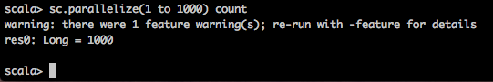

## 使用数人云运行 Spark 集群  

Spark 是 UC Berkeley AMP lab 开源的类 Hadoop MapReduce 的通用的并行计算框架；Spark 基于 map reduce 算法实现的分布式计算，拥有 Hadoop MapReduce 所具有的优点；但不同于MapReduce的是Job中间输出和结果可以保存在内存中，从而不再需要读写 HDFS，因此 Spark 能更好地适用于数据挖掘与机器学习等需要迭代的 map reduce 的算法。  

Spark 支持三种分布式部署方式，分别是 Standalone、Spark on Yarn 以及 Spark on Mesos。其中 Spark on Mesos 模式是很多公司采用的模式，并且 Spark 官方也推荐这种模式。正是由于 Spark 开发之初就考虑到支持 Mesos，因此，目前而言，Spark 运行在 Mesos 上会比运行在 Yarn 上更加灵活，更加自然。数人云集群正是通过 Mesos 进行集群资源调度，因此，数人云部署 Spark 集群，有着天然的优势。

接下来，我们就来体验一下用数人云部署 Spark 集群吧。

<h3 id="step1">第一步 制作镜像</h3>

首先，我们需要在 Docker 环境下制作 Spark 的 Docker 镜像，并推送至可访问的 Docker 镜像仓库。  

####1. 编写如下配置文件  

(1) mesos-site.xml  

```	
	<?xml version="1.0" encoding="UTF-8"?>
	<?xml-stylesheet type="text/xsl" href="configuration.xsl"?>
	
	<configuration>
	    
	  <property>
	    <name>mesos.hdfs.namenode.cpus</name>
	    <value>0.25</value>
	  </property>
	
	  <property>
	    <name>mesos.hdfs.datanode.cpus</name>
	    <value>0.25</value>
	  </property>
	    
	  <property>
	    <name>mesos.hdfs.journalnode.cpus</name>
	    <value>0.25</value>
	  </property>
	    
	  <property>
	    <name>mesos.hdfs.executor.cpus</name>
	    <value>0.1</value>
	  </property>
	    
	  <property>
	    <name>mesos.hdfs.data.dir</name>
	    <description>The primary data directory in HDFS</description>
	    <value>/var/lib/hdfs/data</value>
	  </property>
	
	  <property>
	    <name>mesos.hdfs.framework.mnt.path</name>
	    <value>/opt/mesosphere</value>
	    <description>This is the default for all DCOS installs</description>
	  </property>
	
	  <property>
	    <name>mesos.hdfs.state.zk</name>
	    <value>master.mesos:2181</value>
	    <description>See the Mesos DNS config file for explanation for this</description>
	  </property>
	
	  <property>
	    <name>mesos.master.uri</name>
	    <value>zk://master.mesos:2181/mesos</value>
	    <description>See the Mesos DNS config file for explanation for this</description>
	  </property>
	
	  <property>
	    <name>mesos.hdfs.zkfc.ha.zookeeper.quorum</name>
	    <value>master.mesos:2181</value>
	    <description>See the Mesos DNS config file for explanation for this</description>
	  </property>
	
	  <property>
	    <name>mesos.hdfs.mesosdns</name>
	  	<value>true</value>
	    <description>All DCOS installs come with mesos DNS to maintain static configurations</description>
	  </property>
	
	  <property>
	    <name>mesos.hdfs.native-hadoop-binaries</name>
	    <value>true</value>
	    <description>DCOS comes with pre-distributed HDFS binaries in a single-tenant environment</description>
	  </property>
	
	  <property>
	    <name>mesos.native.library</name>
	    <value>/opt/mesosphere/lib/libmesos.so</value>
	  </property>
	  
	  <property>
	    <name>mesos.hdfs.ld-library-path</name>
	    <value>/opt/mesosphere/lib</value>
	  </property>
	</configuration>
```

(2) hdfs-site.xml  

```
	<configuration>
	  <property>
	    <name>dfs.ha.automatic-failover.enabled</name>
	    <value>true</value>
	  </property>
	
	  <property>
	    <name>dfs.nameservice.id</name>
	    <value>hdfs</value>
	  </property>
	
	  <property>
	    <name>dfs.nameservices</name>
	    <value>hdfs</value>
	  </property>
	
	  <property>
	    <name>dfs.ha.namenodes.hdfs</name>
	    <value>nn1,nn2</value>
	  </property>
	
	  <property>
	    <name>dfs.namenode.rpc-address.hdfs.nn1</name>
	    <value>namenode1.hdfs.mesos:50071</value>
	  </property>
	
	  <property>
	    <name>dfs.namenode.http-address.hdfs.nn1</name>
	    <value>namenode1.hdfs.mesos:50070</value>
	  </property>
	
	  <property>
	    <name>dfs.namenode.rpc-address.hdfs.nn2</name>
	    <value>namenode2.hdfs.mesos:50071</value>
	  </property>
	
	  <property>
	    <name>dfs.namenode.http-address.hdfs.nn2</name>
	    <value>namenode2.hdfs.mesos:50070</value>
	  </property>
	
	  <property>
    	<name>dfs.client.failover.proxy.provider.hdfs</name>
		<value>org.apache.hadoop.hdfs.server.namenode.ha.ConfiguredFailoverProxyProvider</value>
	  </property>
	</configuration>
```  

>注：对接 HDFS 时，需要将 ```dfs.namenode.http-address.hdfs.nn1``` 配置为 HDFS Namenode 地址；

(3) core-site.xml

```  
	<?xml version="1.0" encoding="UTF-8"?>
	<?xml-stylesheet type="text/xsl" href="configuration.xsl"?>
	
	<configuration>
	  <property>
	    <name>fs.default.name</name>
	    <value>hdfs://hdfs</value>
	  </property>
	  <property>
	    <name>hadoop.proxyuser.hue.hosts</name>
	    <value>*</value>
	  </property>
	  <property>
	    <name>hadoop.proxyuser.hue.groups</name>
	    <value>*</value>
	  </property>
	  <property>
	    <name>hadoop.proxyuser.root.hosts</name>
	    <value>*</value>
	  </property>
	  <property>
	    <name>hadoop.proxyuser.root.groups</name>
	    <value>*</value>
	  </property>
	  <property>
	    <name>hadoop.proxyuser.httpfs.hosts</name>
	    <value>*</value>
	  </property>
	  <property>
	    <name>hadoop.proxyuser.httpfs.groups</name>
	    <value>*</value>
	  </property>
	</configuration>
```  

(4) spark-env.sh  

```  
  export JAVA_HOME=$(readlink -f /usr/bin/java | sed "s:jre/bin/java::")
  export MASTER=mesos://zk://${ZOOKEEPER_ADDRESS}/mesos
  export SPARK_HOME=/opt/spark/dist
  export SPARK_LOCAL_IP=`ifconfig eth0 | awk '/inet addr/{print substr($2,6)}'`
  export SPARK_LOCAL_HOSTNAME=`ifconfig eth0 | awk '/inet addr/{print substr($2,6)}'`
  export LIBPROCESS_IP=`ifconfig eth0 | awk '/inet addr/{print substr($2,6)}'`
```  

>注1：数人云已经在 Master 节点预装了 Zookeeper，因此 ```MASTER``` 需要配置为数人云集群的zookeeper 地址；
>注2：```SPARK_LOCAL_IP、SPARK_LOCAL_HOSTNAME、LIBPROCESS_IP```取值都为主机 IP，如果该主机使用的网卡不是 eth0 的话，注意修改这里的网卡名；

(5) spark-default.conf

```  
  spark.mesos.coarse=true
  spark.mesos.executor.home /opt/spark/dist
  spark.mesos.executor.docker.image your.registry.site/spark:1.5.0-hadoop2.6.0
```  

>其中，```spark.mesos.executor.docker.image``` 需要配置为 Spark 镜像在镜像仓库的地址；数人云已将该镜像推送至测试仓库 ```index.shurenyun.com```。

#### 2. 编写 Dockerfile  

```  
	FROM mesosphere/mesos:0.23.0-1.0.ubuntu1404
	
	# Set environment variables.
	ENV DEBIAN_FRONTEND "noninteractive"
	ENV DEBCONF_NONINTERACTIVE_SEEN "true"
	
	# Upgrade package index and install basic commands.
	RUN apt-get update && \
	    apt-get install -y openjdk-7-jdk curl
	
	ENV JAVA_HOME /usr/lib/jvm/java-7-openjdk-amd64
	
	ENV MESOS_NATIVE_JAVA_LIBRARY /usr/local/lib/libmesos.so
	
	ADD . /opt/spark/dist
	
	ADD hdfs-site.xml /etc/hadoop/hdfs-site.xml
	ADD core-site.xml /etc/hadoop/core-site.xml
	ADD mesos-site.xml /etc/hadoop/mesos-site.xml
	ADD spark-env.sh /opt/spark/dist/conf/spark-env.sh
	ADD spark-default.conf /opt/spark/dist/conf/spark-default.conf
	
	RUN ln -sf /usr/lib/libmesos.so /usr/lib/libmesos-0.23.1.so
	
	WORKDIR /opt/spark/dist
```  

#### 3. 创建并上传 Docker image:  

```
	docker build -t your.registry.site/spark:1.5.0-hadoop2.6.0   
	docker push your.registry.site/spark:1.5.0-hadoop2.6.0  
```

>需把 ```your.registry.site``` 换成你的镜像仓库地址；数人云已将该镜像推送至测试仓库 ```index.shurenyun.com```。

<h3 id="step2">第二步 建立集群</h3>

请参见 [创建/删除集群](../function/create_delete_cluster.md) 来创建你的集群。  

<h3 id="step3">第三步 发布应用</h3>    
  
部署 Spark on Mesos 的架构图如下所示：


其中，Cluster Manager 角色由 Mesos 承担，也就是数人云集群的 Master；Driver Program 用于下发 Spark 计算任务，需要在数人云集群内网的某个节点上手动启动，该节点可以是 Master 或 Slave，或者与数人云集群相通的内网机器；Woker Node 由 Mesos slave 承担，也就是数人云集群的 Slave。

登录到需要启动 Driver Program 的主机上，启动 Spark container：
  
  ```
docker run -it --net host -e ZOOKEEPER_ADDRESS=10.3.10.29:2181,10.3.10.63:2181,10.3.10.51:2181 index.shurenyun.com/spark:1.5.0-hadoop2.6.0 bash 
  ```

>注1：Spark 启动需要足够的资源，建议 CPU 数最小为1，内存最低1G；  
>注2：Spark 节点间需要通信，所以选择 HOST 模式部署，避免端口隐射导致而节点间无法通信；  
>注3：请将```ZOOKEEPER_ADDRESS```的取值换成你的数人云集群的 Master 地址，端口为2181。

<h3 id="step4">第四步 测试</h3>  

启动Spark shell

```
  bin/spark-shell
```
  
运行demo

```
  sc.parallelize(1 to 1000) count
```

若看到名为 test 的 keyspace 已经添加成功，如下图所示：



恭喜，现在你的 Spark 集群已经正常运作了！如果觉得这种方式使用 Spark 仍觉得不方便，想要更直观的方法，比如在浏览器上编写和测试 Spark 算法，可以尝试使用 Zeppelin 编写和运行 Spark 任务，稍后数人云会为您提供在数人云上玩转 Zeppelin 的最佳实践，敬请期待！