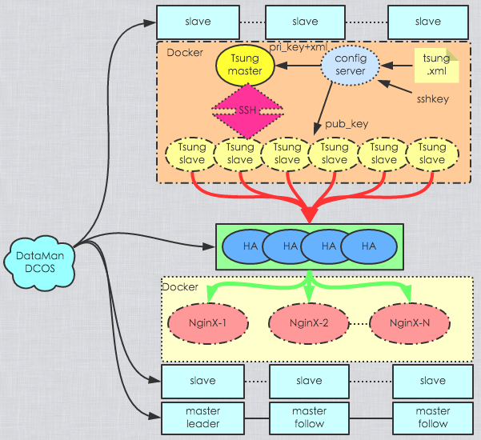
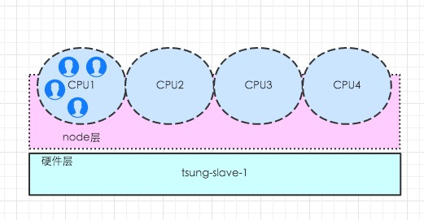
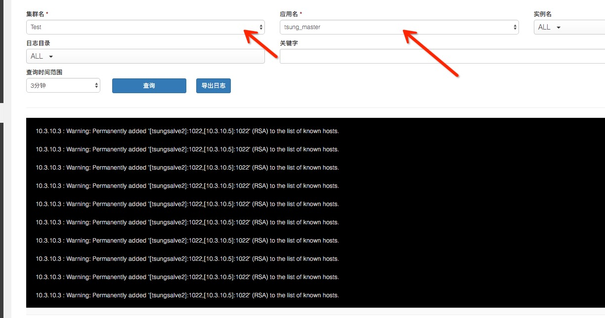

# 数人云TSUNG
    文档信息
    创建人 庞铮
    邮件地址 zpang@dataman-inc.com
    建立时间 2016年3月9号
    更新时间 2016年3月23号
## 1 为什么要使用TSUNG
公司需要使用清华OCP的机器进行100w压测，之前使用的 [locust](http://locust.io/) 对于超线程支持以及本身性能问题(python)，无法在现有硬件资源基础上达到需求，所以更换。
## 2 什么是TSUNG
参考[Tsung 1.6.0 中文手册](https://github.com/Dataman-Cloud/operation/blob/master/%E8%BF%90%E7%BB%B4%E6%96%87%E6%A1%A3/%E6%8A%80%E6%9C%AF%E6%96%87%E6%A1%A3/Tsung/Tsung.md)
参考[Tsung 1.6.0 documentation](http://tsung.erlang-projects.org/user_manual/)
## 3 配置文件使用
参考[配置文件](https://github.com/Dataman-Cloud/operation/blob/master/%E8%BF%90%E7%BB%B4%E6%96%87%E6%A1%A3/%E6%8A%80%E6%9C%AF%E6%96%87%E6%A1%A3/Tsung/tsung-xml-setting.md)
## 4 架构说明
### 4.1 架构图

### 4.2 架构图解释
tsung master 通过 ssh 对 slave 操作，集群之间通讯使用的是 erlang 的 epmd.

执行步骤:

- 首先将 tsung 进行 docker mesos化
    - 安装 ssh
    - 安装 tsung
    - 配置文件 mesos 化
- 其次调用数人云 api 将 tsung 发布
    - api 调用脚本
    
### 4.3 加压结构

### 4.4 程序架构说明
tsung 是个分布式的压测工具，已单个硬件作为程序说明。

- 每个 tsung 的客户端就是一个 slave 主机,单 ip 可以承载 6 w 压力，对于普通服务器压力瓶颈在 cpu
- 每个 slave 上的 cpu 就是 tsung node(节点),虽然erlang 支持 smp 但是官方手册说明想要好性能，必须划分cpu
- 每个 node 上面可以承载很多个虚拟用户
- slave 可以平扩,增大加压端
 
## 5 部署
### 5.1 TSUNG DOCKER 基础构建
编辑 Dockerfile

    mkdir -p /data/tools/tsung/tsung-base && cd /data/tools/tsung/tsung-base 
    vi Dockerfile
    
    FROM centos7/base
    MAINTAINER pro zpang@dataman-inc.com

    #install epel
    #rpm -Uvh "http://download.fedoraproject.org/pub/epel/6/i386/epel-release-6-8.noarch.rpm"
    #install base
    RUN yum install -y \
         wget \
         curl \
         epel-release \
         gcc
    RUN yum install -y \
    #install erlang
         erlang \
    # install tsung-base
         perl \
         perl-RRD-Simple.noarch \
         perl-Log-Log4perl-RRDs.noarch \
    # Tsung report
         perl-Template-Toolkit \
         gnuplot \
         gd \
         libpng \
         zlib
    # SSH install
    RUN yum install -y \
        openssh \
        openssh-server \
        openssh-clients

    #install
    #install Tsung
    #wget http://tsung.erlang-projects.org/dist/tsung-1.6.0.tar.gz
    ADD tsung-1.6.0.tar.gz /tmp/
    RUN cd /tmp/tsung-1.6.0 && \
        ./configure --prefix=/usr/local/tsung && \
        make && \
        make install && \
        cd / && rm -Rf /tmp/tsung-1.6.0 && \
        /usr/local/tsung/bin/tsung -v && \
        mkdir -p /usr/local/lib/tsung/bin && \
        ln -s /usr/local/tsung/lib/tsung/bin/* /usr/local/lib/tsung/bin  <-汇总页面实时生成报告需要
    #settiong ssh
    RUN mkdir -p /root/.ssh && \
        chmod 700 /root/.ssh

    #clean install
    RUN rm -Rf /tsung-1.6.0.tar.gz && \
        rm -Rf /tsung-1.6.0 && \
        yum clean all
创建镜像

    docker build -t centos7-tsung-1.6.0-base .
### 5.2 TSUNG DOCKER 构建
编辑 Dockerfile

    cd /data/tools/tsung/
    vi Dockerfile
    
    ROM centos7-tsung-1.6.0-base
    MAINTAINER pro zpang@dataman-inc.com
    #file cp
    ADD http://10.3.10.33/config/scripts/DM_DOCKER_URI_2.7.py /DM_DOCKER_URI.py
    ADD http://10.3.10.33/config/scripts/filedownload.sh /filedownload.sh
    COPY entrypoint.sh /
    RUN chmod +x /DM_DOCKER_URI.py /entrypoint.sh /filedownload.sh

    ENTRYPOINT ["/entrypoint.sh"]
编辑启动文件
    
    vi entrypoint.sh
    
    #!/bin/bash
    ./filedownload.sh
    # 环境变量
    #env
    TSUNG_SSH_PORT="${TSUNG_SSH_PORT:-1022}" && \
    SSH_CONF_FILE="${SSH_CONF_FILE:-/root/.ssh/config}" && \
    AUTH_FILE="${AUTH_FILE:-/root/.ssh/authorized_keys}" && \
    RSA_FILE="${RSA_FILE:-/root/.ssh/id_rsa}" && \
    HOSTNAME_FILE="${HOSTNAME_FILE:-/etc/hosts}" && \
    TSUNG_ROLE="${TSUNG_ROLE:-SLAVE}" && \
    #TSUNG_SLAVE_MARATHON_ID
    #TSUNG_MASTER_IP

    # 客户端如果是nat模式发，多端口使用，现在暂时不用
    # Failure parameter
    for_in_file() {

        for i in  `cat $HOSTNAME_FILE | awk '{print $1","$2}'`
          do
                IP=$(echo $i | awk -F ',' '{print $1}')
                HOSTNAME=$(echo $i | awk -F ',' '{print $2}')
                echo "Host $HOSTNAME" >> $SSH_CONF_FILE
                echo "    Hostname $IP" >> $SSH_CONF_FILE
                echo "    #IdddentityFile" >> $SSH_CONF_FILE
                echo "    #User root" >> $SSH_CONF_FILE
                echo "    Port $TSUNG_SSH_PORT" >> $SSH_CONF_FILE
                echo "    StrictHostKeyChecking no" >> $SSH_CONF_FILE
                echo "    UserKnownHostsFile /dev/null" >> $SSH_CONF_FILE
          done
    }
    # 主机名文件自动添加，给tsung进行主机名登录用
    # hosts    
    creat_hosts() {
        if [ "$TSUNG_ROLE" == "SLAVE" ];then
                MARATHON_APP_ID="$(echo $MARATHON_APP_ID | awk -F '/' '{print $2}')"
                TSUNG_MASTER_HOSTNAME="${TSUNG_MASTER_HOSTNAME}"
                TSUNG_MASTER_IP="${TSUNG_MASTER_IP}"
                if [ -n "${TSUNG_MASTER_IP}" ];then
                        if [ -n "${TSUNG_MASTER_HOSTNAME}" ];then
                                echo "${TSUNG_MASTER_IP} ${TSUNG_MASTER_HOSTNAME}" >> $HOSTNAME_FILE

                        else
                                echo "TSUNG_MASTER_HOSTNAME is null!!"
                                exit 1
                        fi
        else
                echo "TSUNG_MASTER_IP is null!!"
                exit 1
        fi
        fi

        if [ "$TSUNG_ROLE" == "MASTER" ];then
                MARATHON_APP_ID="${TSUNG_SLAVE_MARATHON_ID}"
        fi
        if [ -n "${MARATHON_APP_ID}" ];then

                if [ -n "${MARATHON_URL}" ];then
                        echo "Discovering tsung-slaves ..."
                        curl -s ${MARATHON_URL}/v2/apps/${MARATHON_APP_ID} |awk -F 'lastTaskFailure' '{print $1}'| grep -Po '"host":"\K.*?(?=")' |sort -n | awk '{ print $1" TsungSalve"NR}' >> $HOSTNAME_FILE
                else
                        echo "MARATHON_URL is null!!"
                        exit 1

                fi
        fi

    }
    # ssh服务 设置
    # ssh clent setting
    easy_ssh_config(){
        # setting ssh
        ssh-keygen -t rsa -f /etc/ssh/ssh_host_rsa_key -N '' && \
        # ssh port
        echo "    Port $TSUNG_SSH_PORT" >> $SSH_CONF_FILE && \
        # no login yes
        echo "    StrictHostKeyChecking no" >> $SSH_CONF_FILE && \
        echo "    UserKnownHostsFile /dev/null" >> $SSH_CONF_FILE && \
        # check ssh key file
        if [ -f "$AUTH_FILE" ]&&[ -f "$RSA_FILE" ] ;then
                chmod 600 $RSA_FILE && \
                chmod 600 $AUTH_FILE
        else
                echo "ssh file is donot exist" && \
                exit 1
        fi
    }

    # 启动 slave 方法调用
    tsung_slave(){
        echo "----------- TSUNG_ROLE IS SLAVE -----------"
        #ssh server setting
                easy_ssh_config && \
                creat_hosts && \
                /usr/sbin/sshd -e -p $TSUNG_SSH_PORT -D
    }
    # 启动 master 方法调用
    tsung_master(){
        echo "----------- TSUNG_ROLE IS MASTER -----------"
                easy_ssh_config && \
                creat_hosts && \
                /usr/sbin/sshd -p $TSUNG_SSH_PORT && \
                /usr/local/tsung/bin/tsung -f /data/tsung.xml -k start
    }
    if [ "$TSUNG_ROLE" == "SLAVE" ];then
        tsung_slave
    fi

    if [ "$TSUNG_ROLE" == "MASTER" ];then
        tsung_master
    fi
下载文件脚本参考[kafka](https://github.com/Dataman-Cloud/operation/blob/master/%E8%BF%90%E7%BB%B4%E6%96%87%E6%A1%A3/%E6%8A%80%E6%9C%AF%E6%96%87%E6%A1%A3/kafka/Kafka%20%20On%20Mesos(Docker).md) 

制作镜像

    docker build --no-cache -t index.shurenyun.com/centos7-openssh-tsung-1.6.0:v0.5 .
上传    
    
    docker push index.shurenyun.com/centos7-openssh-tsung-1.6.0:v0.5
    
### 5.3 发布 TSUNG
#### 5.3.1 configserver 文件准备
登陆 configserver 要发布的服务服务器，对外提供web服务即可,根路径设置`/data/config/`

##### ssh 秘钥对 文件
- 创建目录

            mkdir -p /data/config/tsung
- 创建秘钥对
        
            ssh-keygen -N "" -f /data/config/tsung/id_rsa
- 设置公钥

            mv  /data/config/tsung/id_rsa.pub /data/config/tsung/authorized_keys
            
##### filelist 下载列表文件
         
        vi  /data/config/tsung/filelist.json 
     
        {
        "http://10.3.10.33/config/tsung/id_rsa":"/root/.ssh/id_rsa",
        "http://10.3.10.33/config/tsung/authorized_keys":"/root/.ssh/authorized_keys",
        "http://10.3.10.33/config/tsung/tsung.xml":"/data/tsung.xml",
        "http://10.3.10.33/config/tsung/sshd_config":"/etc/ssh/sshd_config"
        }
##### ssh_config 文件
        
        vi /data/config/tsung/sshd_config
         
        Protocol 2
        HostKey /etc/ssh/ssh_host_rsa_key
        UsePrivilegeSeparation yes
        KeyRegenerationInterval 3600
        ServerKeyBits 1024
        SyslogFacility AUTH
        LogLevel INFO
        LoginGraceTime 120
        PermitRootLogin yes
        StrictModes yes
        RSAAuthentication yes
        PubkeyAuthentication yes
        IgnoreRhosts yes
        RhostsRSAAuthentication no
        HostbasedAuthentication no
        ChallengeResponseAuthentication no
        PasswordAuthentication no
        X11Forwarding yes
        X11DisplayOffset 10
        PrintMotd no
        PrintLastLog yes
        TCPKeepAlive yes
        AcceptEnv LANG LC_*
        Subsystem sftp /usr/lib/openssh/sftp-server
        UsePAM yes    

#### 5.3.2 数人云 API 准备
##### 变量抽离文件
    
    vi /data/config/tsung/config.cfg
    
    #base shurenyun api env
    SRY_BASE_URL="https://forward.shurenyun.com" <- api 服务
    SRY_USER="USER"
    SRY_PASSWD="PASSWD"
    SRY_CLUSTERID="1999"  <- 集群id页面查询
    
    #app nginx test
    NGINX_TEST_IMAGE_URI="xxxx" <- 秒杀项目
    NGINX_TEST_IMAGE_VERSION="xxx" <- 秒杀项目版本号
    NGINX_TEST_SERVER_IP="10.3.10.4"   <- 承压服务发布用

    #tsung-config
    TSUNG_MASTER_HOSTNAME="10-3-10-3" <- master 主机名 
    TSUNG_MASTER_IP="10.3.10.3"    <- master IP
    TSUNG_SLAVE_IP="10.3.10.5|10.3.10.43|10.3.10.44" <- slave ip
    MARATHON_URL="http://10.3.10.3:5098" <- marathon url
    CONFIG_SERVER="http://10.3.10.33" <- configserver url
    TSUNG_IMAGE_URI="index.shurenyun.com/centos7-openssh-tsung-1.6.0"
    TSUNG_IMAGE_VERSION="v0.5"
    TSUNG_SLAVE_NAME="tsung_slave_node" <- 数人云 slave 任务名
##### 获取数人云 TOKEN 脚本
    
    vi /data/config/tsung/get_token.sh 

    #!/bin/bash
    # shurenyun get token
    . ./config.cfg

    TOKEN=`cat /tmp/sry-api-token 2>/dev/null`
    CODE=`curl -X GET --header "Accept: application/json" --header "Authorization: $TOKEN"  "$SRY_BASE_URL/api/v3/auth" 2>/dev/null |python -m json.tool| awk -F ':|"|,|' '/code/{print $4}'`

    if [ -z "$CODE" ] || [ "$CODE" -ne 0 ];then
        TOKEN=`curl -X POST --header "Content-Type: application/json" --header "Accept: application/json" -d "{
                \"email\":\"${SRY_USER}\",
                \"password\":\"${SRY_PASSWD}\"
        }" "$SRY_BASE_URL/api/v3/auth" 2>/dev/null |python -m json.tool|awk -F ':|"' '/token/{print $5}' `
        echo "$TOKEN" > /tmp/sry-api-token
    fi
    echo $TOKEN   
#### 5.3.3 发布 configserver 脚本

    vi /data/config/tsung/configserver.sh
    
    !/bin/bash
    . ../config.cfg
    TOKEN=`./get_token.sh`

    if [ -z "$BASE_DIR" ];then
        echo "BASE_DIR is empty!!!" && exit 1
    fi

    curl -X POST $SRY_BASE_URL/api/v3/clusters/$SRY_CLUSTERID/apps \
        -H Authorization:$TOKEN \
        -H Content-Type:application/json -d '{
           "name": "configserver",
           "cpus": 0.1,
           "mem": 512,
           "instances": 1,
           "volumes": [
            {
                "hostPath": "'${BASE_DIR}'/conf.d",
                "containerPath": "/etc/nginx/conf.d"
            },
            {
                "hostPath": "'${BASE_DIR}'/config",
                "containerPath": "/data/config"
            }
          ],
           "imageName": "'$NGINX_IMAGE_URI'",
           "imageVersion": "'$NGINX_IMAGE_VERSION'",
           "forceImage": false,
           "constraints": [["ip", "LIKE", "'$CONFIGSERVER_IP'" ], ["ip", "UNIQUE"]],
           "network": "HOST",
           "envs":[],
           "portMappings":[],
           "logPaths": []
        }'
#### 5.3.4 发布 tsung-slave 脚本
    vi /data/config/tsung/tsung-slave-all.sh
        
    #!/bin/bash
    . ./config.cfg
    TOKEN=`./get_token.sh`

    curl -X POST $SRY_BASE_URL/api/v3/clusters/$SRY_CLUSTERID/apps \
        -H Authorization:$TOKEN \
        -H Content-Type:application/json -d '{
           "name": "tsung_slave_node", <- 数人云 slave 任务名，对应config.cfg
           "cpus": 1,  <- CPU分配
           "mem": 1024, <-内存分配
           "instances": 3, <-实例数量
           "volumes": [],
           "imageName": "'$TSUNG_IMAGE_URI'",  <- 镜像名
           "imageVersion": "'$TSUNG_IMAGE_VERSION'", <- 镜像版本
           "forceImage": false,
           "constraints": [["ip", "LIKE", "'$TSUNG_SLAVE_IP'" ], ["ip", "UNIQUE"]], <- 规约条件
           "network": "HOST", <- 网络模式
           "envs": [
            {
                "key": "TSUNG_MASTER_HOSTNAME",
                "value": "'$TSUNG_MASTER_HOSTNAME'" <-生成master hosts文件需要
            },
            {
                "key": "TSUNG_MASTER_IP",
                "value": "'$TSUNG_MASTER_IP'" <-生成master hosts文件需要
            },
            {
                "key": "MARATHON_URL",
                "value": "'$MARATHON_URL'" <-MARATHON 地址，用来查询 slave 机器数量动态生成 hosts 文件
            },
            {
                "key": "TSUNG_ROLE",
                "value": "SLAVE" <-启动角色 slave
            },
            {
                "key": "CONFIG_SERVER",
                "value": "'$CONFIG_SERVER'" <-配置服务器地址
            },
            {
                "key": "SERVICE",
                "value": "tsung" <-下载路径
            },
            {
                "key": "NOHOSTNAME",
                "value": "true"
            }
            ],

          "portMappings":[],
          "logPaths": []
        }'
#### 5.3.4 发布承压服务脚本(镜像可用nginx代替)
    vi /data/config/tsung/nginx_test.sh
    
    #!/bin/bash
    . ./config.cfg
    TOKEN=`./get_token.sh` <- 获取token

    curl -X POST $SRY_BASE_URL/api/v3/clusters/$SRY_CLUSTERID/apps \
        -H Authorization:$TOKEN \
        -H Content-Type:application/json -d '{
           "name": "nginx_test",
           "cpus": 1,
           "mem": 1024,
           "instances": 1,
           "volumes": [],
           "imageName": "'$NGINX_TEST_IMAGE_URI'",
           "imageVersion": "'$NGINX_TEST_IMAGE_VERSION'",
           "forceImage": false,
           "constraints": [["ip", "LIKE", "'$NGINX_TEST_SERVER_IP'" ], ["ip", "UNIQUE"]],
           "network": "HOST",
           "envs": [
            {
                "key": "COUNTER_BATCH",
                "value": "5"
            },
            {
                "key": "PROXY_MODE",
                "value": "dev"
            },
            {
                "key": "TOKEN_COOKIE",
                "value": "DM_SK_UID"
            },
            {
                "key": "SALT_OFFSET",
                "value": "180000"
            }
                ],
          "portMappings":[],
          "logPaths": []
        }'    
#### 5.3.5 生成用力    
##### 获取 marathon task ID
    
    vi /data/config/tsung/get_app_name.sh
    
    #!/bin/bash
    # shurenyun get token
    . ./config.cfg

    TOKEN=`./get_token.sh`
    MARATHON_ID=`curl -X GET --header "Accept: application/json" --header "Authorization: $TOKEN"  "$SRY_BASE_URL/api/v3/clusters/$SRY_CLUSTERID/apps" 2>/dev/null | awk -F 'tsung_slave_node' '{print $2}' | awk -F '\"' '{print $5}'`
    echo $MARATHON_ID
##### 生成压测用力脚本(Tsung-Master 使用)
因为 slave 主机是动态的，所以需要 slave 主机名是动态生成的，测试用力使用主机名，所以也需要动态生成的。

- 动态生成脚本
        
        vi /data/config/tsung/create_tsung_xml.sh
        
        #!/bin/bash
        
        . ./config.cfg
        set -x
        MARATHON_URL="http://10.18.0.13:5098"  <- MARATHON 的地址
        TSUNG_SLAVE_MARATHON_ID=`./get_app_name.sh` <- TSUNG SLAVE 的 MARATHON 任务id
        MAXUSER="60000" <-最大单机模拟用户
        CPU="40"    <-最大单机节点数
        XML_PATH="/data/config/tsung"
        XML_FILE="${XML_PATH}/tsung.xml"

        HOST_NAME(){        
        if [ -n "${MARATHON_URL}" ];then
                HOSTS_FILE=$(curl -s ${MARATHON_URL}/v2/apps/${MARATHON_APP_ID} | awk -F 'lastTaskFailure' '{print $1}' | grep -Po '"host":"\K.*?(?=")' |sort -n | awk '{ print $1" TsungSalve"NR}'|awk '{print $1","$2}')
        else
                echo "MARATHON_URL is null!!"
                exit 1
        fi
        }

        SLAVE(){
        HOST_NAME
        for i in  $HOSTS_FILE
        do
                IP=$(echo $i | awk -F ',' '{print $1}')
                HOSTNAME=$(echo $i | awk -F ',' '{print $2}')
                echo "    <client host=\"$HOSTNAME\"  maxusers=\"$MAXUSER\" cpu=\"$CPU\" >"
                echo "          <ip value=\"$IP\"></ip>"
                echo "    </client>"
        done
        }

        MONITOR(){
        HOST_NAME
        for i in  $HOSTS_FILE
        do
                HOSTNAME=$(echo $i | awk -F ',' '{print $2}')
                echo "    <monitor host=\"$HOSTNAME\" type=\"erlang\"></monitor>"
        done
        }
        FRIST(){
        #cat << EOF > ${XML_FILE}
        cat << EOF > ${XML_FILE}
        <?xml version="1.0"?>
        <!DOCTYPE tsung SYSTEM "/usr/local/tsung/share/tsung/tsung-1.0.dtd">
        <tsung loglevel="warning" version="1.0">

          <!-- Client side setup -->
          <clients>
        EOF
        }

        SECOND(){
        cat << EOF >> ${XML_FILE}
          </clients>

         <!-- Server side setup -->
        <servers>
          <server host="10.30.0.2" port="8091" type="tcp"></server>
        </servers>

          <!-- to start os monitoring (cpu, network, memory). Use an erlang
          agent on the remote machine or SNMP. erlang is the default -->

          <monitoring>
        EOF
        }
        
        THIRD(){
        cat << EOF >> ${XML_FILE}
         </monitoring>

        <load>
          <!-- several arrival phases can be set: for each phase, you can set
          the mean inter-arrival time between new clients and the phase
          duration -->
           <arrivalphase phase="1" duration="10" unit="minute">
             <users maxnumber="300000" arrivalrate="10000" unit="second"></users>
           </arrivalphase>
        </load>

          <options>
           <option type="ts_http" name="user_agent">
            <user_agent probability="80">Mozilla/5.0 (X11; U; Linux i686; en-US; rv:1.7.8) Gecko/20050513 Galeon/1.3.21</user_agent>
            <user_agent probability="20">Mozilla/5.0 (Windows; U; Windows NT 5.2; fr-FR; rv:1.7.8) Gecko/20050511 Firefox/1.0.4</user_agent>
           </option>
          </options>

          <!-- start a session for a http user. the probability is the
          frequency of this type os session. The sum of all session's
          probabilities must be 100 -->

         <sessions>
          <session name="dataman-test" probability="100" type="ts_http">
            <!-- full url with server name, this overrides the "server" config value -->
            <for from="1" to="2000000" var="i">
                <request>
                        <http url="/api/v1/events?cid=1" method="GET" version="1.1">
                                <http_header name="Cache-Control" value="no-cache"/>
                        </http>
                </request>
                <thinktime value="1" random="true"></thinktime>
            </for>
        </session>
         </sessions>
        </tsung>
        EOF
        }
        
        RUN(){
        SLAVE=`SLAVE`
        MONITOR=`MONITOR`

        if [ -f  "${XML_FILE}" ];then
                rm -Rf ${XML_FILE}
        fi
        FRIST
                cat << EOF >> ${XML_FILE}
        $SLAVE
        EOF
        SECOND
                cat << EOF >> ${XML_FILE}
        $MONITOR
        EOF
        THIRD
        }
        RUN

- 检查生成文件

        vi /data/config/tsung/tsung.xml
        
        <?xml version="1.0"?>
        <!DOCTYPE tsung SYSTEM "/usr/local/tsung/share/tsung/tsung-1.0.dtd">
        <tsung loglevel="warning" version="1.0">

        # 加压客户端设置
          <!-- Client side setup -->
          <clients>
          <client host="TsungSalve1"  maxusers="60000" cpu="40" >
                <ip value="10.30.0.15"></ip>
            </client>
          <client host="TsungSalve2"  maxusers="60000" cpu="40" >
                <ip value="10.30.0.16"></ip>
            </client> 
          ....
          </clients>

         <!-- Server side setup -->
        # 打压力给谁
        <servers>
              <server host="10.30.0.2" port="8091" type="tcp"></server>
              <server host="10.30.0.3" port="8091" type="tcp"></server>
        </servers>

         <!-- to start os monitoring (cpu, network, memory). Use an erlang
          agent on the remote machine or SNMP. erlang is the default -->
        # tsung 提供的内部监控
          <monitoring>
                <monitor host="TsungSalve1" type="erlang"></monitor>
                <monitor host="TsungSalve2" type="erlang"></monitor>
          ....
          </monitoring>

        # 压力方法
        <load>
          <!-- several arrival phases can be set: for each phase, you can set
          the mean inter-arrival time between new clients and the phase
          duration -->
           <arrivalphase phase="1" duration="10" unit="minute">
             <users maxnumber="300000" arrivalrate="10000" unit="second"></users>
           </arrivalphase>
          </load>

        # 用户连接模拟客户端情况
         <options>
           <option type="ts_http" name="user_agent">
            <user_agent probability="80">Mozilla/5.0 (X11; U; Linux i686; en-US; rv:1.7.8) Gecko/20050513 Galeon/1.3.21</user_agent>
            <user_agent probability="20">Mozilla/5.0 (Windows; U; Windows NT 5.2; fr-FR; rv:1.7.8) Gecko/20050511 Firefox/1.0.4</user_agent>
           </option>
          </options>

         # 每个用户session情况
         <sessions>
          <session name="dataman-test" probability="100" type="ts_http">
            <!-- full url with server name, this overrides the "server" config value -->
            <for from="1" to="2000000" var="i">
                <request>
                        <http url="/api/v1/events?cid=1" method="GET" version="1.1">
                                <http_header name="Cache-Control" value="no-cache"/>
                        </http>
                </request>
               
                <thinktime value="1" random="true"></thinktime>
            </for>
          </session>
        </sessions>
        </tsung>
        
#### 5.3.6 发布 tsung-master 脚本 
    
    vi /data/config/tsung/tsung-master.sh
    
    #!/bin/bash
    . ./config.cfg
    TOKEN=`./get_token.sh`
    TSUNG_SLAVE_MARATHON_ID=`./get_app_name.sh`

    curl -X POST $SRY_BASE_URL/api/v3/clusters/$SRY_CLUSTERID/apps \
        -H Authorization:$TOKEN \
        -H Content-Type:application/json -d '{
           "name": "tsung_master",
           "cpus": 1,
           "mem": 1024,
           "instances": 1,
           "volumes": [],
           "imageName": "'$TSUNG_IMAGE_URI'",
           "imageVersion": "'$TSUNG_IMAGE_VERSION'",
           "forceImage": false,
           "constraints": [["ip", "LIKE", "'$TSUNG_MASTER_IP'" ], ["ip", "UNIQUE"]],
           "network": "HOST",
           "envs": [
            {
                "key": "TSUNG_SLAVE_MARATHON_ID",
                "value": "'$TSUNG_SLAVE_MARATHON_ID'"
            },
            {
                "key": "MARATHON_URL",
                "value": "'$MARATHON_URL'"
            },
            {
                "key": "TSUNG_ROLE",
                "value": "MASTER"
            },
            {
                "key": "CONFIG_SERVER",
                "value": "'$CONFIG_SERVER'"
            },
            {
                "key": "SERVICE",
                "value": "tsung"
            },
            {
                "key": "NOHOSTNAME",
                "value": "true"
            }
                ],

          "portMappings":[],
          "logPaths": []
        }' 
#### 5.3.7 设置权限

    cd /data/config/tsung/ && chmod 755 *.sh
#### 5.3.8 数人云 api 发布流程

- 检查 configserver 文件准备
    - ssh 秘钥对(注意权限)
    - filelist 下载配置列表 
    - ssh_config
- 数人云 API 准备
    - 变量抽离
    - 获取数人云 TOKEN
- 发布 configserver
    
        sh /data/config/tsung/configserver.sh
- 发布 tsung-slave

        sh /data/config/tsung/tsung-slave-all.sh
- 发布承压服务

        sh /data/config/tsung/nginx_test.sh
- 生成用力
    - 获取 marathon task ID 
    - tsung.xml 
        - 生成压测用力脚本
            
                sh /data/config/tsung/create_tsung_xml.sh
        - 检查用力文件
- 发布 tsung master
        
        sh /data/config/tsung/tsung-master.sh
- 登陆 数人云查看 master 启动结果
- 登陆 tsung 实时压测页面进行查看压测结果
    - 游览器检查
    
        游览器打开:`http://$TSUNG_MASTER_IP:8091` 查看压测结果，机器越多需要等待时间越长，因为需要加载服务。
    - 日志检查
    
        进入数人云日志查询 -> 选择集群名 -> 选择应用名 -> 点击查询，看到如下日志，说明正常运行。 

        
        
## 6 注意事项
- 每个压力测试机单ip加压6W，可以通过增加ip数量增大这个值
- 加压力端需要调节文件句柄
- 集群大的时候，有时候用力一次加载不上，需要重复加载，问题未知
- 时间服务很重要
- master 当机可能是因为 slave 端 ssh 异常,检查
- centos 镜像 ssh 服务不兼容主机ubuntu aufs 存储问题

## 7 最终百万压测
### 7.1 配置
- 加压端
    - tsung 客户端加压机
        - 数量 20
        - cpu 40核超线程
        - mem 141G
        - network 万兆网络 
        - cpu 消耗 不到瓶颈
        - docker host模式
        - docker 下发20个(每台1个)
    - tsung 控制器
        - 数量 1 
        - cpu 40核超线程
        - mem 141G
        - network 万兆网络 
        - 完全没瓶颈
        - docker host模式
        - docker 下发1个(每台1个)
- 转发
    - haproxy
        - 数量 4
        - cpu 48核超线程
        - mem 141G
        - network 万兆网络 
        - cpu 消耗超高-瓶颈
        - 内存消耗 将尽20g
        - 实体模式
- 承压              
    - nginx
        - 数量 6
        - cpu 32核超线程
        - mem 141G
        - network 万兆网络 
        - cpu 消耗超高
        - mem 消耗10g
        - docker nat模式
        - docker 下发48个(每台8个,折算48w并发连接)    

### 7.2 [最终结果](http://qinghua.dataman-inc.com/report.html)