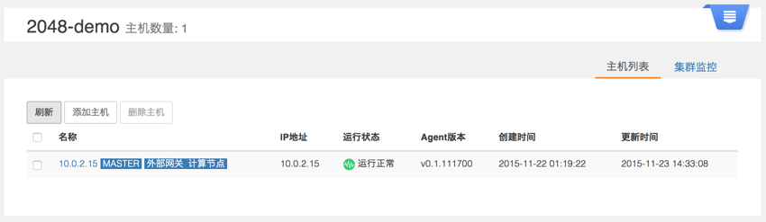
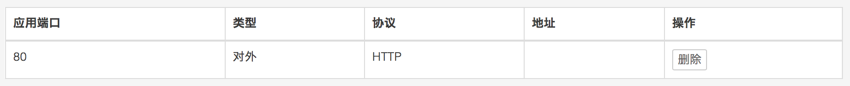

# 用 Vagrant 虚拟主机创建数人云集群  

## 1 安装虚拟主机

在个人电脑上玩数人云，需要创建虚拟主机，并添加到通过数人云所创建的集群中。这里我要用 Vagrant 来创建虚拟机主机。  
Vagrant是一个让你可以方便设置你想要的虚拟机的便携式工具，它底层支持 VirtualBox、VMware 甚至AWS作为虚拟机系统。下面，我将使用 VirtualBox 来进行说明。第一步需要先安裝 Vagrant 和 VirtualBox。

### 1.1 安装VirtualBox
VirtualBox 是 Oracle 开源的虚拟化系统，它支持多个平台，所以你可以到官方网站：[https://www.virtualbox.org/wiki/Downloads/](https://www.virtualbox.org/wiki/Downloads/) 下载适合你平台的 VirtualBox 最新版本并安装，它的安装过程都很傻瓜化，一步一步执行就可以完成安装了。

### 1.2 安装Vagrant
最新版本的Vagrant已经无法通过 `gem` 命令来安装，因为依赖库太多了，所以目前无法使用`gem`来安装，目前网络上面很多教程还是类似这样的命令，那些都是错误的。目前唯一安装的办法就是到官方网站下载打包好的安装包：[http://www.vagrantup.com/downloads.html](http://www.vagrantup.com/downloads.html)  他的安装过程和VirtualBox的安装一样都是傻瓜化安装，一步一步执行就可以完成安装。

> 尽量下载最新的程序，因为VirtualBox经常升级，升级后有些接口会变化，老的Vagrant可能无法使用。

要想检测安装是否成功，可以打开终端命令行工具，输入 `vagrant`，看看程序是不是已经可以运行了。如果不行，请检查一下$PATH里面是否包含 `vagrant` 所在的路径。

### 1.3 创建虚拟机

当我们安装好 VirtualBox 和 Vagrant 后，我们要开始考虑在VM上使用什么操作系统了，一个打包好的操作系统在 Vagrant 中称为 Box，即 Box 是一个打包好的操作系统环境，目前网络上什么都有，所以你不用自己去制作操作系统或者制作Box：[vagrantbox.es](http://www.vagrantbox.es/) 上面有大家熟知的大多数操作系统，你只需要下载就可以了，下载主要是为了安装的时候快速，当然 Vagrant 也支持在线安装。

#### 1.3.1 建立开发环境目录
我的开发机是 Mac，所以我建立了如下的开发环境目录，读者可以根据自己的系统不同建立一个目录就可以：

	/Users/mymac/vagrant

#### 1.3.2 下载 box
前面讲的 box 实际上它是一个zip包，包含了 Vagrant 的配置信息和 VirtualBox 的虚拟机镜像文件.我们这一次的实战使用一个 box: https://github.com/jose-lpa/packer-ubuntu_14.04/releases/download/v2.0/ubuntu-14.04.box ,这个 box 基于 Ubuntu 14.04，并且已经配置好了 Docker 环境。  

当然你也可以选一个自己团队在用的系统，例如 CentOS、Debian 等，我们可以通过上面说的地址下载开源爱好者们制作好的 box。  

#### 1.3.3 添加 box
添加 box 的命令如下：

	vagrant box add base 远端的box地址或者本地的box文件名

`vagrant box add` 是添加box的命令；`base` 是 box 的名称，可以是任意的字符串，`base` 是默认名称，主要用来标识一下你添加的 box ，后面的命令都是基于这个标识来操作的。

我在开发机上面是这样操作的，首先进入我们的开发环境目录 `/Users/mymac/vagrant`，执行如下的命令

	sudo vagrant box add base https://github.com/jose-lpa/packer-ubuntu_14.04/releases/download/v2.0/ubuntu-14.04.box

安装过程的信息：

	Box file was not detected as metadata. Adding it directly...
	Adding box 'base' (v0) for provider:
	Downloading: http://files.vagrantup.com/lucid64.box
	Box download is resuming from prior download progress
	Successfully added box 'base' (v0) for 'virtualbox'!

box 中的镜像文件被放到了：`/Users/mymac/.vagrant.d/boxes/`，如果在 Windows 系统中应该是放到了：
`C:\Users\当前用户名\.vagrant.d\boxes\` 目录下。

>通过 `vagrant box add` 这样的方式安装远程的 box，可能很慢，所以建议大家先下载 box 到本地再执行这样的操作。

#### 1.3.4 初始化
初始化的命令如下：

	vagrant init

如果你添加的box名称不是base，那么需要在初始化的时候指定名称，例如

	vagrant init "CentOS 6.3 x86_64 minimal"

初始化过程的信息：

	A `Vagrantfile` has been placed in this directory.
	You are now ready to `vagrant up` your first virtual environment!
	Please read the comments in the Vagrantfile as well as documentation on `vagrantup.com` for more information on using Vagrant.

这样就会在当前目录生成一个	`Vagrantfile` 的文件，里面有很多配置信息，默认的配置可以开箱即用。

#### 1.3.5 启动虚拟机
启动虚拟机的命令如下：

	vagrant up

启动过程的信息:

	Bringing machine 'default' up with 'virtualbox' provider...
	default: Importing base box 'base'...
	default: Matching MAC address for NAT networking...
	default: Setting the name of the VM: vagrant_default_1448125851882_1574
	default: Clearing any previously set network interfaces...
	default: Preparing network interfaces based on configuration...
    default: Adapter 1: nat
	default: Forwarding ports...
    default: 22 => 2222 (adapter 1)
	default: Booting VM...
	default: Waiting for machine to boot. This may take a few minutes...
    default: SSH address: 127.0.0.1:2222
    default: SSH username: vagrant
    default: SSH auth method: private key
    default: Warning: Connection timeout. Retrying...
    default:
    default: Vagrant insecure key detected. Vagrant will automatically replace
    default: this with a newly generated keypair for better security.
    default:
    default: Inserting generated public key within guest...
    default: Removing insecure key from the guest if it's present...
    default: Key inserted! Disconnecting and reconnecting using new SSH key...
	default: Machine booted and ready!
	default: Checking for guest additions in VM...
    default: The guest additions on this VM do not match the installed version of
    default: VirtualBox! In most cases this is fine, but in rare cases it can
    default: prevent things such as shared folders from working properly. If you see
    default: shared folder errors, please make sure the guest additions within the
    default: virtual machine match the version of VirtualBox you have installed on
    default: your host and reload your VM.
    default:
    default: Guest Additions Version: 4.3.16
    default: VirtualBox Version: 5.0
	default: Mounting shared folders...
    default: /vagrant => /Users/mymac/vagrant

#### 1.3.6 连接到虚拟机
上面已经启动了虚拟机，之后我们就可以通过 ssh 来连接到虚拟机了。比如在我的开发机中可以像这样来连接：

	vagrant ssh

连接到虚拟机后的信息如下：

	Welcome to Ubuntu 14.04 LTS (GNU/Linux 3.13.0-45-generic x86_64)

	 * Documentation:  https://help.ubuntu.com/
	Last login: Thu Feb 12 10:37:57 2015 from 10.0.2.2

这样我们就可以像连接到一台服务器一样进行操作了。

>Windows 机器不支持这样的命令，必须使用第三方客户端来进行连接，例如 putty、Xshell4 等.

>putty 为例：

>主机地址: 127.0.0.1

>端口: 2222

>用户名: vagrant

>密码: vagrant

#### 1.3.8 Vagrantfile配置
在我们的开发目录下有一个文件 `Vagrantfile`，里面包含有大量的配置信息，主要包括三个方面的配置，虚拟机的配置、SSH 配置、Vagrant 的一些基础配置。Vagrant 是使用 Ruby 开发的，所以它的配置语法也是 Ruby 的。这里需要对虚拟机的网络进行配置。

2. 网络设置

	Vagrant 有两种方式来进行网络连接，一种是 host-only(主机模式)，意思是主机和虚拟机之间的网络互访，而不是虚拟机访问 Internet 的技术，其他人访问不到你的虚拟机。另一种是 Bridge(桥接模式)，该模式下的 VM 就像是局域网中的一台独立的主机，也就是说需要 VM 到你的路由器要 IP，这样的话局域网里面其他机器就可以访问它了。我们设置为 host-only 模式，在 Vagrantfile 中添加如下配置：

		config.vm.network "public_network", ip: "192.168.1.120"

修改完 Vagrantfile 的配置后，记得要用 `vagrant reload` 命令来重启VM之后才能使用 VM 更新后的配置。

就这样，我们已经在个人电脑中完成了虚拟机的制作。  


## 2. 加入数人云

现在，我们要将刚才制作的虚拟机加入到数人云的集群中。  

### 2.1 建立集群

登录数人云账户后，在集群管理页，点击创建集群。  

填写集群名称，选择 1 Master 集群，点击完成。

### 2.2 添加主机

首先，配置主机环境：

1. ssh 登陆虚拟机；  
2. ping 数人云：`ping www.shurenyun.com`，连通 OK；
3. 升级 Docker；之前操作中使用的 Vagrant base 镜像中虽然预装了 Docker，但是版本较低，需要更新到最新版本，可以按照“添加主机”页面中提示的指令执行：`curl -sSL https://get.docker.com/ | sh`，待执行结束后，运行`docker version`，最后可以看到如下信息：  

```
Client:
 Version:      1.9.1
 API version:  1.21
 Go version:   go1.4.2
 Git commit:   a34a1d5
 Built:        Fri Nov 20 13:12:04 UTC 2015
 OS/Arch:      linux/amd64

Server:
 Version:      1.9.1
 API version:  1.21
 Go version:   go1.4.2
 Git commit:   a34a1d5
 Built:        Fri Nov 20 13:12:04 UTC 2015
 OS/Arch:      linux/amd64
```

配置完成后，回到“添加主机”页面，填写主机名称，主机类型选择计算节点和外部网关，点击复制。   

回到 Vagrant 虚拟主机，粘贴代码并执行，可以看到如下执行信息：  

	-> Deploying Docker Runtime Environment...
	Docker already installed
	-> Installing omega-agent...
	-> Downloading omega-agent from http://agent.shurenyun.com/packages/omega-agent-v0.1.111700_amd64.deb
	  % Total    % Received % Xferd  Average Speed   Time    Time     Time  Current
                                 Dload  Upload   Total   Spent    Left  Speed
	100 3340k  100 3340k    0     0   697k      0  0:00:04  0:00:04 --:--:--  697k
	Selecting previously unselected package omega-agent.
	(Reading database ... 67782 files and directories currently installed.)
	Preparing to unpack .../omega-agent-v0.1.111700_amd64.deb ...
	Unpacking omega-agent (1.0) ...
	Setting up omega-agent (1.0) ...
	Processing triggers for ureadahead (0.100.0-16) ...
	-> Configuring omega-agent...
	-> Done!

  	***************************************************************************
	  Omega Agent installed successfully
  	***************************************************************************

	  You can view omega-agent log at /var/log/omega/agent.log
	  And You can Start or Stop omega-agent with: service omega-agent start/stop/restart/status

主机添加完成后，稍等一段时间，回到集群管理，看看集群状态。  

  

就这样，我的个人集群已经搭建完成了！  

### 2.3 发布应用  

按照 [第一个应用-2048](../get-started/2048.md) 所述，发布一个 2048 游戏的小应用。  

  

应用地址为对外 HTTP，映射端口为避免冲突一般大于1000，这里设置为8585.  

  

等待服务部署完成，进入“运行中”状态。还记得 1.3.9 在 Vagrantfile 配置的 IP 吗？我们可以在浏览器访问 ```http://l192.168.1.120:8585```，开始2048。

至此，我们已经可以使用个人电脑在数人云上创建集群和发布应用了！  