## 搭建 Wordpress 个人博客
### 目录
#### [第一步建立集群](#step1)
#### [第二步发布应用](#step2)

<h3 id="step1">1 第一步建立集群（应用发布环境）</h3>

### 1.1 注册&登录数人云

访问 [www.shurenyun.com](http://www.shurenyun.com) 注册并登录系统。

### 1.2 准备主机

需要准备至少两台主机，主机可以是可以连接互联网的私有主机，也可以是阿里云、Ucloud、
AWS、Azure、首都在线、华为云等公有云上购买的任意一台云主机。

### 1.3 建立集群

1.3.1 登录账户后，在集群管理中，点击创建群组。  

1.3.2 填写集群名称（demo），选择 1 Master集群，点击完成,集群已经建立，如下图所示。

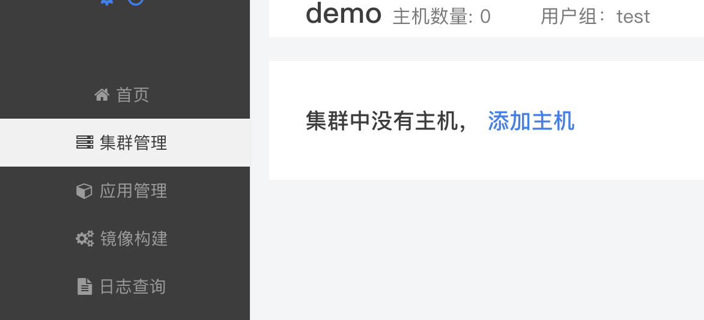


### 1.4 添加主机

1.4.1 添加主机，如图点击右上角下拉菜单，选择添加主机。


1.4.2 填写主机名称，并在主机上根据"连接主机"的提示进行操作。   

1.4.3 选择主机类型：
  
  * 第一台主机为 Master 
  * 第二台主机为 slave；
  
  
注：实现本案例，所需最小规模集群为2台主机，一台为 Master 节点，另一台包括所有节点类型。为便于区分各种主机类型，分别在不同主机上部署了不同的节点类型。

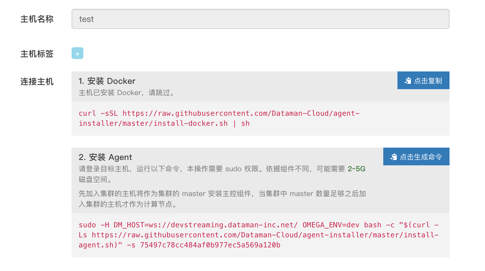

（1）安装 Docker

       curl -sSL https://raw.githubusercontent.com/Dataman-Cloud/agent-installer/master/install-docker.sh | sh 


（2）安装 Agent

         sudo -H DM_HOST=ws://devstreaming.dataman-inc.net/ OMEGA_ENV=dev bash -c "$(curl -Ls https://raw.githubusercontent.com/Dataman-Cloud/agent-installer/master/install-agent.sh)" -s 75497c78cc484af0b977ec5a569a120b


**注：**  Agent命令每添加一台需要重新生成一次；按提示执行以上两步后，点击"完成"即成功添加主机。主机名称可以添加后在集群中修改。

**提示** ：向同一集群添加的主机应存在于同一网段内，暂不支持跨公网的主机组建集群。

### 1.5 确认集群环境正常

主机添加完成后，检查主机运行是否正常，如图所示：

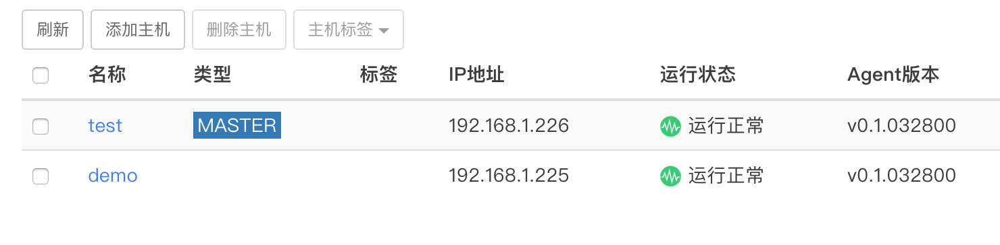

<h3 id="step2">2 第二步发布应用</h3>  
部署 Wordpress 应用，首先需要部署 mysql 数据库，然后部署 Wordpress 服务；我们先从 mysql 开始。  

### 2.1 新建 Mysql 应用

2.1.1 选择"应用管理"中的"新建应用"，如图所示：  

  

2.1.2 新建应用  

填写应用名称：mysql  

选择集群：demo（图中的test为用户组)  

添加应用镜像地址：index.shurenyun.com/mysql  

填写镜像版本：5.6   

网络模式：网桥模式

强制拉镜像：容器重启时自动更新最新镜像。

主机选择：支持随机选择，或者指定主机。
 
挂载点：可以将主机目录挂载到容器内。

容器路径：容器内的挂载目录  /var/lib/mysql

主机路径：主机上的挂载目录  /var/lib/mysql

选择容器规格： CPU：0.2   内存：512 MB  

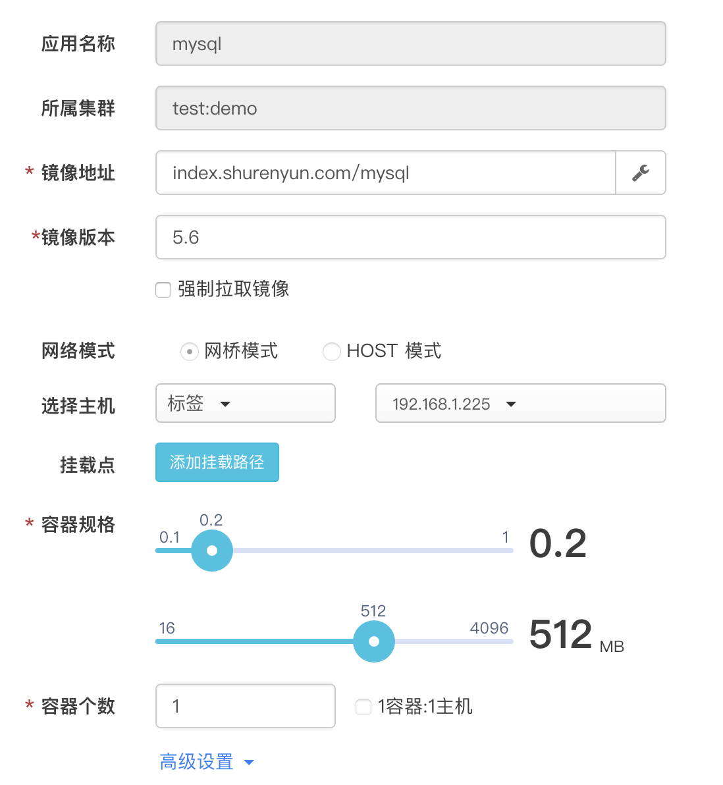  

高级设置：  

填写应用地址：  端口：3306，类型：对内 TCP  

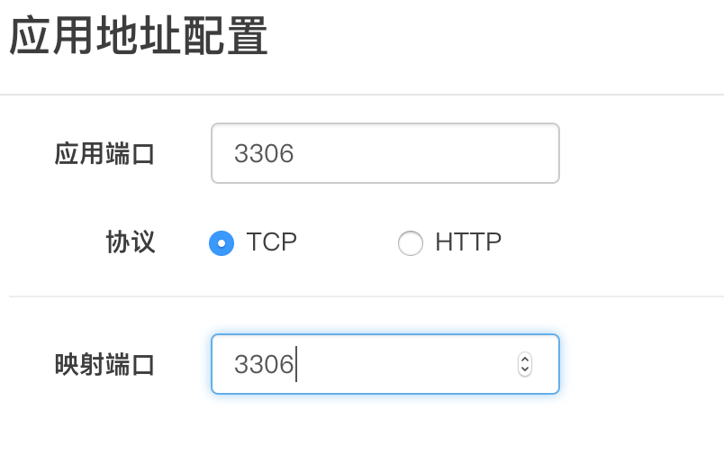 

填写环境变量参数：

```Key:MYSQL_ROOT_PASSWORD  Value:123```  

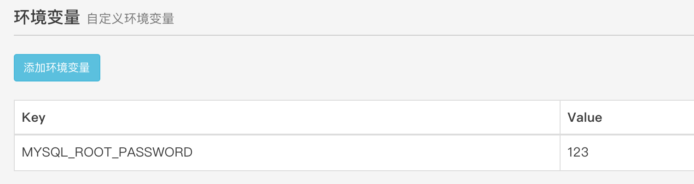
  
填写完成后，点击创建。  

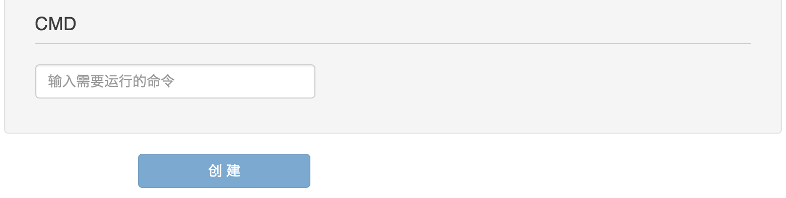

### 2.2 新建 Wordpress 应用  

点击新建应用，新建 Wordpress 应用：  

填写应用名称:wordpress  

选择集群：demo（图中的test为用户组)  

添加应用镜像地址：index.shurenyun.com/wordpress  

填写镜像版本：4.3   

网络模式：网桥模式

选择容器规格：  CPU：0.5   内存：512 MB  

容器个数：1 

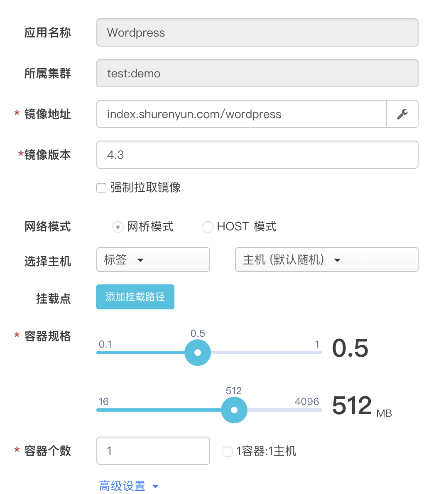  

高级设置：  

填写应用地址： 端口：80，映射端口：88 类型：HTTP   
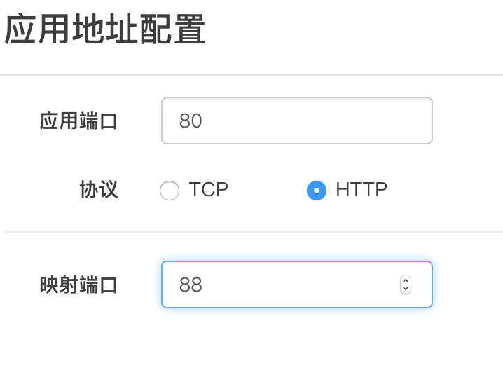 

填写环境变量参数：  

 ```Key:WORDPRESS_DB_HOST Value:192.168.1.225:3306```

  ```Key:WORDPRESS_DB_USER    Value:root```

```Key:WORDPRESS_DB_PASSWORD     Value:123```
    
注：环境变量一次添加一个，如果多个环境变量需要设置，需要分次添加。WORDPRESS_DB_HOST取值为mysql的应用地址。

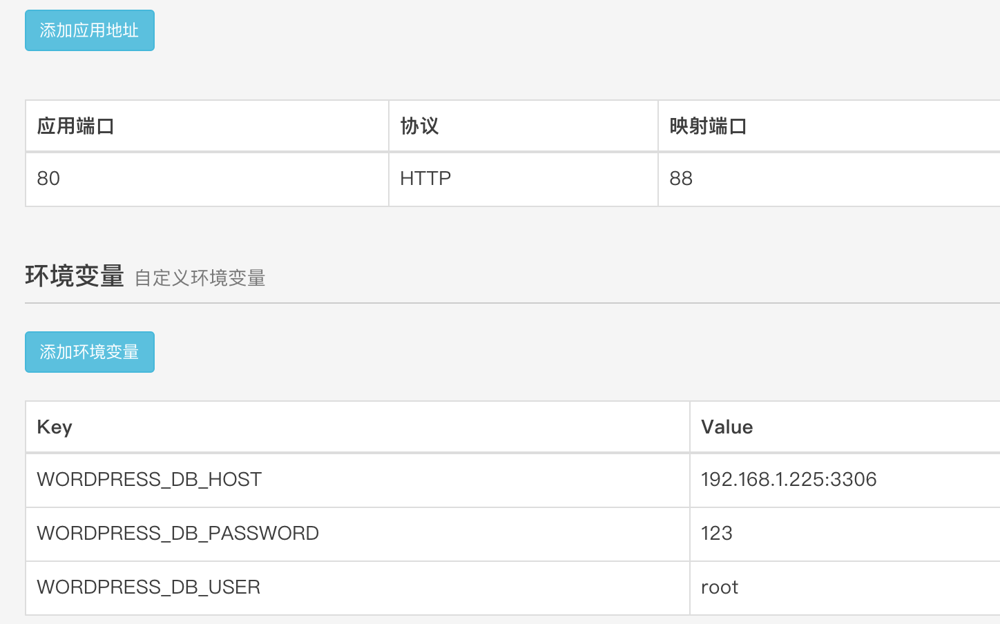  
填写完成后，点击创建。

### 2.3 确认应用正常运行

回到应有管理中，即可看到应用已正常运行。

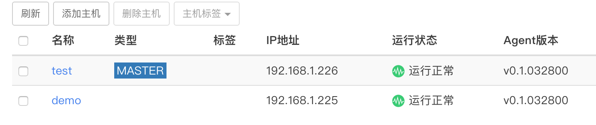  

打开浏览器，访问地址，http://192.168.1.226:88 或者 http://192.168.1.225:88 看到如下页面，则说明 Wordpress 应用已经成功运行。


恭喜，现在您已经拥有了一个小型的 Wordpress 站点，并且可以通过应用管理横向拓展。

