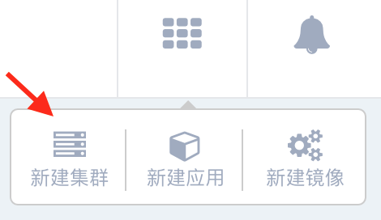
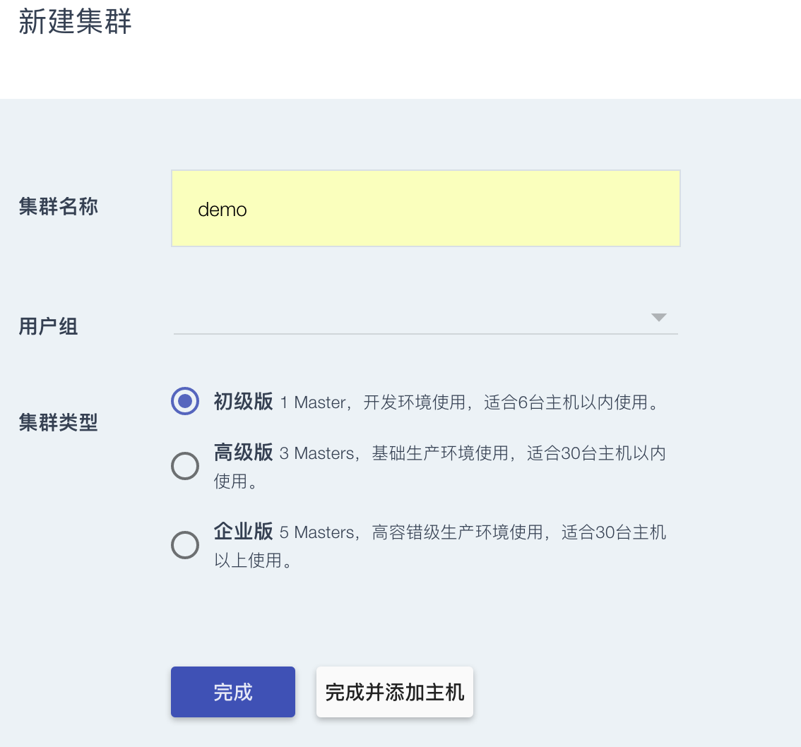
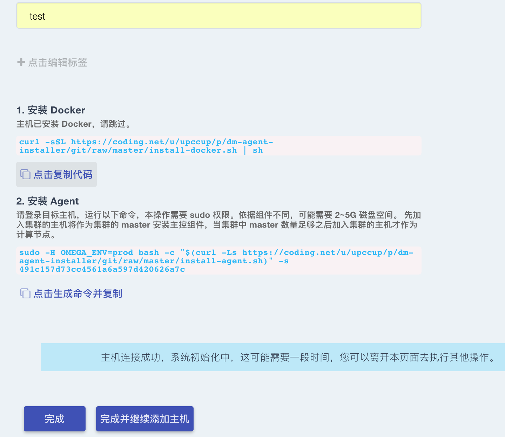
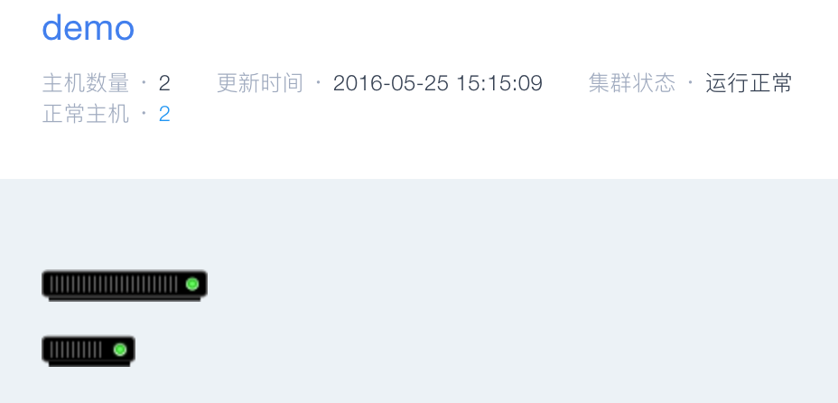
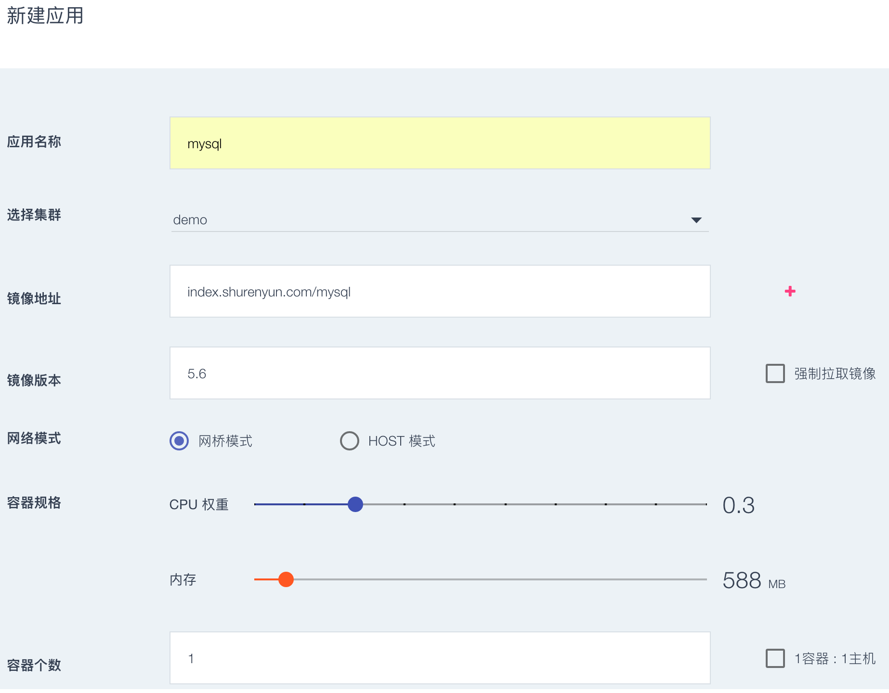
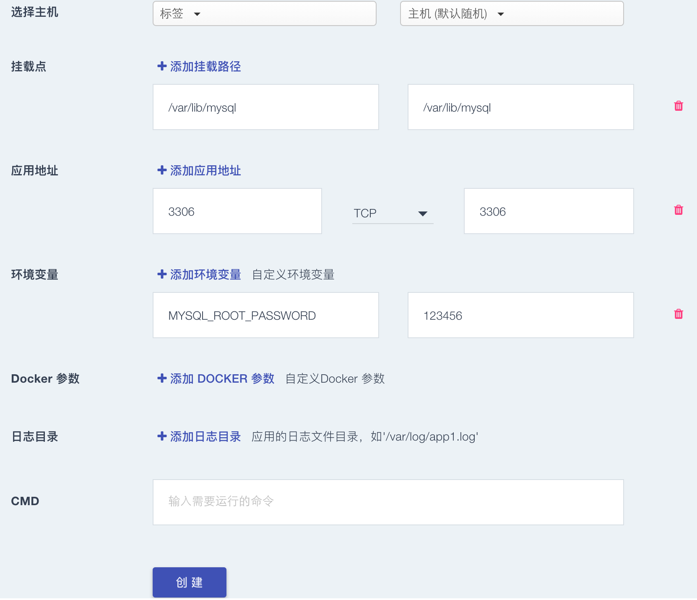
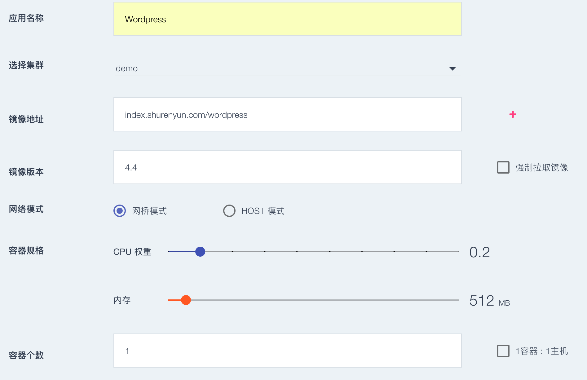
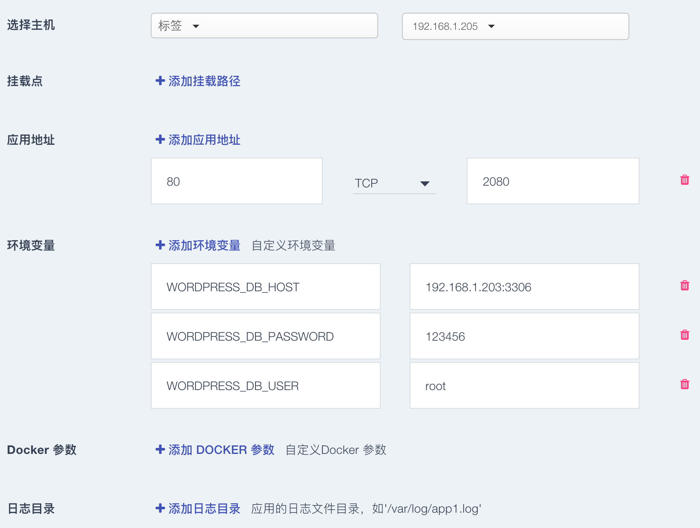

## 搭建 Wordpress 个人博客
### 目录
#### [第一步建立集群](#step1)
#### [第二步发布应用](#step2)

<h3 id="step1">1 第一步建立集群（应用发布环境）</h3>

### 1.1 注册&登录数人云

访问 [www.shurenyun.com](http://www.shurenyun.com) 注册并登录系统。

### 1.2 准备主机

需要准备至少两台主机，主机可以是可以连接互联网的私有主机，也可以是阿里云、Ucloud、
AWS、Azure、首都在线、华为云等公有云上购买的任意一台云主机。

### 1.3 建立集群

1.3.1 登录账户后，在集群管理中，点击创建群组。  

1.3.2 填写集群名称（demo），选择 1 Master集群，点击完成,集群已经建立，如下图所示。




### 1.4 添加主机

1.4.1 添加主机，在集群界面点击右上角菜单，选择添加主机。


1.4.2 填写主机名称，并在主机上根据"连接主机"的提示进行操作。   

1.4.3 选择主机类型：
  
  * 第一台主机为 Master 
  * 第二台主机为 slave；
  
 



（1）安装 Docker

       curl -sSL https://coding.net/u/upccup/p/dm-agent-installer/git/raw/master/install-docker.sh | sh
                 


（2）安装 Agent
			
	 sudo -H  OMEGA_ENV=prod bash -c "$(curl -Ls https://coding.net/u/upccup/p/dm-agent-installer/git/raw/master/install-agent.sh)" -s 491c157d73cc4561a6a597d420626a7c 

* 点击 `完成并继续添加主机`

**注：**  Agent命令每添加一台需要重新生成一次；按提示执行以上两步后，点击"完成"即成功添加主机。主机名称可以添加后在集群中修改。

**提示** ：向同一集群添加的主机应存在于同一网段内，暂不支持跨公网的主机组建集群。

### 1.5 确认集群环境正常

* 集群主机添加完成后，检查主机运行是否正常，如图所示：集群正常运行后可以发布应用



<h3 id="step2">2 第二步发布应用</h3>  
* 部署 Wordpress 应用，首先需要部署 mysql 数据库，然后部署 Wordpress 服务；我们先从 mysql 开始。  

### 2.1 新建 Mysql 应用

2.1.1 选择"应用管理"中的"新建应用"，如图所示：  

  

2.1.2 新建应用  

填写应用名称：mysql  

选择集群：demo

添加应用镜像地址：index.shurenyun.com/mysql  

填写镜像版本：5.6   

网络模式：网桥模式

强制拉镜像：容器重启时自动更新最新镜像。

选择容器规格： CPU：0.2   内存：588 MB  

  

高级设置：  

主机选择：支持随机选择，或者指定主机。

挂载点：可以将主机目录挂载到容器内。

容器路径：容器内的挂载目录  /var/lib/mysql

主机路径：主机上的挂载目录  /var/lib/mysql

填写应用地址：  端口：3306，类型： TCP  


填写环境变量参数：

```Key:MYSQL_ROOT_PASSWORD  Value:123```  
  
填写完成后，点击创建。  

### 2.2 新建 Wordpress 应用  

点击新建应用，新建 Wordpress 应用：  

填写应用名称:wordpress  

选择集群：demo

添加应用镜像地址：index.shurenyun.com/wordpress  

填写镜像版本：4.4   

网络模式：网桥模式

选择容器规格：  CPU：0.2   内存：512 MB  

容器个数：1 

  

高级设置：  


 
填写应用地址： 端口：80，映射端口：88 类型：HTTP   
填写环境变量参数：  

 ```Key:WORDPRESS_DB_HOST Value:192.168.1.205:3306```#mysql的应用地址

  ```Key:WORDPRESS_DB_USER    Value:root```

```Key:WORDPRESS_DB_PASSWORD     Value:123```
    
注：环境变量一次添加一个，如果多个环境变量需要设置，需要分次添加。WORDPRESS_DB_HOST取值为mysql的应用地址。

填写完成后，点击创建。

### 2.3 确认应用正常运行

回到应有管理中，如果应用状态为正常运行。

打开浏览器，访问地址，http://192.168.1.203:2080 或者 http://192.168.1.203:2080 看到如下页面，则说明 Wordpress 应用已经成功运行。


恭喜，现在您已经拥有了一个小型的 Wordpress 站点，并且可以通过应用管理横向拓展。

