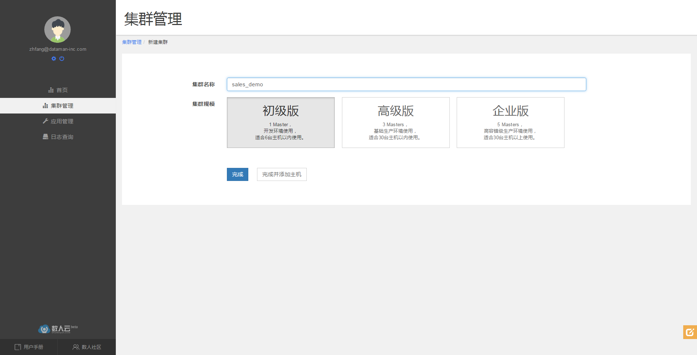

## 搭建 Wordpress 个人博客
### 目录
#### [第一步建立集群](#step1)
#### [第二步发布应用](#step2)

<h3 id="step1">1 第一步建立集群（应用发布环境）</h2>

### 1.1 注册&登录数人云

访问 [www.shurenyun.com](http://www.shurenyun.com) 注册并登录系统。

备注：数人云目前是内测期，如您需要邀请码，请填写免费试用表单申请。  

[免费试用>>](http://form.mikecrm.com/f.php?t=CgBTTT)

### 1.2 准备主机

需要准备至少一台主机，主机可以是可以连接互联网的私有主机，也可以是阿里云、Ucloud、
AWS、Azure、首都在线、华为云等公有云上购买的任意一台云主机。

### 1.3 建立集群

1.3.1 登录账户后，在集群管理中，点击创建群组。  

1.3.2 填写集群名称（sales_demo），选择 3 Master集群，点击完成。




集群已经建立，如下图所示：


### 1.4 添加主机

1.4.1 添加主机，如图点击右上角下拉菜单，选择添加主机。


1.4.2 填写主机名称，并在主机上根据"连接主机"的提示进行操作。   

1.4.3 选择主机类型：
  
  * 前三台主机为 Master 节点，类型为计算节点；
  * 第四台主机选择计算节点，用于部署无状态应用；
  * 第五台主机选择计算节点和外部网关，用于部署对外的计算服务，该节点需要配置外网 IP 和域名；
  * 第六台主机选择代理节点和数据节点，用于部署有状态的应用，如 mysql、redis 等。  
  
注：实现本案例，所需最小规模集群为2台主机，一台为 Master 节点，另一台包括所有节点类型。为便于区分各种主机类型，分别在不同主机上部署了不同的节点类型。  


（1）安装Docker

	curl -sSL https://get.docker.com/ | sh

（2）安装 Agent

	curl -Ls https://www.shurenyun.com/install.sh | sudo -H sh -s 050f9bb687234f0e9e1e304aa7ddb0ba

按提示执行以上两步后，点击"完成"即成功添加主机。

提示：向同一集群添加的主机应存在于同一网段内，暂不支持跨公网的主机组建集群。

### 1.5 确认集群环境正常

主机添加完成后，检查主机运行是否正常，如图所示：


<h3 id="step2">2 第二步发布应用</h2>  
部署 Wordpress 应用，首先需要部署 mysql 数据库，然后部署 Wordpress 服务；我们先从 mysql 开始。  

### 2.1 新建mysql应用

2.1.1 选择"应用管理"中的"新建应用"，如图所示：  

  

2.1.2 新建应用  

填写应用名称：mysql  

选择集群：your-cluster  

添加应用镜像地址：mysql  

填写镜像版本：latest   

选择应用类型：有状态应用  

主机选择：DB-proxy  
这里的主机只能从数据节点中选择，目前只有 DB-proxy；有状态应用不能迁移，只能固定在被选择的节点上；另外，有状态应用一次只能部署一个容器；  

容器目录：容器内的挂载目录  

主机目录：主机上的挂载目录  

选择容器规格： CPU：0.2   内存：256 MB  

  

高级设置：  

填写应用地址：  端口：3306，类型：对内 TCP  
选择“对内 TCP”方式，则该应用会向内部代理注册，内部代理对外暴露3306端口；  

填写环境变量参数：
```Key:MYSQL_ROOT_PASSWORD  Value:your-password```  

  
填写完成后，点击创建。  

### 2.2 新建 wordpress 应用  

点击新建应用，新建 wordpress 应用：  

填写应用名称:wordpress  

选择集群：your-cluster  

添加应用镜像地址：wordpress  

填写镜像版本：latest   

选择应用类型：无状态应用  

选择容器规格：  CPU：0.2   内存：256 MB  

容器个数：2  

  

高级设置：  

填写应用地址：  端口：80，类型：对外标准 HTTP，域名：your-website  
注：由于 Wordpress 是 HTTP 应用，并需要对外服务发现，因此选择对外标准 HTTP，会对外暴露 80 端口；同时，需要填写域名：your-website；  

填写环境变量参数：  
```
Key:WORDPRESS_DB_HOST  Value:10.3.10.63:3306  
Key:WORDPRESS_DB_USER  Value:root
Key:WORDPRESS_DB_PASSWORD  Value:your-password
```  
注1：应用地址选择对外标准 HTTP 时，需要配置相应的域名或外网 IP 到对外网关节点，以确保可以通过公网进行访问；  
注2：配置 mysql 地址的环境变量时，mysql 地址应该为内部代理的 IP 和 mysql 的映射 IP，根据上述 mysql 配置，该地址为10.3.10.63:3306。

  

### 2.3 确认应用正常运行

回到应有管理中，即可看到应用已正常运行。

  

打开浏览器，访问地址：http://yma.dataman-inc.com（替换成你的域名或者网关 IP），看到如下页面，则说明wordpress 应用已经成功运行。  


恭喜，现在你已经拥有了一个小型的 wordpress 站点，并且为 web server 创建了 2 个实例，实现了最基础的横向扩展和负载均衡！