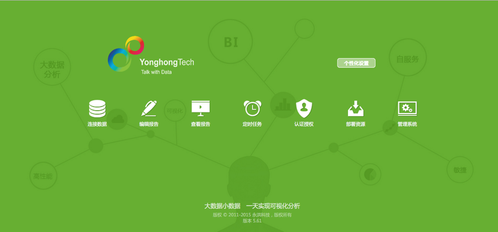

## 永洪 BI 入驻数人云  

永洪商智科技有限公司作为国内领先的数据可视化分析解决方案提供商，正在为百亿级数据量的大型企业和各个垂直行业的中小企业提供灵活易用的数据分析解决方案。  

永洪 BI 是目前国内最好用的数据可视化分析软件，具有简单易用、多样化呈现、交互式体验、支持各类移动终端等特色，可以帮助客户提升10-100倍运营效率、实时洞悉业务状况和变化。其客户包括中国移动、国家电网、航天三院、四达传媒、中国风电、浪潮集团、博彦科技、宝宝树、百程旅行网等在内的知名企业。  

现在，永洪 BI 已经数人云。只需要10分钟，就可以为您的商业系统部署一套专属您的永洪 BI！

<h3 id="step1">1 第一步 制作镜像</h3>

首先，我们拿到了永洪 BI 产品的安装文件，在docker 环境中安装，然后封装成 docker image。

<h3 id="step1">1 第二步 建立集群</h3>

请参见 [创建/删除集群](../function/create_delete_cluster.md) 来创建您的集群。  

创建集群的实例可以参考[第一个应用-2048](../get-started/2048.md)。

>注意：如果您需要从集群外部来访问服务，则需要配置外网 IP 或可访问域名，集群中要配置外部网关，以便对外进行服务暴露。

<h3 id="step2">2 第三步 发布应用</h3>    

点击新建应用：  

填写应用名称:yonghongbi  

选择集群：your-cluster  

添加应用镜像地址：/path/to/yonghongbi/image  

填写镜像版本：version   

选择应用类型：无状态应用  

选择容器规格：  CPU：0.5   内存：2048 MB  

容器个数：1  

高级设置：  

填写应用地址：  端口：8080，类型：对外 HTTP，域名：your-website  
注：由于 永洪 BI 是 Web 应用，并需要对外服务发现，因此选择对外标准 HTTP，会对外暴露 80 端口；同时，需要填写域名：your-website；  

填写CMD：  
```
/app/YH/tomcat/bin/catalina.sh run
```  
>注：应用地址选择对外标准 HTTP 时，需要配置相应的域名或外网 IP 到对外网关节点，以确保可以通过公网进行访问；  

等一会再回到应有管理中，可以看到应用已正常运行。永洪 BI 的 Docker image 比较大，所以部署时间会比较长，请耐心等待一会。

打开浏览器，访问地址：http://yonghongbi.dataman-inc.com（替换成你的域名或者网关 IP），看到如下页面，则说明 yonghongbi 应用已经成功运行。  



恭喜，现在你已经完成了一套永洪 BI 的部署！