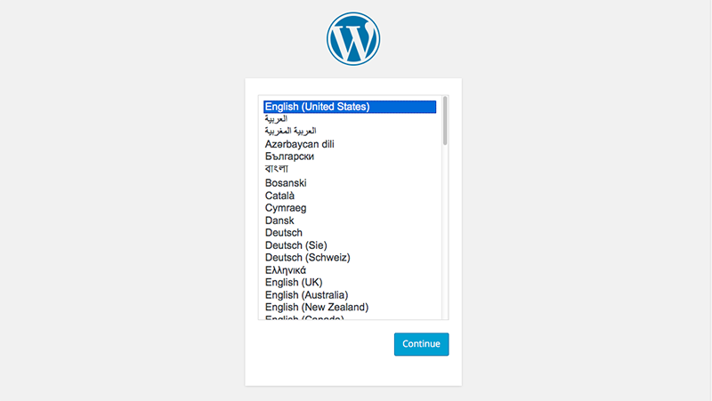

### 通过数人云玩转 Spark  

Zeppelin是一个Apache的孵化项目，提供了一个 web server，支持交互式数据分析。通过 Zeppelin 可以实现以下需求：  
 
- 数据采集 
- 数据发现 
- 数据分析 
- 数据可视化和协作

Zeppelin 提供了内置的 Apache Spark 集成，并自动引入SparkContext 和 SQLContext，因此无需再单独部署 Spark。

那我们今天就通过数人云部署 Zeppelin，并创建 Spark 集群，来实现 Web 方式的 Spark 编程体验。

<h3 id="step1">1 第一步 制作镜像</h3>

###运行Zeppelin
  登录主机。  
  注意：主机的网络配置要求开放所有进出方向的 tcp 端口，easystack 主机需要在 security group 修改默认配置。  
  修改主机名文件：  
  vi /etc/hosts
  
  ########################  
  127.0.0.1  sparkimage    ##sparkimage换成自己的主机名  
  ######################## 
  
  安装 docker：  
  ```wget -qO- https://get.docker.com/ | sh```  
  
  修改 docker 配置文件,增加以下内容;  
  vi /etc/default/docker  
  
  ########################  
  DOCKER_OPTS="--insecure-registry 192.168.111.93:5000"  
  ########################  
  
  重启 docker：  
  ```service docker restart```  
  
  下载 zeppelin image：  
  ```docker pull 192.168.111.93:5000/tsinghua/zeppelin:b2```  
  
  创建 container：  
  ```docker run -d --net host 192.168.111.93:5000/tsinghua/zeppelin:b2 
  ```  
  
  运行 spark：
  创建ssh tunnel 并配置浏览器代理，以便访问内网地址；  
  通过以下地址访问zeppelin：    
  ```http://HOST_IP:8080```  
  
  运行demo:  
  点击```Create new note```，创建一个 notebook；  
  点击进入 notebook，输入代码：  
  ```
  sc.parallelize(1 to 1000) count
  ```  
  点击 Run.  
  
创建并上传 Docker image:  

```
	docker build -t DockerRegistryPath/zeppelin:v1   
	docker push DockerRegistryPath/zeppelin:v1  
```

<h3 id="step1">1 第二步 建立集群</h3>

请参见 [创建/删除集群](../function/create_delete_cluster.md) 来创建您的集群。  

创建集群的实例可以参考[第一个应用-2048](../get-started/2048.md)。

>注意：如果您需要从集群外部来访问服务，则需要配置外网 IP 或可访问域名，集群中要配置外部网关和内部代理，以便对外进行服务暴露。  

<h3 id="step2">2 第三步 发布应用</h3>    

接下来，通过数人云创建应用。  

1. 新建 Zeppelin 应用：  
填写应用名称:zeppelin  
	选择集群：your-cluster  
	添加应用镜像地址：```DockerRegistryPath/zeppelin```  
	填写镜像版本：```v1```   
	选择应用类型：无状态应用  
	添加目录：主机目录：```/var/lib/onesql```，容器目录：```/data/onesql/data```  
	选择容器规格：  CPU：0.5   内存：512 MB  
	容器个数：1  
高级设置：  
	填写应用地址：  端口：8080，类型：对内 HTTP，映射端口：8080  



恭喜，现在你的 onesql 已经正常运作了！
