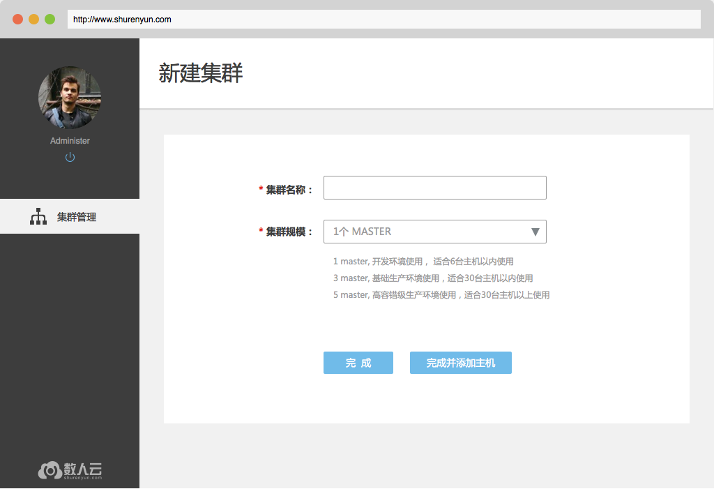
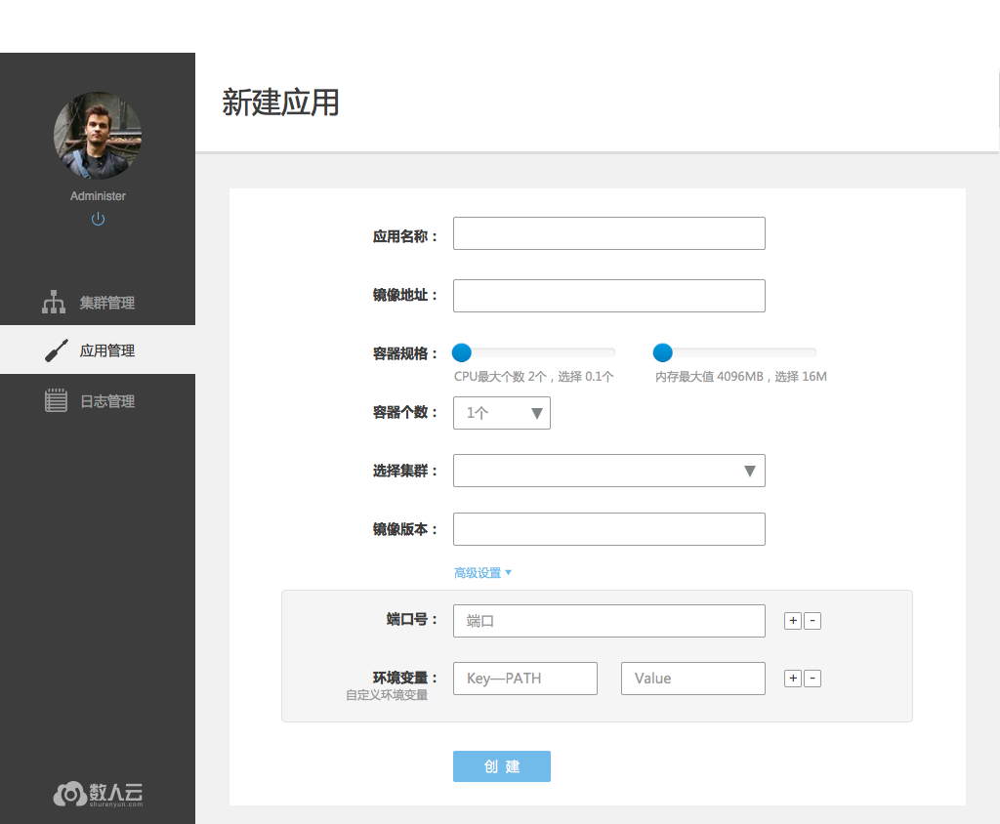
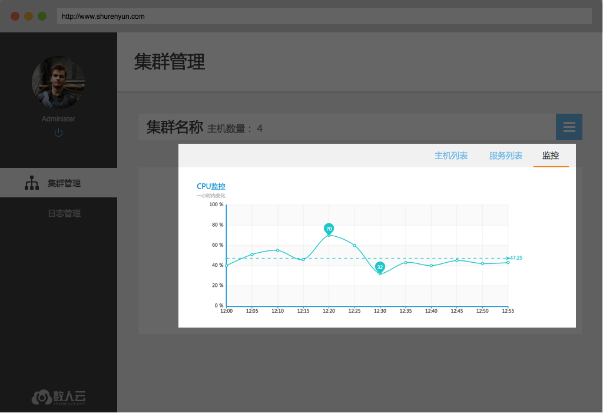
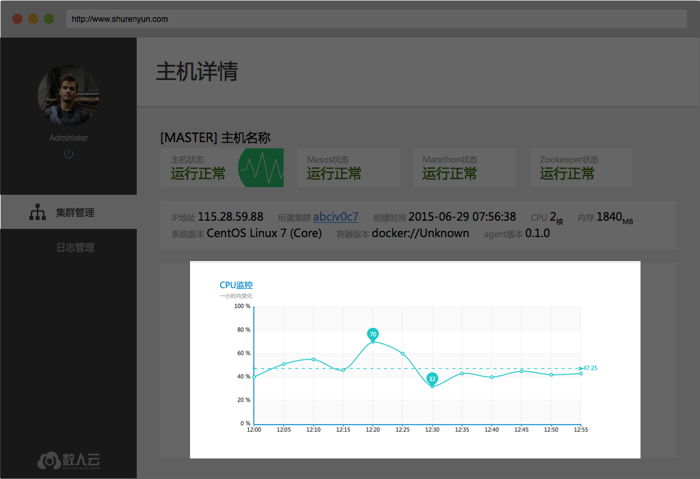

# 1. 数人云是什么 

数人云是一款可一键部署在任意公有云或私有云上的云管理软件，也是国内领先的分布式操作系统产品。其采用了Apache Mesos分布式计算框架、Docker容器等最新技术，根据长期的生产运维经验进行深度集成开发，能为企业级客户带来全新的云使用体验。    

数人云能够帮助用户轻松管理集群，使得集群易使用，无论集群大小，对于您而言其逻辑上是一台机器，应用的部署、运行和监控如同在单机进行，并且通过调度管理功能极大提高资源利用率，从而提高整体集群的性能。同时，用户能够使用简单易用的web界面，获得集群的监控、状态信息，像使用一台机器那样向集群部署应用，并监控应用的运行状况。方便开发者进行持续集成，从而推进产品的迭代优化，实现持续交付。    

# 2. 入门指引  

## 2.1. 什么是集群  

## 2.2. 什么是容器服务  

## 2.3. 了解数人云  
   
# 2. 产品介绍
## 集群管理  

### 1、创建/删除新集群  

**1.1 创建集群**     
只需输入集群名称就可以建立一个新的集群，。用户进一步添加主机（详见2、添加/删除主机）才能构成真正可以工作的集群。创建集群时可以根据集群规模选择在集群中安装 1、3 或 5 个master。建议：当集群中主机数量 > 10时建议选择3master，当主机数 >30 时选择5master更适合。   
    

**1.2 删除集群**    
用户在集群管理、集群详情页面都可以删除集群，确认删除后，数人云平台会停止集群上运行的所有应用、组件，但应用产生的业务数据依然保留在原主机上。   
  

### 2、添加/删除主机

**2.1 添加主机**   
用户在集群管理页、集群详情页都可以找到“添加主机”。向集群添加主机:  
1. 确认主机已经安装 Docker；如果没有，请按照提示安装Docker；
2. 根据主机的用途选择主机类型；  
3. 复制安装指令到主机，安装数人云的主机监控程序；  
4. 添加成功后，会提示连接成功；  
5. 可以点击完成，转向集群详情页，就可以在主机列表中看到这台主机；也可以选择继续添加其他主机，进行相同的操作即可。  
提醒：向同一集群添加的主机应存在于同一网段内，暂不支持跨公网的主机组建集群。  
     
当作为master的主机出现异常时，新添加其他主机进入集群，需要保证新加入要做master的这台为同样的IP。    

**2.2 删除主机**   
即将主机从该集群中删除，在集群详情页选择想要删除的主机，点击删除主机按钮并确认。删除主机并不删除主机上的应用数据，但会停止主机监控程序，即agent，从而无法通过数人云平台的集群管理访问该主机。     
    

### 3、查看集群 

**3.1 集群状态**     
集群正常工作时，用户可以在集群管理页看到集群中4种主机状态下各有多少台主机，以及集群中每一个master的运行状态。     
   

当集群中超过半数的master为非正常状态时，集群也将被标识为异常状态，如下图所示。     
   

**3.2 集群中的主机**   
集群管理页和集群详情页（可由查看集群进入）都能看到集群中的主机，每个主机的图形、文字符号，也都可以转向主机的详情页面（详见4、查看主机）。     

### 4、查看主机

**4.1 主机状态**      
主机整体的运行状态，在主机列表中均有标识，无论是集群管理页的图形化主机列表还是集群详情页的表格、文字主机列表。主机有4种运行状态：    
- 正常，主机监控程序及数人云平台管理组件都正常运行，平台可以向主机分发应用、下发任务；    
- 异常，主机监控程序可以与数人云平台通信，但是管理组件已无法正常接收、执行平台下发的任务；    
- 失联，主机监控程序与数人云平台的通信中断；    
- 初始化中，主机监控程序正常运行，正在初始化数人云平台的管理组件。 
  

## 应用管理
### 1、新建/删除应用
**1.1 新建应用**     
用户通过新建应用向指定的集群中部署一个新的应用。   
1. 填写应用名；  
- 同一集群中的应用不可重名；     
- 应用名不能包含下划线；  
2. 填写镜像地址；  
3. 选择容器数量，默认为1；  
4. 为应用预分配 CPU、内存；  
5. 选择部署应用的集群；  
6. 填写镜像版本号；  
7. 根据具体情况，填写高级设置，如暴露端口、环境变量、启动命令等；  
注1：镜像需要由用户自己制作，或使用公共仓库的通用镜像；用户自己制作镜像时，建议不要使用 latest 作为版本号，便于后期的镜像版本更新；  
注2：新建应用时配置的端口、规格、环境参数等在应用成功运行后不能修改。

  

**1.2 删除应用**     
用户可以删除一个应用，在应用管理页和应用详情页都有删除按钮可以删除应用。应用一旦被删除，相关的数据也将一并在集群中删除且不可通过数人云平台恢复。     

#### 服务发现  

#### 发布有状态应用  

### 2、查看应用
**2.1 应用列表**     
当成功向集群部署应用后，用户可以在应用管理页看到所有成功部署的应用，包括这些应用当前的状态以及可以对应用进行的操作，启动/停止、扩展、删除，这些操作在应用详情页同样可以进行。     

**2.2 应用详情**     
用户在应用详情能看到应用的状态、分布于哪些实例、配置信息（包括容器规格、端口和环境变量）、以及应用的事件。当前版本，配置信息不可修改，若需要修改，则需要新建应用，事件，记录了应用从第一次成功部署到被删除之前的发生的变化过程。     
    
    
### 3、启动/停止应用
用户可以停止正在运行的应用，也可以再次启动它。在应用列表和应用详情都有启动/停用按钮。    
[需要两个页面的截图，高亮表示出按钮所在位置]

### 4、应用伸缩
用户按照应用的需要扩充或缩减实例的个数，同样，在应用列表和应用详情都有扩展按钮可以进行这项操作。 与新建应用时调整容器个数的操作方式一样。    

## 日志查询

用户可以查询历史日志，通过页面上给定的条件，见下图。其中，选择的集群会影响应用列表呈现的内容。  
  
对查找结果中的某一行日志点击，可以定位该日志所在主机及应用的实例，并检索该行日志所在应用实例的上下文日志（约100行）。  
(png)

## 监控

### 1、 集群监控

用户能在集群详情页看到集群的实时监控信息，包括CPU、内存和磁盘的整体使用情况。  

### 2、 主机监控

用户能在主机详情页看到主机一小时内的使用情况，包括CPU、内存和磁盘。

### 3、 应用监控

用户能在应用详情页看到监控信息，包括该应用的实时CPU、内存使用情况，以及这个应用所有容器的资源使用量与应用所申请资源的占比。   
[应用详情页—监控部分]

## 报告问题

用户可以通过“反馈”向我们报告使用数人云遇到的任何问题，按照页面显示输入问题描述，尽可能详细。数人云的客服会及时处理，并在必要的时候联络用户以获取更多信息制定并实施解决方案。   

